# Object Interaction Diagrams

## Overview

This document provides detailed object interaction diagrams showing how components in ProjectOne communicate and collaborate. These diagrams illustrate the runtime behavior and message flow between objects.

## 1. Audio Recording and Transcription Interaction

### Sequence Diagram: Audio Recording Flow

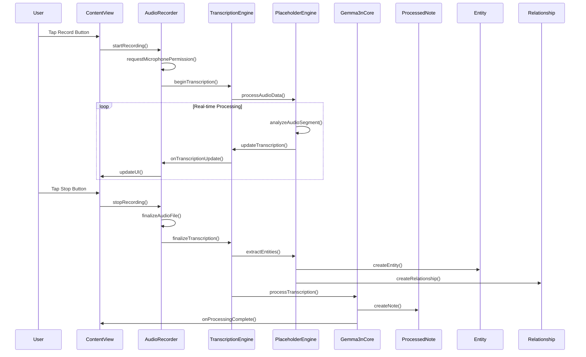

### Collaboration Diagram: Transcription Components

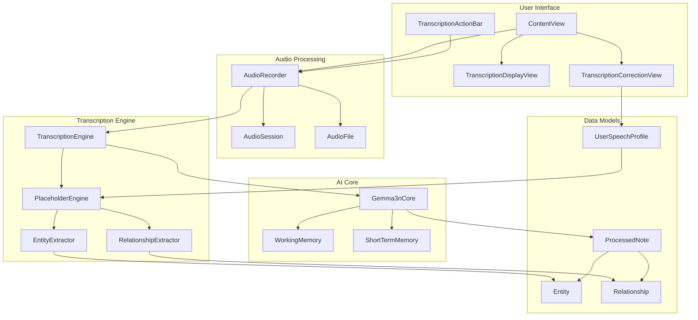

## 2. Knowledge Graph Visualization Interaction

### Sequence Diagram: Knowledge Graph Loading

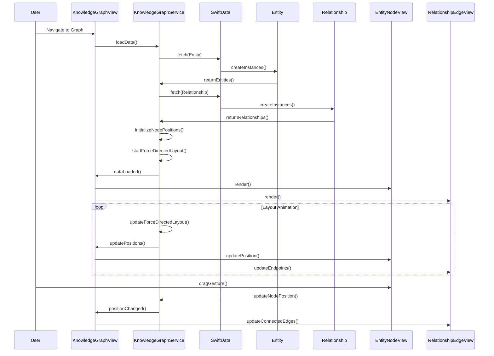

### Collaboration Diagram: Graph Interaction Components

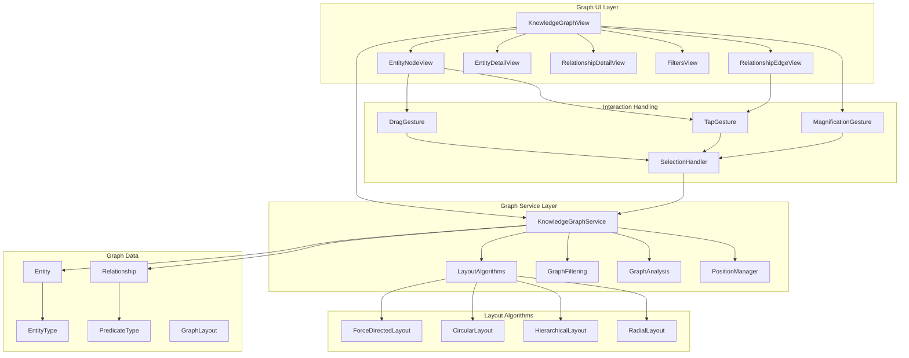

## 3. Memory Consolidation Interaction

### Sequence Diagram: STM to LTM Consolidation

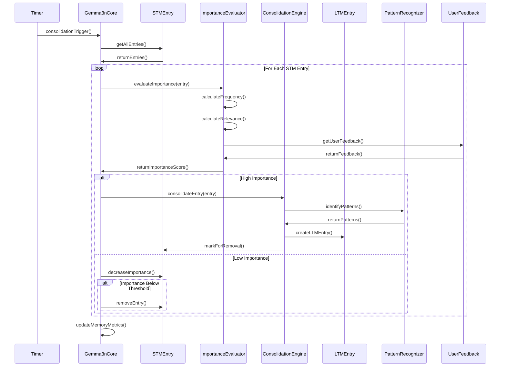

### Collaboration Diagram: Memory System Components

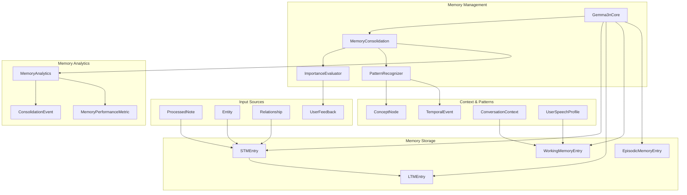

## 4. Data Export/Import Interaction

### Sequence Diagram: Data Export Process

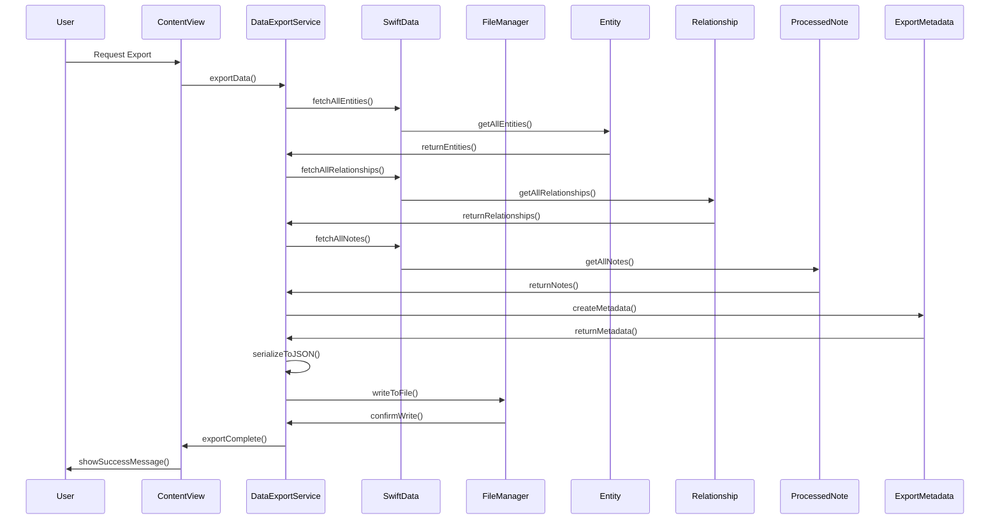

### Collaboration Diagram: Export/Import System

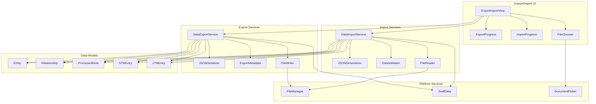

## 5. User Interface Navigation Interaction

### Sequence Diagram: Navigation Flow

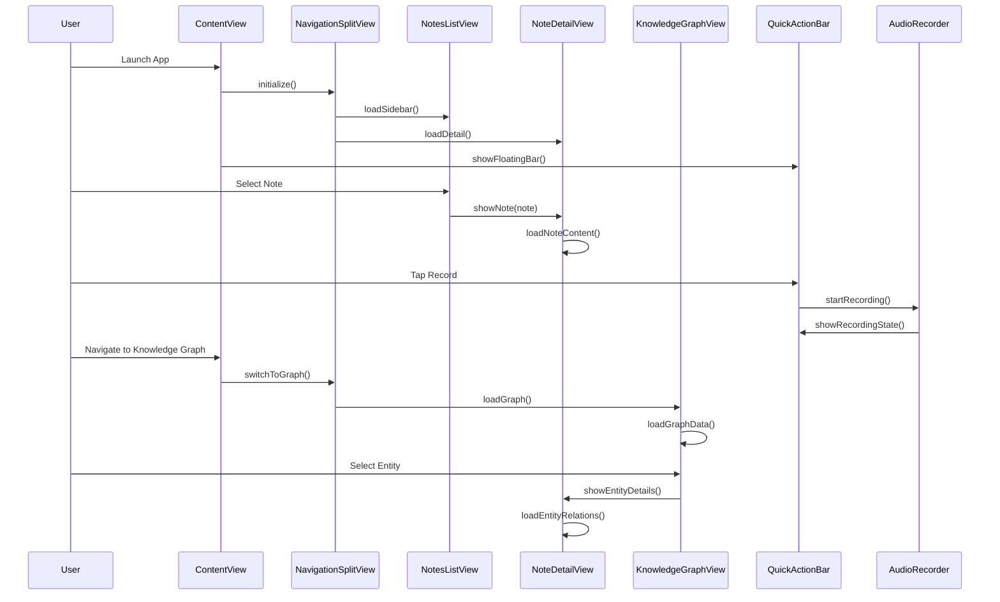

### Collaboration Diagram: UI Component Hierarchy

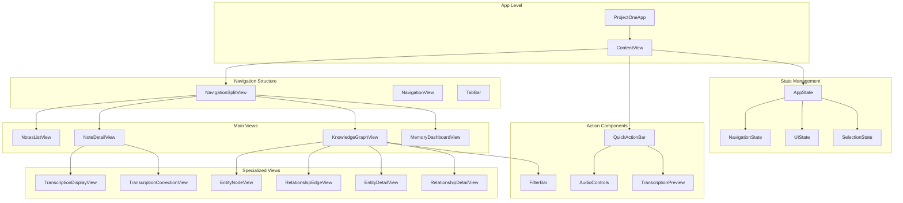

## 6. Error Handling and Recovery Interaction

### Sequence Diagram: Error Recovery Flow

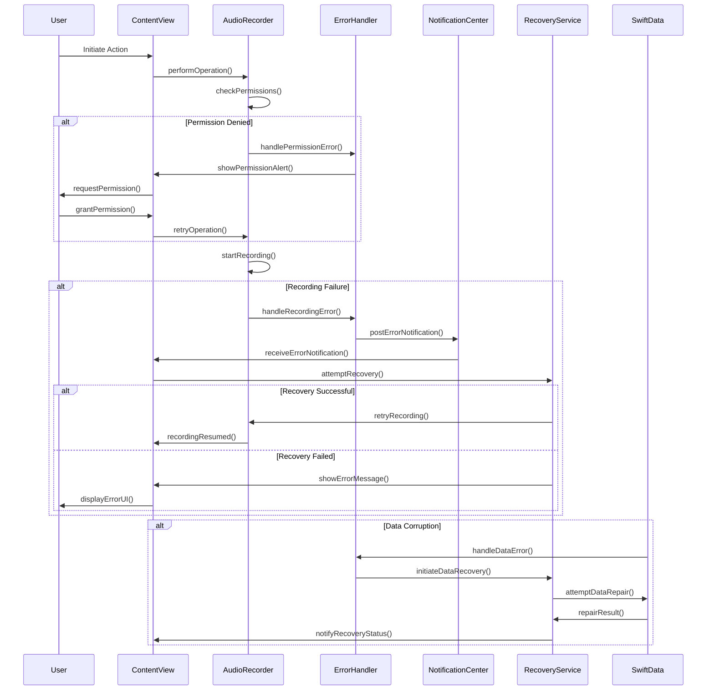

These interaction diagrams provide a comprehensive view of how objects collaborate in the ProjectOne system, showing both the static relationships and dynamic runtime behavior across all major functional areas.