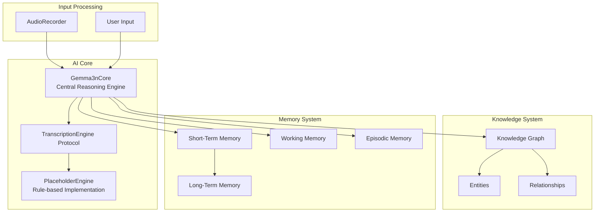
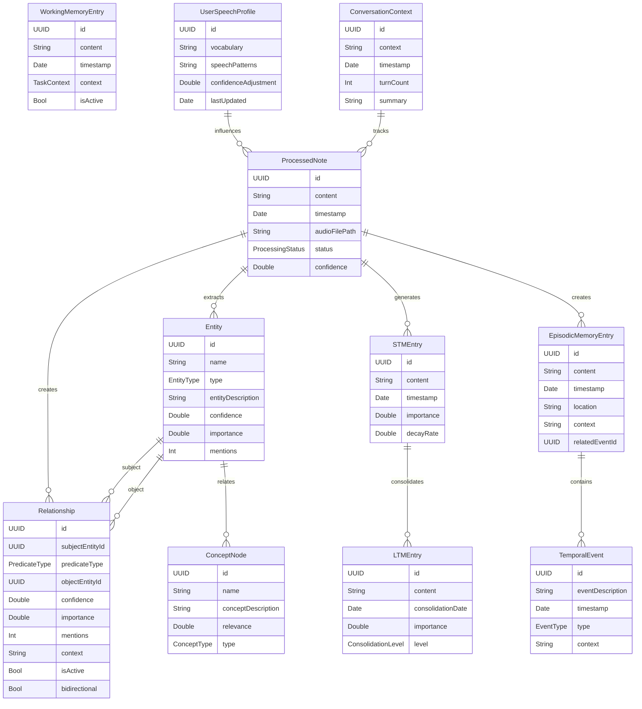
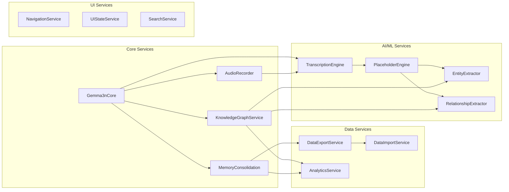
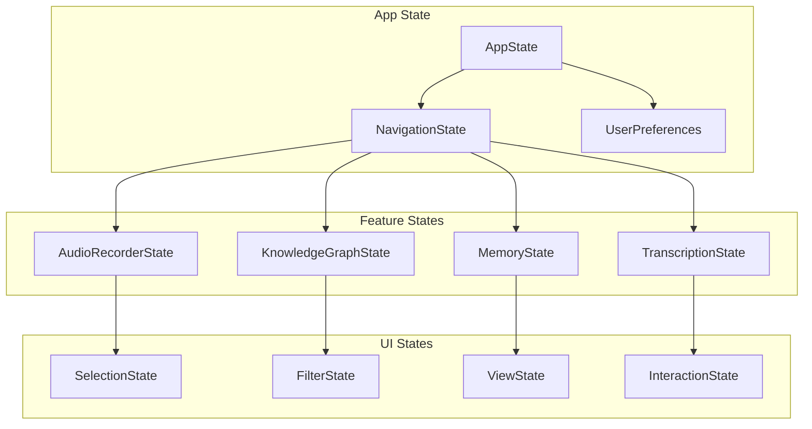

# ProjectOne System Architecture Overview

## Executive Summary

ProjectOne is a sophisticated SwiftUI iOS/macOS personal AI knowledge system that combines audio recording, real-time transcription, knowledge graph construction, and intelligent memory management. The system is built around the **Gemma3nCore** AI reasoning engine and uses a Titans-inspired memory architecture.

**Current Status**: Phase 3 Complete (Knowledge Graph Visualization) - Ready for Phase 4 (Advanced AI Integration)

## High-Level System Architecture

```
┌─────────────────────────────────────────────────────────────────────────────────┐
│                              ProjectOne System                                  │
├─────────────────────────────────────────────────────────────────────────────────┤
│                                                                                 │
│  ┌─────────────────┐  ┌─────────────────┐  ┌─────────────────┐  ┌─────────────┐ │
│  │   UI Layer      │  │  Service Layer  │  │   Data Layer    │  │ AI/ML Layer │ │
│  │                 │  │                 │  │                 │  │             │ │
│  │ • SwiftUI Views │  │ • Gemma3nCore   │  │ • SwiftData     │  │ • PlaceholderEngine │
│  │ • Navigation    │  │ • AudioRecorder │  │ • 11 Models     │  │ • Future MLX │
│  │ • Interactive   │  │ • Transcription │  │ • Relationships │  │ • CoreML     │
│  │   Components    │  │ • Knowledge     │  │ • Persistence   │  │ • Foundation │
│  │                 │  │   Graph Service │  │                 │  │   Models     │
│  └─────────────────┘  └─────────────────┘  └─────────────────┘  └─────────────┘ │
│                                                                                 │
├─────────────────────────────────────────────────────────────────────────────────┤
│                            Memory Architecture                                  │
│  ┌─────────────────┐  ┌─────────────────┐  ┌─────────────────┐  ┌─────────────┐ │
│  │ Short-Term      │  │ Working Memory  │  │ Long-Term       │  │ Episodic    │ │
│  │ Memory (STM)    │  │                 │  │ Memory (LTM)    │  │ Memory      │ │
│  │                 │  │ • Active        │  │                 │  │             │ │
│  │ • Recent        │  │   Processing    │  │ • Consolidated  │  │ • Temporal  │ │
│  │   Interactions  │  │ • Current       │  │   Knowledge     │  │   Events    │ │
│  │ • Decay         │  │   Context       │  │ • Patterns      │  │ • Time-     │ │
│  │   Mechanisms    │  │ • Task State    │  │ • Permanent     │  │   based     │ │
│  │                 │  │                 │  │   Storage       │  │   Storage   │ │
│  └─────────────────┘  └─────────────────┘  └─────────────────┘  └─────────────┘ │
└─────────────────────────────────────────────────────────────────────────────────┘
```

## Core Components Deep Dive

### 1. Central AI System



### 2. SwiftData Model Architecture



### 3. Service Layer Architecture



## Data Flow Patterns

### 1. Audio Processing Pipeline

```
┌─────────────────┐    ┌─────────────────┐    ┌─────────────────┐    ┌─────────────────┐
│ User Recording  │ → │ AudioRecorder   │ → │ TranscriptionEngine │ → │ ProcessedNote   │
│                 │    │                 │    │                 │    │                 │
│ • Voice Input   │    │ • AVFoundation  │    │ • PlaceholderEngine │    │ • Text Content  │
│ • Real-time     │    │ • File Storage  │    │ • Entity Extraction │    │ • Confidence    │
│ • Continuous    │    │ • Status Updates │    │ • Relationship Det. │    │ • Metadata      │
└─────────────────┘    └─────────────────┘    └─────────────────┘    └─────────────────┘
```

### 2. Knowledge Graph Construction

```
┌─────────────────┐    ┌─────────────────┐    ┌─────────────────┐    ┌─────────────────┐
│ ProcessedNote   │ → │ Entity Extraction │ → │ Relationship    │ → │ Knowledge Graph │
│                 │    │                 │    │ Detection       │    │                 │
│ • Text Content  │    │ • Named Entity  │    │ • Pattern Match │    │ • Entities      │
│ • Confidence    │    │ • Type Class.   │    │ • Confidence    │    │ • Relationships │
│ • Metadata      │    │ • Deduplication │    │ • Bidirectional │    │ • Visualization │
└─────────────────┘    └─────────────────┘    └─────────────────┘    └─────────────────┘
```

### 3. Memory Consolidation Flow

```
┌─────────────────┐    ┌─────────────────┐    ┌─────────────────┐    ┌─────────────────┐
│ STM Entry       │ → │ Importance      │ → │ Consolidation   │ → │ LTM Entry       │
│                 │    │ Evaluation      │    │ Process         │    │                 │
│ • Recent Data   │    │ • Frequency     │    │ • Pattern       │    │ • Permanent     │
│ • Decay Timer   │    │ • Relevance     │    │ • Abstraction   │    │ • Indexed       │
│ • Working Context │    │ • User Feedback │    │ • Compression   │    │ • Searchable    │
└─────────────────┘    └─────────────────┘    └─────────────────┘    └─────────────────┘
```

## UI Architecture

### 1. Navigation Structure

```
ProjectOneApp
├── ContentView (Master-Detail)
│   ├── NotesListView
│   │   ├── NoteDetailView
│   │   └── TranscriptionDisplayView
│   ├── KnowledgeGraphView
│   │   ├── EntityNodeView
│   │   ├── RelationshipEdgeView
│   │   ├── EntityDetailView
│   │   └── RelationshipDetailView
│   └── MemoryDashboardView (Future)
│       ├── STMListView
│       ├── LTMListView
│       └── ConsolidationView
└── QuickActionBar (Floating)
    ├── AudioControls
    └── TranscriptionPreview
```

### 2. State Management



## Development Phases

### ✅ Phase 1: Foundation (Complete)
- SwiftData models and relationships
- Basic UI navigation and note management
- Audio recording infrastructure
- Project setup and configuration

### ✅ Phase 2: Audio Processing & Transcription (Complete)
- TranscriptionEngine abstraction and PlaceholderEngine
- Real-time transcription UI with correction system
- Knowledge graph population from transcriptions
- End-to-end audio → note → knowledge graph pipeline

### ✅ Phase 3: Knowledge Graph & Visualization (Complete)
- Interactive knowledge graph visualization
- Multiple layout algorithms (force-directed, circular, hierarchical, radial)
- Real-time filtering and search capabilities
- Entity and relationship detail views
- Graph analysis and metrics

### 🔄 Phase 4: Advanced AI Integration (Next)
- MLX Swift integration when Xcode 26 compatibility improves
- Advanced language models for better transcription
- Semantic understanding and context awareness
- Enhanced memory consolidation algorithms
- Personalized AI assistance features

## Integration Patterns

### 1. Cross-Platform Support
- **NavigationSplitView**: Adaptive layouts for iPhone/iPad/Mac
- **Platform-specific UI**: iOS/macOS optimized interfaces
- **Universal Binary**: Single codebase for all Apple platforms

### 2. Privacy & Security
- **Local Processing**: All AI processing happens on-device
- **No External APIs**: No data leaves the device
- **Secure Storage**: SwiftData provides encrypted local storage
- **Permission Management**: Microphone access with clear user consent

### 3. Performance Optimization
- **Lazy Loading**: On-demand data loading
- **Efficient Queries**: Optimized SwiftData fetch descriptors
- **Memory Management**: Proper cleanup and resource management
- **Real-time Updates**: Efficient change propagation

## Error Handling Strategy

### 1. Audio Processing Errors
- Microphone permission handling
- Audio session management
- File I/O error recovery
- Transcription failure graceful degradation

### 2. Data Integrity
- SwiftData transaction safety
- Model validation
- Relationship consistency checks
- Migration error handling

### 3. UI Resilience
- Loading states
- Error state presentation
- Retry mechanisms
- User feedback systems

## Testing Architecture

### 1. Unit Tests
- Model validation
- Service layer logic
- Algorithm correctness
- Data transformation

### 2. Integration Tests
- SwiftData model interactions
- Service coordination
- Audio processing pipeline
- Knowledge graph construction

### 3. UI Tests
- Navigation flow
- User interactions
- State management
- Cross-platform compatibility

## Future Extensibility

### 1. AI/ML Enhancements
- Advanced language models
- Semantic embeddings
- Context understanding
- Predictive analytics

### 2. Feature Additions
- Collaboration features
- Export/import capabilities
- Advanced analytics
- Custom workflows

### 3. Platform Extensions
- Apple Watch integration
- macOS menu bar app
- iOS widgets
- Shortcuts integration

This architecture provides a comprehensive foundation for ProjectOne's evolution while maintaining clean separation of concerns, testability, and performance optimization across all components.