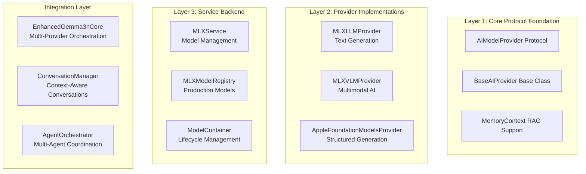

# AI Provider APIs

> **Production three-layer AI provider system with MLX Swift 0.25.6 and iOS 26.0+ Foundation Models**

Complete API reference for ProjectOne's sophisticated three-layer AI provider architecture with production-ready implementations, advanced @Generable types, and multi-agent orchestration.

## Architecture Overview

ProjectOne implements a sophisticated **Three-Layer AI Provider Architecture**:



## Layer 1: Core Protocol Foundation

### AIModelProvider Protocol

The foundational contract that all AI providers must implement:

```swift
/// Protocol for AI model providers in the Memory Agent system
public protocol AIModelProvider: AnyObject {
    
    // MARK: - Core Properties
    var identifier: String { get }                   // Unique provider ID
    var displayName: String { get }                  // User-friendly name
    var isAvailable: Bool { get }                    // Runtime availability
    var supportsPersonalData: Bool { get }           // Privacy capability
    var isOnDevice: Bool { get }                     // Local processing
    var estimatedResponseTime: TimeInterval { get }  // Performance metric
    var maxContextLength: Int { get }                // Context window size
    
    // MARK: - Core Operations
    func generateResponse(prompt: String, context: MemoryContext) async throws -> AIModelResponse
    func prepare() async throws                      // Model initialization
    func cleanup() async                            // Resource cleanup
    func canHandle(contextSize: Int) -> Bool        // Capacity check
}
```

#### Protocol Extensions (Default Implementations)

```swift
extension AIModelProvider {
    
    public func canHandle(contextSize: Int) -> Bool {
        return contextSize <= maxContextLength
    }
    
    public var estimatedResponseTime: TimeInterval {
        return isOnDevice ? 0.5 : 2.0
    }
    
    public var maxContextLength: Int {
        return isOnDevice ? 8192 : 32768
    }
}
```

### BaseAIProvider Implementation

Abstract base class providing common functionality with protocol-oriented design:

```swift
public class BaseAIProvider: AIModelProvider, ObservableObject {
    
    // MARK: - Common Infrastructure
    internal let logger: Logger
    
    // Published properties for SwiftUI integration
    @Published public var isModelLoaded = false
    @Published public var modelLoadingStatus: ModelLoadingStatus = .notStarted
    @Published public var loadingProgress: Double = 0.0
    @Published public var statusMessage: String = ""
    @Published public var isAvailable: Bool = false
    @Published public var lastUpdated: Date = Date()
    
    // MARK: - Protocol Extension Methods (Safe Defaults)
    
    /// Safe default implementation - no fatalError
    internal func generateModelResponse(_ prompt: String) async throws -> String {
        throw AIModelProviderError.processingFailed("Subclass must implement generateModelResponse(_:)")
    }
    
    /// Thread-safe state updates
    @MainActor
    public func updateAvailability(_ available: Bool) {
        isAvailable = available
        lastUpdated = Date()
        objectWillChange.send()
    }
    
    /// Memory-enhanced response generation
    public func generateResponse(prompt: String, context: MemoryContext) async throws -> AIModelResponse {
        guard isAvailable else {
            throw AIModelProviderError.providerUnavailable("\(displayName) not available")
        }
        
        // Build enriched prompt with memory context
        let enrichedPrompt = buildEnrichedPromptWithFallback(prompt: prompt, context: context)
        
        // Validate context size
        try validateContextSize(enrichedPrompt, maxLength: maxContextLength)
        
        // Generate with timing
        let (response, processingTime) = try await measureProcessingTime {
            try await generateModelResponse(enrichedPrompt)
        }
        
        return createResponse(
            content: response,
            confidence: getModelConfidence(),
            processingTime: processingTime,
            tokensUsed: estimateTokenCount(enrichedPrompt + response),
            context: context
        )
    }
}
```

## Layer 2: Provider Implementations

### MLXLLMProvider - Text Generation

Apple Silicon optimized text generation with verified production models:

```swift
public class MLXLLMProvider: BaseAIProvider {
    
    // MARK: - Protocol Implementation
    public override var identifier: String { "mlx-llm" }
    public override var displayName: String { "MLX Language Model" }
    public override var maxContextLength: Int { 4096 }
    public override var estimatedResponseTime: TimeInterval { 0.8 }
    
    // MARK: - Production Models Support
    
    /// Supported production models (verified working)
    public enum SupportedModel {
        case gemma2_2B      // mlx-community/gemma-2-2b-it-4bit
        case gemma2_9B      // mlx-community/gemma-2-9b-it-4bit
        case qwen25_3B      // mlx-community/Qwen2.5-3B-Instruct-4bit
        case qwen25_7B      // mlx-community/Qwen2.5-7B-Instruct-4bit
        case llama32_3B     // mlx-community/Llama-3.2-3B-Instruct-4bit
        case phi35_mini     // mlx-community/Phi-3.5-mini-instruct-4bit
    }
    
    // MARK: - Key Methods
    
    /// Load model with verified configuration
    public func loadModel(_ configuration: MLXModelConfiguration) async throws {
        guard configuration.type == .llm else {
            throw MLXLLMError.invalidModelType("Configuration is not for LLM model")
        }
        
        guard isSupported else {
            throw MLXLLMError.deviceNotSupported("MLX requires Apple Silicon hardware")
        }
        
        logger.info("Loading LLM model: \(configuration.name)")
        
        let container = try await mlxService.loadModel(modelId: configuration.modelId, type: .llm)
        
        self.modelContainer = container
        self.currentConfiguration = configuration
        
        guard container.isReady else {
            throw MLXLLMError.modelNotReady("Container loaded but model not ready")
        }
        
        await MainActor.run { isReady = true }
    }
    
    /// Load recommended model for current platform
    public func loadRecommendedModel() async throws {
        guard let config = MLXModelRegistry.getRecommendedModel(for: .llm) else {
            throw MLXLLMError.noModelAvailable("No recommended LLM model found")
        }
        try await loadModel(config)
    }
    
    /// Generate text response
    public func generateResponse(to prompt: String) async throws -> String {
        guard let container = modelContainer else {
            throw MLXLLMError.modelNotLoaded("No LLM model loaded")
        }
        
        return try await mlxService.generate(with: container, prompt: prompt)
    }
    
    /// Stream response for real-time UI updates
    public func streamResponse(to prompt: String) -> AsyncThrowingStream<String, Error> {
        return AsyncThrowingStream { continuation in
            Task {
                do {
                    guard let container = modelContainer else {
                        continuation.finish(throwing: MLXLLMError.modelNotLoaded("No LLM model loaded"))
                        return
                    }
                    
                    for try await chunk in mlxService.streamGenerate(with: container, prompt: prompt) {
                        continuation.yield(chunk)
                    }
                    continuation.finish()
                } catch {
                    continuation.finish(throwing: error)
                }
            }
        }
    }
}
```

#### Usage Example

```swift
let provider = MLXLLMProvider()

// Check device compatibility
guard provider.isSupported else {
    print("MLX not supported on this device")
    return
}

// Load recommended model
try await provider.loadRecommendedModel()

// Generate response
let response = try await provider.generateResponse(to: "Explain Swift concurrency")

// Stream response for real-time UI
for try await chunk in provider.streamResponse(to: "Write a story") {
    print(chunk, terminator: "")
}
```

### MLXVLMProvider - Multimodal AI

Vision-language model provider for image + text processing:

```swift
public class MLXVLMProvider: BaseAIProvider {
    
    // MARK: - Protocol Implementation
    public override var identifier: String { "mlx-vlm" }
    public override var displayName: String { "MLX Vision-Language Model" }
    public override var maxContextLength: Int { 2048 }
    public override var estimatedResponseTime: TimeInterval { 1.2 }
    
    // MARK: - Multimodal Capabilities
    public var supportsImageAnalysis: Bool { true }
    public var maxImageCount: Int { 4 }
    public var supportedImageFormats: [String] { ["jpg", "jpeg", "png", "heic"] }
    
    // MARK: - Supported Models
    public enum SupportedVLMModel {
        case qwen2VL_2B     // mlx-community/Qwen2-VL-2B-Instruct-4bit
        case qwen2VL_7B     // mlx-community/Qwen2-VL-7B-Instruct-4bit
        case llava16_7B     // mlx-community/llava-v1.6-mistral-7b-4bit
        case pixtral_12B    // mlx-community/pixtral-12b-4bit
    }
    
    // MARK: - Key Methods
    
    /// Generate response with image inputs
    public func generateResponse(to prompt: String, images: [PlatformImage]) async throws -> String {
        guard let container = modelContainer else {
            throw MLXVLMError.modelNotLoaded("No VLM model loaded")
        }
        
        guard !images.isEmpty else {
            throw MLXVLMError.noImagesProvided("VLM requires at least one image")
        }
        
        guard images.count <= maxImageCount else {
            throw MLXVLMError.tooManyImages("Maximum \(maxImageCount) images supported")
        }
        
        return try await mlxService.generateWithImages(
            container: container,
            prompt: prompt,
            images: images
        )
    }
    
    /// Analyze single image
    public func analyzeImage(_ image: PlatformImage, question: String = "What do you see?") async throws -> String {
        return try await generateResponse(to: question, images: [image])
    }
}
```

#### Usage Example

```swift
let provider = MLXVLMProvider()

// Load VLM model
try await provider.loadRecommendedModel()

// Analyze image
let image = UIImage(named: "photo.jpg")!
let description = try await provider.analyzeImage(image, question: "Describe this image in detail")

// Multi-image analysis
let images = [UIImage(named: "chart1.jpg")!, UIImage(named: "chart2.jpg")!]
let comparison = try await provider.generateResponse(
    to: "Compare these two charts and explain the differences",
    images: images
)
```

### AppleFoundationModelsProvider - Structured Generation

iOS 26.0+ system integration with advanced @Generable support:

```swift
@available(iOS 26.0, macOS 26.0, *)
public class AppleFoundationModelsProvider: BaseAIProvider {
    
    // MARK: - Protocol Implementation
    public override var identifier: String { "apple-foundation-models" }
    public override var displayName: String { "Apple Foundation Models" }
    public override var estimatedResponseTime: TimeInterval { 0.2 }
    public override var maxContextLength: Int { 8192 }
    
    // MARK: - Advanced Structured Generation
    
    /// Generate with @Generable type safety
    public func generateWithGuidance<T: Generable>(prompt: String, type: T.Type) async throws -> T {
        #if canImport(FoundationModels)
        guard isAvailable, let model = languageModel else {
            throw AIModelProviderError.providerUnavailable("Foundation Models not available")
        }
        
        let guidedSession = LanguageModelSession(
            model: model,
            instructions: """
            Generate structured responses following the provided schema exactly. 
            Be accurate and comprehensive. All required fields must be populated 
            with relevant, high-quality information.
            """
        )
        
        let response = try await guidedSession.respond(to: prompt, generating: type)
        return response.content
        #else
        throw AIModelProviderError.providerUnavailable("Foundation Models framework not available")
        #endif
    }
    
    /// Get comprehensive model capabilities
    public func getCapabilities() -> FoundationModelCapabilities {
        #if canImport(FoundationModels)
        if let model = languageModel, isAvailable {
            return FoundationModelCapabilities(
                supportsTextGeneration: true,
                supportsGuidedGeneration: true,
                supportsToolCalling: true,
                supportsStreamingGeneration: true,
                maxContextLength: maxContextLength,
                supportedLanguages: Array(model.supportedLanguages.map { 
                    $0.languageCode?.identifier ?? "en" 
                }),
                supportedStructuredTypes: [
                    "SummarizedContent", "ExtractedEntities", "MemoryExtraction",
                    "ConversationSummary", "KnowledgeGraph", "TaskStructure", "EmotionalAnalysis"
                ]
            )
        }
        #endif
        return FoundationModelCapabilities.unavailable
    }
}
```

#### Usage Example

```swift
@available(iOS 26.0, *)
let provider = AppleFoundationModelsProvider()

// Wait for availability
guard provider.isAvailable else {
    print("Foundation Models not available")
    return
}

// Basic text generation
let response = try await provider.generateModelResponse("Explain machine learning")

// Structured generation
let summary = try await provider.generateWithGuidance(
    prompt: "Summarize this article: \(articleText)",
    type: SummarizedContent.self
)

let entities = try await provider.generateWithGuidance(
    prompt: "Extract entities from: \(text)",
    type: ExtractedEntities.self
)
```

## Layer 3: Service Backend

### MLXService - Apple Silicon ML Backend

Core service handling MLX Swift operations with production model configurations:

```swift
public class MLXService: ObservableObject {
    
    // MARK: - State Management
    @Published public var isLoading = false
    @Published public var loadingProgress: Double = 0.0
    @Published public var errorMessage: String?
    
    // MARK: - Model Loading (MLX Swift 0.25.6 API)
    
    public func loadModel(modelId: String, type: MLXModelType) async throws -> ModelContainer {
        logger.info("Loading MLX model: \(modelId)")
        
        await MainActor.run {
            isLoading = true
            loadingProgress = 0.0
        }
        
        let modelContext: ModelContext
        switch type {
        case .llm:
            modelContext = try await MLXLMCommon.loadModel(
                configuration: .init(id: modelId)
            ) { [weak self] progress in
                Task { @MainActor in
                    self?.loadingProgress = progress
                }
            }
        case .vlm:
            modelContext = try await MLXVLM.loadModel(
                configuration: .init(id: modelId)
            ) { [weak self] progress in
                Task { @MainActor in
                    self?.loadingProgress = progress
                }
            }
        }
        
        let container = ModelContainer(
            modelContext: modelContext,
            modelId: modelId,
            type: type
        )
        
        await MainActor.run {
            isLoading = false
            loadingProgress = 1.0
        }
        
        return container
    }
    
    /// Generate text response
    public func generate(with container: ModelContainer, prompt: String) async throws -> String {
        guard container.isReady else {
            throw MLXServiceError.modelNotReady("Model container not ready")
        }
        
        switch container.type {
        case .llm:
            return try await MLXLMCommon.generate(
                promptTokens: container.modelContext.encode(text: prompt),
                parameters: .init(temperature: 0.7, topP: 0.9),
                model: container.modelContext
            ) { _ in }
        case .vlm:
            throw MLXServiceError.invalidOperation("Use generateWithImages for VLM models")
        }
    }
    
    /// Stream generation for real-time responses
    public func streamGenerate(with container: ModelContainer, prompt: String) -> AsyncThrowingStream<String, Error> {
        return AsyncThrowingStream { continuation in
            Task {
                do {
                    for try await token in container.modelContext.generateStream(prompt: prompt) {
                        continuation.yield(token.text)
                    }
                    continuation.finish()
                } catch {
                    continuation.finish(throwing: error)
                }
            }
        }
    }
}
```

### MLXModelRegistry - Production Model Configurations

Curated registry of verified working models:

```swift
public struct MLXModelRegistry {
    
    // MARK: - Production LLM Models (Verified Working)
    public static let llmModels: [MLXModelConfiguration] = [
        
        // Gemma 2 Models (Most Reliable)
        MLXModelConfiguration(
            name: "Gemma 2 2B Instruct",
            modelId: "mlx-community/gemma-2-2b-it-4bit",
            type: .llm,
            memoryRequirement: "~1.5GB RAM",
            recommendedPlatform: .iOS,
            quantization: "4-bit",
            description: "Compact, efficient Gemma 2 model perfect for mobile devices"
        ),
        
        MLXModelConfiguration(
            name: "Qwen2.5 7B Instruct",
            modelId: "mlx-community/Qwen2.5-7B-Instruct-4bit",
            type: .llm,
            memoryRequirement: "~4GB RAM",
            recommendedPlatform: .macOS,
            quantization: "4-bit",
            description: "Excellent balance of quality and performance"
        ),
        
        // Additional verified models...
    ]
    
    // MARK: - Platform-Specific Recommendations
    
    public static func getRecommendedModel(for type: MLXModelType) -> MLXModelConfiguration? {
        #if os(iOS)
        let platformModels = models(for: Platform.iOS).filter { $0.type == type }
        return platformModels.first { $0.name.contains("Gemma 2 2B") } ??
               platformModels.first { $0.name.contains("Qwen2.5 3B") } ??
               platformModels.first
        #else
        let platformModels = models(for: Platform.macOS).filter { $0.type == type }
        return platformModels.first { $0.name.contains("Qwen2.5 7B") } ??
               platformModels.first { $0.name.contains("Gemma 2 9B") } ??
               platformModels.first
        #endif
    }
}
```

### ModelContainer - Lifecycle Management

Model wrapper with state validation and lifecycle management:

```swift
public class ModelContainer {
    
    public let modelContext: ModelContext
    public let modelId: String
    public let type: MLXModelType
    public let loadedAt: Date
    
    public private(set) var isReady: Bool = false
    public private(set) var memoryUsage: Int = 0
    public private(set) var lastUsed: Date
    
    public init(modelContext: ModelContext, modelId: String, type: MLXModelType) {
        self.modelContext = modelContext
        self.modelId = modelId
        self.type = type
        self.loadedAt = Date()
        self.lastUsed = Date()
        
        self.isReady = validateModelReadiness()
        self.memoryUsage = calculateMemoryUsage()
    }
    
    private func validateModelReadiness() -> Bool {
        guard modelContext.isLoaded else { return false }
        
        do {
            let testTokens = modelContext.encode(text: "Hello")
            return !testTokens.isEmpty
        } catch {
            return false
        }
    }
    
    public func markUsed() {
        lastUsed = Date()
    }
    
    public var info: String {
        return "\(modelId) (\(type.rawValue), \(memoryUsage)MB, ready: \(isReady))"
    }
}
```

## Integration Layer

### EnhancedGemma3nCore - Multi-Provider Orchestration

Sophisticated provider orchestration with automatic routing:

```swift
@available(iOS 26.0, macOS 26.0, *)
class EnhancedGemma3nCore: ObservableObject {
    
    // MARK: - Provider Management
    @StateObject private var mlxLLMProvider = MLXLLMProvider()
    @StateObject private var mlxVLMProvider = MLXVLMProvider()
    @StateObject private var foundationProvider = AppleFoundationModelsProvider()
    
    // MARK: - Advanced Structured Generation Methods
    
    /// Extract memory-relevant information from conversation
    public func extractMemoryContent(from conversation: String) async throws -> MemoryExtraction {
        let prompt = """
        Analyze this conversation and extract memory-relevant information. Identify what should be stored in different memory types:
        - Short-term: Current context, ongoing topics, recent decisions
        - Long-term: Facts learned, important insights, user preferences 
        - Episodic: Significant events, experiences, temporal context
        - Entities: People, places, concepts mentioned with their roles/relationships
        
        Conversation: \(conversation)
        """
        return try await foundationProvider.generateWithGuidance(prompt: prompt, type: MemoryExtraction.self)
    }
    
    /// Generate comprehensive conversation summary with context
    public func summarizeConversation(_ conversation: String) async throws -> ConversationSummary {
        let prompt = """
        Create a comprehensive conversation summary including:
        - Main topics discussed
        - Key decisions or outcomes
        - Action items or follow-ups
        - Participant roles and contributions
        - Important context for future reference
        
        Conversation: \(conversation)
        """
        return try await foundationProvider.generateWithGuidance(prompt: prompt, type: ConversationSummary.self)
    }
    
    /// Process text using smart provider selection
    public func processText(_ text: String, images: [PlatformImage] = [], forceProvider: AIProviderType? = nil) async -> String {
        let provider = forceProvider ?? selectBestProvider(for: text, images: images)
        
        do {
            switch provider {
            case .mlxLLM:
                return try await mlxLLMProvider.generateResponse(to: text)
            case .mlxVLM:
                return try await mlxVLMProvider.generateResponse(to: text, images: images)
            case .foundation:
                return try await foundationProvider.generateModelResponse(text)
            case .automatic:
                return try await processWithAutomatic(text, images: images)
            }
        } catch {
            return "Error processing request: \(error.localizedDescription)"
        }
    }
    
    private func selectBestProvider(for text: String, images: [PlatformImage]) -> AIProviderType {
        if !images.isEmpty {
            return mlxVLMProvider.isReady ? .mlxVLM : .automatic
        } else {
            if foundationProvider.isAvailable {
                return .foundation
            } else if mlxLLMProvider.isReady {
                return .mlxLLM
            } else {
                return .automatic
            }
        }
    }
}
```

### ConversationManager - Context-Aware Conversations

Advanced conversation management with memory integration:

```swift
@available(iOS 26.0, macOS 26.0, *)
public class ConversationManager: ObservableObject {
    
    private let aiCore: EnhancedGemma3nCore
    private let memoryContextBuilder: MemoryContextBuilder
    
    @Published public var currentSession: ConversationSession?
    @Published public var isProcessing = false
    @Published public var lastAnalysis: ConversationSummary?
    
    /// Process user message with memory-enhanced context
    public func processMessage(_ message: ConversationMessage) async throws -> ConversationResponse {
        guard let session = currentSession else {
            throw ConversationError.noActiveSession
        }
        
        // Add message to session
        session.addMessage(message)
        
        // Build memory context for RAG enhancement
        let memoryContext = await memoryContextBuilder.buildContext(
            for: message.content,
            session: session,
            configuration: configuration
        )
        
        // Generate response using AI providers
        let response = try await generateResponse(
            for: message,
            context: memoryContext,
            session: session
        )
        
        return response
    }
    
    /// Stream response for real-time UI updates
    public func streamResponse(for message: ConversationMessage) -> AsyncThrowingStream<ConversationResponseChunk, Error> {
        return AsyncThrowingStream { continuation in
            Task {
                // Implementation for streaming with memory context
            }
        }
    }
}
```

## Advanced @Generable Structured Types

ProjectOne supports sophisticated structured generation with 7+ @Generable types:

### Core Structured Types

```swift
@Generable
public struct SummarizedContent {
    public let title: String
    public let keyPoints: [String]
    public let summary: String
    public let wordCount: Int
    public let readingTimeMinutes: Int
}

@Generable
public struct ExtractedEntities {
    public let people: [String]
    public let places: [String]
    public let organizations: [String]
    public let concepts: [String]
    public let relationships: [String]
}
```

### Advanced Analysis Types

```swift
@Generable
public struct MemoryExtraction {
    public let shortTermMemories: [MemoryItem]
    public let longTermMemories: [MemoryItem]
    public let episodicMemories: [EpisodicItem]
    public let extractedEntities: [EntityItem]
    public let contextualTags: [String]
    public let importanceLevel: ImportanceLevel
}

@Generable
public struct ConversationSummary {
    public let mainTopics: [String]
    public let keyDecisions: [String]
    public let actionItems: [ActionItem]
    public let participants: [ParticipantInfo]
    public let timeframe: String
    public let nextSteps: [String]
    public let contextForFuture: String
}

@Generable
public struct KnowledgeGraph {
    public let entities: [GraphEntity]
    public let relationships: [GraphRelationship]
    public let temporalEvents: [TemporalEvent]
    public let hierarchies: [Hierarchy]
    public let confidence: Double
    public let contextMetadata: [String: String]
}

@Generable
public struct TaskStructure {
    public let primaryGoal: String
    public let successCriteria: [String]
    public let dependencies: [String]
    public let subtasks: [Subtask]
    public let requiredResources: [String]
    public let estimatedDuration: String
    public let riskFactors: [RiskFactor]
}

@Generable
public struct EmotionalAnalysis {
    public let overallTone: EmotionalTone
    public let specificEmotions: [DetectedEmotion]
    public let intensityLevel: Double
    public let emotionalTriggers: [String]
    public let suggestedResponses: [String]
    public let empathyRecommendations: [String]
}
```

## Testing Framework

### UnifiedAITestView

Comprehensive testing interface for all providers:

```swift
struct UnifiedAITestView: View {
    
    @StateObject private var mlxLLMProvider = MLXLLMProvider()
    @StateObject private var mlxVLMProvider = MLXVLMProvider()
    @StateObject private var foundationProvider = AppleFoundationModelsProvider()
    
    @State private var testResults: [ProviderTestResult] = []
    @State private var isRunningTests = false
    
    var body: some View {
        NavigationView {
            List {
                // Provider Status Section
                Section("Provider Status") {
                    ProviderStatusRow(
                        name: "MLX LLM",
                        status: mlxLLMProvider.isReady ? .ready : .loading,
                        model: mlxLLMProvider.getModelInfo()?.displayName
                    )
                    
                    ProviderStatusRow(
                        name: "MLX VLM", 
                        status: mlxVLMProvider.isReady ? .ready : .loading,
                        model: mlxVLMProvider.getModelInfo()?.displayName
                    )
                    
                    ProviderStatusRow(
                        name: "Foundation Models",
                        status: foundationProvider.isAvailable ? .ready : .unavailable,
                        model: "System Model"
                    )
                }
                
                // Test Controls
                Section("Performance Testing") {
                    Button("Run Comprehensive Tests") {
                        Task { await runComprehensiveTests() }
                    }
                    .disabled(isRunningTests)
                }
                
                // Test Results
                if !testResults.isEmpty {
                    Section("Test Results") {
                        ForEach(testResults) { result in
                            TestResultRow(result: result)
                        }
                    }
                }
            }
        }
    }
    
    private func runComprehensiveTests() async {
        // Parallel testing of all providers
        async let mlxLLMTest = testProvider(mlxLLMProvider, type: .textGeneration)
        async let mlxVLMTest = testProvider(mlxVLMProvider, type: .multimodal)
        async let foundationTest = testProvider(foundationProvider, type: .structured)
        
        let results = await [mlxLLMTest, mlxVLMTest, foundationTest]
        
        await MainActor.run {
            testResults = results
            isRunningTests = false
        }
    }
}

struct ProviderTestResult: Identifiable {
    let id = UUID()
    let providerName: String
    let testType: TestType
    let success: Bool
    let duration: TimeInterval
    let responseLength: Int
    let errorMessage: String?
}
```

## Error Handling

### Comprehensive Error Types

```swift
// MLX-specific errors
public enum MLXLLMError: Error, LocalizedError {
    case deviceNotSupported(String)
    case modelNotLoaded(String)
    case modelNotReady(String)
    case generationFailed(String)
    case invalidModelType(String)
    case noModelAvailable(String)
    
    public var errorDescription: String? {
        switch self {
        case .deviceNotSupported(let message):
            return "Device not supported: \(message)"
        case .modelNotLoaded(let message):
            return "Model not loaded: \(message)"
        // ... other cases
        }
    }
}

// Foundation Models errors
public enum FoundationModelsError: Error, LocalizedError {
    case sessionNotAvailable
    case modelUnavailable
    case deviceNotEligible
    case appleIntelligenceNotEnabled
    case contextWindowExceeded(Int)
    case structuredGenerationFailed(String)
    
    public var errorDescription: String? {
        // Error descriptions for each case
    }
}

// Conversation management errors
public enum ConversationError: Error, LocalizedError {
    case noActiveSession
    case messageValidationFailed(String)
    case contextSizeExceeded(Int, Int)
    case memoryContextFailed(String)
}
```

## Best Practices

### Provider Selection Strategy

1. **iOS 26.0+ Devices**: Prefer Foundation Models for system integration and structured generation
2. **Apple Silicon Macs**: Use MLX for privacy-sensitive content and local processing
3. **Multimodal Requests**: Always route to MLXVLMProvider when images are involved
4. **Fallback Strategy**: Implement graceful degradation with multiple provider options

### Model Management

1. **Memory Optimization**: Use platform-appropriate models (2B for iOS, 7B+ for macOS)
2. **Progressive Loading**: Show loading progress for better user experience
3. **Resource Cleanup**: Unload models when not in use to free memory
4. **Error Recovery**: Implement retry logic with exponential backoff

### Performance Optimization

1. **Concurrent Operations**: Test and load providers in parallel
2. **Response Caching**: Cache frequent responses to improve performance
3. **Context Management**: Optimize memory context size for faster processing
4. **Streaming Responses**: Use streaming for real-time UI updates

### Testing Strategy

1. **Comprehensive Testing**: Test all providers simultaneously for comparison
2. **Performance Benchmarking**: Track response times, success rates, and quality metrics
3. **Device Variation**: Test across different hardware configurations
4. **Structured Generation Testing**: Validate @Generable type accuracy and completeness

## Usage Examples

### Basic Provider Usage

```swift
// MLX LLM Provider
let mlxProvider = MLXLLMProvider()
try await mlxProvider.loadRecommendedModel()
let response = try await mlxProvider.generateResponse(to: "Explain machine learning")

// Foundation Models Provider (iOS 26.0+)
@available(iOS 26.0, *)
let foundationProvider = AppleFoundationModelsProvider()
let summary = try await foundationProvider.generateWithGuidance(
    prompt: "Summarize: \(text)",
    type: SummarizedContent.self
)

// Enhanced Core Orchestration
let core = EnhancedGemma3nCore()
await core.setup()
let response = await core.processText("What is quantum computing?")
```

### Advanced Structured Generation

```swift
// Memory extraction from conversation
let memoryData = try await core.extractMemoryContent(from: conversationText)
print("STM entries: \(memoryData.shortTermMemories.count)")
print("LTM entries: \(memoryData.longTermMemories.count)")

// Comprehensive conversation analysis
let summary = try await core.summarizeConversation(conversationText)
print("Topics: \(summary.mainTopics)")
print("Action items: \(summary.actionItems.count)")

// Knowledge graph construction
let knowledge = try await core.extractKnowledgeGraph(from: documentText)
print("Entities: \(knowledge.entities.count)")
print("Relationships: \(knowledge.relationships.count)")
```

### Conversation Management

```swift
let conversationManager = ConversationManager(aiCore: core)
await conversationManager.startNewSession()

let userMessage = ConversationMessage(
    content: "Help me understand AI architecture patterns",
    role: .user
)

let response = try await conversationManager.processMessage(userMessage)
print("Response: \(response.content)")
print("Provider used: \(response.provider)")
```

## Navigation

- **← Back to [API Index](README.md)**
- **→ Foundation Models: [Foundation Models API](FOUNDATION_MODELS_API.md)**  
- **→ Memory System: [Memory Agent API](MEMORY_AGENT_API.md)**

---

*Last updated: 2025-07-22 - Three-layer architecture with advanced @Generable types complete*