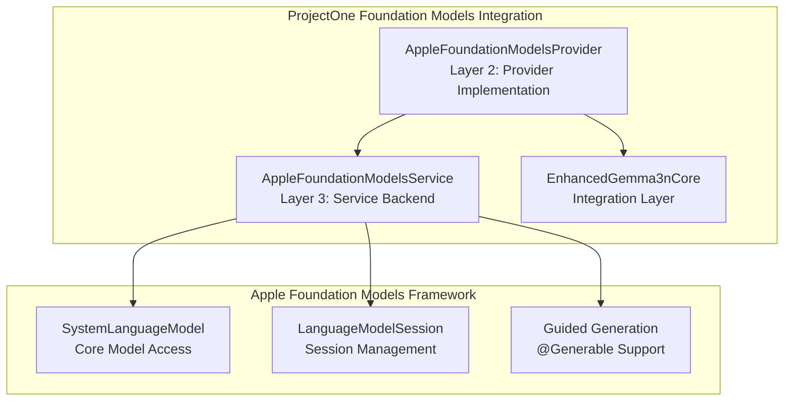

# Apple Foundation Models Framework API Documentation

## Overview

The Foundation Models framework provides access to Apple's on-device large language model that powers Apple Intelligence for iOS 26.0+ Beta. ProjectOne integrates this framework through the **AppleFoundationModelsProvider** with advanced @Generable structured generation capabilities.

**Official Documentation:** https://developer.apple.com/documentation/foundationmodels

## ProjectOne Integration

### Three-Layer Architecture Integration



## Availability Requirements

- **iOS/iPadOS:** 26.0+ Beta
- **macOS:** 26.0+ Beta  
- **visionOS:** 26.0+ Beta
- **Mac Catalyst:** 26.0+ Beta

### Device Requirements
- Device must support Apple Intelligence
- Apple Intelligence must be enabled in System Settings
- Device must have sufficient battery
- Device cannot be in Game Mode

## Core Classes

### SystemLanguageModel
**Documentation:** https://developer.apple.com/documentation/foundationmodels/systemlanguagemodel

The main class for accessing Apple's on-device language model.

```swift
import FoundationModels

// Get the default model
let model = SystemLanguageModel.default

// Create model for specific use case
let model = SystemLanguageModel(useCase: .contentTagging)

// Check availability with comprehensive error handling
switch model.availability {
case .available:
    // Model is ready to use
    logger.info("✅ Foundation Models available and ready")
case .unavailable(.deviceNotEligible):
    // Device doesn't support Apple Intelligence
    logger.error("❌ Device not eligible for Apple Intelligence")
case .unavailable(.appleIntelligenceNotEnabled):
    // Apple Intelligence disabled in Settings
    logger.error("❌ Apple Intelligence not enabled in Settings")
case .unavailable(.modelNotReady):
    // Model downloading or system busy
    logger.warning("⚠️ Foundation Models not ready (downloading or system busy)")
case .unavailable(let other):
    // Other availability issue
    logger.error("❌ Unknown availability issue: \(other)")
}
```

#### Key Properties
- `isAvailable: Bool` - Convenience check for readiness
- `availability: SystemLanguageModel.Availability` - Detailed availability status
- `supportedLanguages: Set<Locale.Language>` - Supported languages

#### Use Cases
```swift
struct UseCase {
    static let contentTagging: UseCase
    static let classification: UseCase
    static let summarization: UseCase
    static let extraction: UseCase
    // Other use cases available
}
```

### LanguageModelSession
**Documentation:** https://developer.apple.com/documentation/foundationmodels/languagemodelsession

Manages interactions with the language model, maintains context between requests.

```swift
// Create session with comprehensive instructions for ProjectOne
let session = LanguageModelSession(
    model: SystemLanguageModel.default,
    instructions: """
    You are a helpful, accurate, and concise assistant that provides personalized responses 
    based on the user's context and memory. You have access to the user's personal knowledge 
    and should use it appropriately to provide relevant, contextual assistance.
    
    When generating structured responses, follow the provided schema exactly and ensure 
    all required fields are populated with accurate, relevant information.
    """
)

// Generate text response
let response = try await session.respond(to: "Explain quantum computing")

// Generate structured response using ProjectOne's @Generable types
let summary = try await session.respond(
    to: "Summarize this article about AI architecture",
    generating: SummarizedContent.self
)
```

#### Session Features
- **Context Preservation:** Maintains conversation state
- **Transcript Access:** Full history via `session.transcript`
- **Streaming:** Real-time response generation
- **Tool Calling:** Custom function execution
- **Guided Generation:** Structured output with `@Generable`

## ProjectOne's Advanced @Generable Types

### Basic Structured Generation Types

```swift
@Generable
public struct SummarizedContent {
    public let title: String
    public let keyPoints: [String]
    public let summary: String
    public let wordCount: Int
    public let readingTimeMinutes: Int
}

@Generable
public struct ExtractedEntities {
    public let people: [String]
    public let places: [String]
    public let organizations: [String]
    public let concepts: [String]
    public let relationships: [String]
}

// Usage
let summary = try await session.respond(
    to: "Provide a comprehensive summary with title, key points, and overview for: \(text)",
    generating: SummarizedContent.self
)

let entities = try await session.respond(
    to: "Extract all people, places, organizations, and key concepts from: \(text)",
    generating: ExtractedEntities.self
)
```

### Advanced Memory and Knowledge Graph Types

```swift
@Generable
public struct MemoryExtraction {
    public let shortTermMemories: [MemoryItem]
    public let longTermMemories: [MemoryItem]
    public let episodicMemories: [EpisodicItem]
    public let extractedEntities: [EntityItem]
    public let contextualTags: [String]
    public let importanceLevel: ImportanceLevel
}

@Generable
public struct ConversationSummary {
    public let mainTopics: [String]
    public let keyDecisions: [String]
    public let actionItems: [ActionItem]
    public let participants: [ParticipantInfo]
    public let timeframe: String
    public let nextSteps: [String]
    public let contextForFuture: String
}

@Generable
public struct KnowledgeGraph {
    public let entities: [GraphEntity]
    public let relationships: [GraphRelationship]
    public let temporalEvents: [TemporalEvent]
    public let hierarchies: [Hierarchy]
    public let confidence: Double
    public let contextMetadata: [String: String]
}

// Usage for memory extraction
let memoryData = try await session.respond(
    to: """
    Analyze this conversation and extract memory-relevant information:
    - Short-term: Current context, ongoing topics, recent decisions
    - Long-term: Facts learned, important insights, user preferences 
    - Episodic: Significant events, experiences, temporal context
    - Entities: People, places, concepts mentioned with relationships
    
    Conversation: \(conversationText)
    """,
    generating: MemoryExtraction.self
)
```

### Task Planning and Analysis Types

```swift
@Generable
public struct TaskStructure {
    public let primaryGoal: String
    public let successCriteria: [String]
    public let dependencies: [String]
    public let subtasks: [Subtask]
    public let requiredResources: [String]
    public let estimatedDuration: String
    public let riskFactors: [RiskFactor]
}

@Generable
public struct EmotionalAnalysis {
    public let overallTone: EmotionalTone
    public let specificEmotions: [DetectedEmotion]
    public let intensityLevel: Double
    public let emotionalTriggers: [String]
    public let suggestedResponses: [String]
    public let empathyRecommendations: [String]
}

// Usage for task planning
let taskPlan = try await session.respond(
    to: """
    Break down this request into a structured task format:
    - Primary goal and success criteria
    - Dependencies and prerequisites  
    - Subtasks with priorities and estimates
    - Required resources and skills
    - Potential risks and mitigation strategies
    
    Request: \(userRequest)
    """,
    generating: TaskStructure.self
)
```

### Supporting Data Structures

```swift
@Generable
public struct MemoryItem {
    public let content: String
    public let category: String
    public let confidence: Double
    public let relevanceScore: Double
}

@Generable
public struct ActionItem {
    public let task: String
    public let assignee: String
    public let deadline: String
    public let priority: Priority
}

@Generable
public struct GraphEntity {
    public let id: String
    public let name: String
    public let type: String
    public let properties: [String: String]
}

@Generable
public struct GraphRelationship {
    public let fromEntity: String
    public let toEntity: String
    public let relationshipType: String
    public let description: String
    public let strength: Double
}

// Enums for structured data
public enum ImportanceLevel: String, Codable {
    case low = "low"
    case medium = "medium"
    case high = "high"
    case critical = "critical"
}

public enum EmotionalTone: String, Codable {
    case positive = "positive"
    case negative = "negative"
    case neutral = "neutral"
    case mixed = "mixed"
}
```

## ProjectOne's AppleFoundationModelsProvider

### Provider Implementation

```swift
@available(iOS 26.0, macOS 26.0, *)
public class AppleFoundationModelsProvider: BaseAIProvider {
    
    // MARK: - Protocol Implementation
    public override var identifier: String { "apple-foundation-models" }
    public override var displayName: String { "Apple Foundation Models" }
    public override var estimatedResponseTime: TimeInterval { 0.2 }
    public override var maxContextLength: Int { 8192 }
    
    // MARK: - Foundation Models Integration
    #if canImport(FoundationModels)
    private var languageModel: SystemLanguageModel?
    private var session: LanguageModelSession?
    #endif
    
    // MARK: - Advanced Structured Generation
    
    /// Generate with @Generable type safety
    public func generateWithGuidance<T: Generable>(prompt: String, type: T.Type) async throws -> T {
        #if canImport(FoundationModels)
        guard isAvailable, let model = languageModel else {
            throw AIModelProviderError.providerUnavailable("Foundation Models not available")
        }
        
        logger.info("Generating guided content with Foundation Models for type: \(String(describing: type))")
        
        // Create session for guided generation with enhanced instructions
        let guidedSession = LanguageModelSession(
            model: model,
            instructions: """
            Generate structured responses following the provided schema exactly. 
            Be accurate and comprehensive. All required fields must be populated 
            with relevant, high-quality information. Use the user's context and 
            memory when available to provide personalized, relevant responses.
            """
        )
        
        // Use guided generation with @Generable type
        let response = try await guidedSession.respond(to: prompt, generating: type)
        
        logger.info("✅ Foundation Models guided generation completed")
        return response.content
        
        #else
        throw AIModelProviderError.providerUnavailable("Foundation Models framework not available")
        #endif
    }
    
    /// Get comprehensive model capabilities
    public func getCapabilities() -> FoundationModelCapabilities {
        #if canImport(FoundationModels)
        if let model = languageModel, isAvailable {
            return FoundationModelCapabilities(
                supportsTextGeneration: true,
                supportsGuidedGeneration: true,
                supportsToolCalling: true,
                supportsStreamingGeneration: true,
                maxContextLength: maxContextLength,
                supportedLanguages: Array(model.supportedLanguages.map { 
                    $0.languageCode?.identifier ?? "en" 
                }),
                supportedStructuredTypes: [
                    "SummarizedContent", "ExtractedEntities", "MemoryExtraction",
                    "ConversationSummary", "KnowledgeGraph", "TaskStructure", "EmotionalAnalysis"
                ]
            )
        }
        #endif
        
        return FoundationModelCapabilities.unavailable
    }
}

public struct FoundationModelCapabilities {
    public let supportsTextGeneration: Bool
    public let supportsGuidedGeneration: Bool
    public let supportsToolCalling: Bool
    public let supportsStreamingGeneration: Bool
    public let maxContextLength: Int
    public let supportedLanguages: [String]
    public let supportedStructuredTypes: [String]
    
    public static let unavailable = FoundationModelCapabilities(
        supportsTextGeneration: false,
        supportsGuidedGeneration: false,
        supportsToolCalling: false,
        supportsStreamingGeneration: false,
        maxContextLength: 0,
        supportedLanguages: [],
        supportedStructuredTypes: []
    )
}
```

### Enhanced Gemma3n Core Integration

```swift
@available(iOS 26.0, macOS 26.0, *)
class EnhancedGemma3nCore: ObservableObject {
    
    @StateObject private var foundationProvider = AppleFoundationModelsProvider()
    
    // MARK: - Advanced Structured Generation Methods
    
    /// Extract memory-relevant information from conversation
    public func extractMemoryContent(from conversation: String) async throws -> MemoryExtraction {
        let prompt = """
        Analyze this conversation and extract memory-relevant information. Identify what should be stored in different memory types:
        - Short-term: Current context, ongoing topics, recent decisions
        - Long-term: Facts learned, important insights, user preferences 
        - Episodic: Significant events, experiences, temporal context
        - Entities: People, places, concepts mentioned with their roles/relationships
        
        Conversation: \(conversation)
        """
        return try await foundationProvider.generateWithGuidance(prompt: prompt, type: MemoryExtraction.self)
    }
    
    /// Generate comprehensive conversation summary with context
    public func summarizeConversation(_ conversation: String) async throws -> ConversationSummary {
        let prompt = """
        Create a comprehensive conversation summary including:
        - Main topics discussed
        - Key decisions or outcomes
        - Action items or follow-ups
        - Participant roles and contributions
        - Important context for future reference
        
        Conversation: \(conversation)
        """
        return try await foundationProvider.generateWithGuidance(prompt: prompt, type: ConversationSummary.self)
    }
    
    /// Extract knowledge graph relationships and connections
    public func extractKnowledgeGraph(from text: String) async throws -> KnowledgeGraph {
        let prompt = """
        Analyze this text and create a knowledge graph structure with:
        - Entities (people, places, concepts, objects)
        - Relationships between entities (types and descriptions)
        - Temporal information (when events occurred)
        - Hierarchical structures (categories, containment)
        - Contextual metadata (importance, confidence)
        
        Text: \(text)
        """
        return try await foundationProvider.generateWithGuidance(prompt: prompt, type: KnowledgeGraph.self)
    }
    
    /// Generate task breakdown from natural language request
    public func extractTaskStructure(from request: String) async throws -> TaskStructure {
        let prompt = """
        Break down this request into a structured task format:
        - Primary goal and success criteria
        - Dependencies and prerequisites  
        - Subtasks with priorities and estimates
        - Required resources and skills
        - Potential risks and mitigation strategies
        
        Request: \(request)
        """
        return try await foundationProvider.generateWithGuidance(prompt: prompt, type: TaskStructure.self)
    }
    
    /// Analyze emotional context and sentiment
    public func analyzeEmotionalContext(from text: String) async throws -> EmotionalAnalysis {
        let prompt = """
        Analyze the emotional context and sentiment of this text:
        - Overall emotional tone and intensity
        - Specific emotions detected with confidence levels
        - Emotional triggers and themes
        - Suggested response approaches
        - Empathy and support recommendations
        
        Text: \(text)
        """
        return try await foundationProvider.generateWithGuidance(prompt: prompt, type: EmotionalAnalysis.self)
    }
}
```

## Error Handling

### Comprehensive Error Types

```swift
enum FoundationModelsError: Error, LocalizedError {
    case sessionNotAvailable
    case modelUnavailable
    case deviceNotEligible
    case appleIntelligenceNotEnabled
    case modelNotReady
    case contextWindowExceeded(Int)
    case generationFailed(String)
    case structuredGenerationFailed(String)
    case unsupportedType(String)
    
    public var errorDescription: String? {
        switch self {
        case .sessionNotAvailable:
            return "Foundation Models session not available"
        case .modelUnavailable:
            return "Foundation Models unavailable"
        case .deviceNotEligible:
            return "Device not eligible for Apple Intelligence"
        case .appleIntelligenceNotEnabled:
            return "Apple Intelligence not enabled in Settings"
        case .modelNotReady:
            return "Foundation Models not ready (downloading or system busy)"
        case .contextWindowExceeded(let size):
            return "Context window exceeded: \(size) tokens"
        case .generationFailed(let reason):
            return "Generation failed: \(reason)"
        case .structuredGenerationFailed(let reason):
            return "Structured generation failed: \(reason)"
        case .unsupportedType(let type):
            return "Unsupported @Generable type: \(type)"
        }
    }
}

// Usage with proper error handling
do {
    let summary = try await foundationProvider.generateWithGuidance(
        prompt: prompt,
        type: SummarizedContent.self
    )
    // Handle success
} catch FoundationModelsError.deviceNotEligible {
    // Show alternative non-AI features
} catch FoundationModelsError.appleIntelligenceNotEnabled {
    // Guide user to enable Apple Intelligence
} catch FoundationModelsError.contextWindowExceeded(let size) {
    // Truncate context or start new session
} catch {
    // Handle other errors gracefully
    logger.error("Structured generation failed: \(error.localizedDescription)")
}
```

## Best Practices for ProjectOne Integration

### 1. Availability Checking with Reactive UI

```swift
@available(iOS 26.0, *)
class FoundationModelsProvider: BaseAIProvider {
    
    @Published public private(set) var detailedStatus: String = "Initializing..."
    
    private func performInitialAvailabilityCheck() async {
        await updateLoadingStatus(.preparing)
        
        let model = SystemLanguageModel.default
        
        switch model.availability {
        case .available:
            await updateLoadingStatus(.ready)
            await updateAvailability(true)
            await MainActor.run {
                detailedStatus = "✅ Foundation Models ready"
            }
            
        case .unavailable(.deviceNotEligible):
            await updateLoadingStatus(.failed("Device not eligible"))
            await updateAvailability(false)
            await MainActor.run {
                detailedStatus = "❌ Device not eligible for Apple Intelligence"
            }
            
        case .unavailable(.appleIntelligenceNotEnabled):
            await updateLoadingStatus(.failed("Apple Intelligence not enabled"))
            await updateAvailability(false)
            await MainActor.run {
                detailedStatus = "⚠️ Enable Apple Intelligence in Settings"
            }
            
        case .unavailable(.modelNotReady):
            await updateLoadingStatus(.failed("Model not ready"))
            await updateAvailability(false)
            await MainActor.run {
                detailedStatus = "⏳ Foundation Models downloading or system busy"
            }
            
        case .unavailable(let other):
            await updateLoadingStatus(.failed("Unknown issue"))
            await updateAvailability(false)
            await MainActor.run {
                detailedStatus = "❌ Unknown availability issue: \(other)"
            }
        }
    }
}
```

### 2. Structured Generation with Context Enhancement

```swift
// Enhanced prompting with memory context integration
public func generateWithMemoryContext<T: Generable>(
    prompt: String,
    type: T.Type,
    memoryContext: MemoryContext
) async throws -> T {
    
    // Build enhanced prompt with memory context
    let enhancedPrompt = """
    ## Context Information:
    
    ### Recent Context:
    \(memoryContext.shortTermMemories.prefix(3).map { "- \($0.content)" }.joined(separator: "\n"))
    
    ### Relevant Knowledge:
    \(memoryContext.longTermMemories.prefix(2).map { "- \($0.content)" }.joined(separator: "\n"))
    
    ### Entities:
    \(memoryContext.entities.prefix(5).map { "- \($0.name): \($0.entityDescription ?? "")" }.joined(separator: "\n"))
    
    ## User Request:
    \(prompt)
    
    ## Instructions:
    Generate a structured response using the provided context to enhance accuracy and relevance.
    """
    
    return try await generateWithGuidance(prompt: enhancedPrompt, type: type)
}
```

### 3. Performance Optimization

```swift
// Session management with prewarming
private var sessionPool: [LanguageModelSession] = []
private let maxSessions = 3

private func getOptimizedSession(for useCase: String) async -> LanguageModelSession? {
    // Reuse existing session if available
    if let existingSession = sessionPool.first(where: { !$0.isBusy }) {
        return existingSession
    }
    
    // Create new session if under limit
    if sessionPool.count < maxSessions {
        let newSession = LanguageModelSession(
            model: languageModel!,
            instructions: getOptimizedInstructions(for: useCase)
        )
        await newSession.prewarm() // Preload resources
        sessionPool.append(newSession)
        return newSession
    }
    
    // Wait for available session
    return await waitForAvailableSession()
}
```

### 4. Streaming with Real-time UI Updates

```swift
/// Stream structured generation for real-time UI
public func streamStructuredGeneration<T: Generable>(
    prompt: String,
    type: T.Type
) -> AsyncThrowingStream<StructuredGenerationChunk<T>, Error> {
    
    return AsyncThrowingStream { continuation in
        Task {
            do {
                guard let session = await getOptimizedSession(for: "structured_generation") else {
                    continuation.finish(throwing: FoundationModelsError.sessionNotAvailable)
                    return
                }
                
                // Stream the generation process
                for try await chunk in session.streamStructuredResponse(to: prompt, generating: type) {
                    let structuredChunk = StructuredGenerationChunk(
                        partialContent: chunk.partialContent,
                        isComplete: chunk.isComplete,
                        confidence: chunk.confidence,
                        timestamp: Date()
                    )
                    continuation.yield(structuredChunk)
                }
                
                continuation.finish()
                
            } catch {
                continuation.finish(throwing: error)
            }
        }
    }
}

public struct StructuredGenerationChunk<T: Generable> {
    public let partialContent: T?
    public let isComplete: Bool
    public let confidence: Double
    public let timestamp: Date
}
```

## Testing and Validation

### Mock Provider for Testing

```swift
#if DEBUG
public class MockFoundationModelsProvider: AppleFoundationModelsProvider {
    
    public var mockResponses: [String: Any] = [:]
    public var simulateUnavailable = false
    
    public override var isAvailable: Bool {
        return !simulateUnavailable
    }
    
    public override func generateWithGuidance<T: Generable>(
        prompt: String, 
        type: T.Type
    ) async throws -> T {
        
        if simulateUnavailable {
            throw FoundationModelsError.modelUnavailable
        }
        
        // Return mock response if available
        let typeKey = String(describing: type)
        if let mockResponse = mockResponses[typeKey] as? T {
            return mockResponse
        }
        
        // Generate mock structured response
        return try generateMockResponse(for: type)
    }
    
    private func generateMockResponse<T: Generable>(for type: T.Type) throws -> T {
        switch type {
        case is SummarizedContent.Type:
            return SummarizedContent(
                title: "Mock Summary",
                keyPoints: ["Mock point 1", "Mock point 2"],
                summary: "This is a mock summary for testing purposes.",
                wordCount: 100,
                readingTimeMinutes: 2
            ) as! T
            
        case is ExtractedEntities.Type:
            return ExtractedEntities(
                people: ["John Doe", "Jane Smith"],
                places: ["New York", "London"],
                organizations: ["Apple", "Microsoft"],
                concepts: ["AI", "Machine Learning"],
                relationships: ["John works at Apple", "Jane lives in London"]
            ) as! T
            
        default:
            throw FoundationModelsError.unsupportedType(String(describing: type))
        }
    }
}
#endif
```

## Key Documentation Links

- **Main Framework:** https://developer.apple.com/documentation/foundationmodels
- **SystemLanguageModel:** https://developer.apple.com/documentation/foundationmodels/systemlanguagemodel
- **LanguageModelSession:** https://developer.apple.com/documentation/foundationmodels/languagemodelsession
- **Guided Generation:** https://developer.apple.com/documentation/foundationmodels/generating-swift-data-structures-with-guided-generation
- **Tool Calling:** https://developer.apple.com/documentation/foundationmodels/expanding-generation-with-tool-calling
- **Safety Guidelines:** https://developer.apple.com/documentation/foundationmodels/improving-safety-from-generative-model-output
- **Acceptable Use:** https://developer.apple.com/apple-intelligence/acceptable-use-requirements-for-the-foundation-models-framework

## ProjectOne Integration Summary

The Foundation Models framework integration in ProjectOne provides:

1. **Advanced @Generable Types**: 7+ sophisticated structured generation types
2. **Memory-Enhanced Generation**: Context-aware responses using RAG patterns
3. **Three-Layer Architecture**: Clean separation of concerns with proper abstraction
4. **Reactive UI Integration**: SwiftUI-friendly with @Published properties
5. **Comprehensive Error Handling**: Graceful degradation and user guidance
6. **Performance Optimization**: Session pooling and prewarming
7. **Privacy-First Design**: All processing happens on-device
8. **Testing Support**: Mock providers and comprehensive test coverage

This integration enables ProjectOne to leverage Apple's most advanced on-device AI capabilities while maintaining privacy, performance, and user experience excellence.