# Memory Agent API Documentation

> **Production memory management system with ProjectOne's three-layer AI architecture integration**

Complete API reference for ProjectOne's sophisticated Memory Agent system, featuring privacy-aware memory management, RAG-enhanced retrieval, autonomous operations, and seamless integration with the three-layer AI provider architecture.

## Overview

ProjectOne's Memory Agent API provides intelligent memory management capabilities that integrate seamlessly with the three-layer AI provider architecture (MLX Swift, Apple Foundation Models). The system handles memory consolidation, privacy-aware processing, knowledge graph maintenance, and autonomous operations while maintaining strict privacy controls and on-device processing capabilities.

## Integration with Three-Layer AI Architecture

```mermaid
graph TB
    subgraph "Memory Agent Integration with AI Architecture"
        
        subgraph "Memory Agent Core"
            PrivacyAnalyzer[PrivacyAnalyzer<br/>• Query privacy analysis<br/>• Personal data detection<br/>• Processing route decisions]
            MemoryRetrieval[MemoryRetrievalEngine<br/>• RAG-based retrieval<br/>• Semantic ranking<br/>• Context assembly]
            MemoryOrchestrator[MemoryAgentOrchestrator<br/>• Autonomous operations<br/>• Memory consolidation<br/>• Background processing]
        end
        
        subgraph "AI Provider Layer Integration"
            MLXLLMProvider[MLXLLMProvider<br/>• Memory-enhanced generation<br/>• Privacy-aware processing<br/>• Local inference]
            FoundationProvider[AppleFoundationModelsProvider<br/>• Structured memory extraction<br/>• @Generable memory types<br/>• System integration]
            EnhancedCore[EnhancedGemma3nCore<br/>• Multi-provider coordination<br/>• Memory context integration<br/>• Smart routing]
        end
        
        subgraph "Memory Data Layer"
            MemoryContext[MemoryContext<br/>• Structured memory container<br/>• Privacy-aware context<br/>• Multi-memory integration]
            STMEntries[STM Entries<br/>• Short-term memories<br/>• Recent interactions<br/>• Context preservation]
            LTMEntries[LTM Entries<br/>• Long-term knowledge<br/>• Consolidated insights<br/>• Persistent facts]
            KnowledgeGraph[Knowledge Graph<br/>• Entity relationships<br/>• Semantic connections<br/>• Contextual understanding]
        end
        
        PrivacyAnalyzer --> MemoryRetrieval
        MemoryRetrieval --> MemoryContext
        MemoryContext --> MLXLLMProvider
        MemoryContext --> FoundationProvider
        MLXLLMProvider --> EnhancedCore
        FoundationProvider --> EnhancedCore
        EnhancedCore --> MemoryOrchestrator
        
        MemoryContext --> STMEntries
        MemoryContext --> LTMEntries
        MemoryContext --> KnowledgeGraph
    end
```



## Core Classes

### PrivacyAnalyzer

**Purpose**: Advanced privacy analysis for memory and query content with AI provider routing decisions.

#### Core Features
- **Personal Data Detection**: Identifies PII, health data, financial information
- **Processing Route Decisions**: Determines on-device vs cloud processing
- **Context Filtering**: Removes sensitive data for external processing
- **AI Provider Selection**: Routes to appropriate provider based on privacy level
- **Real-time Analysis**: Sub-100ms privacy classification

#### Public Interface

```swift
public class PrivacyAnalyzer: ObservableObject {
    
    // MARK: - Initialization
    public init()
    
    // MARK: - Core Analysis Methods
    
    /// Comprehensive privacy analysis for queries and context
    public func analyzePrivacy(
        query: String, 
        context: MemoryContext? = nil
    ) async -> PrivacyAnalysis
    
    /// Memory-specific privacy assessment
    public func analyzeMemoryPrivacy<T>(_ memory: T) async -> PrivacyAnalysis where T: MemoryProtocol
    
    /// Batch analysis for multiple memory items
    public func batchAnalyzePrivacy<T: Collection>(
        _ memories: T
    ) async -> [PrivacyAnalysis] where T.Element: MemoryProtocol
    
    // MARK: - Processing Route Decisions
    
    /// Determine optimal AI provider based on privacy analysis
    public func recommendedAIProvider(for analysis: PrivacyAnalysis) -> AIProviderType
    
    /// Check if on-device processing is required
    public func shouldUseOnDeviceProcessing(for analysis: PrivacyAnalysis) -> Bool
    
    /// Get recommended context size based on privacy level
    public func getRecommendedContextSize(for analysis: PrivacyAnalysis) -> Int
    
    // MARK: - Context Filtering
    
    /// Filter personal data from memory context
    public func filterPersonalDataFromContext(
        _ context: MemoryContext, 
        targetLevel: PrivacyLevel
    ) -> MemoryContext
    
    /// Create privacy-safe context for external processing
    public func createSafeContext(
        from originalContext: MemoryContext,
        query: String
    ) async -> MemoryContext
    
    // MARK: - Advanced Features
    
    /// Real-time privacy monitoring
    public func startPrivacyMonitoring()
    
    /// Get privacy statistics
    public func getPrivacyStatistics() -> PrivacyStatistics
}
```

#### PrivacyAnalysis Structure

```swift
public struct PrivacyAnalysis {
    let level: PrivacyLevel                // Privacy classification
    let personalIndicators: [String]       // Detected personal terms
    let sensitiveEntities: [String]        // Sensitive data found
    let riskFactors: [String]             // Risk assessment factors
    let confidence: Double                // Classification confidence
    let requiresOnDevice: Bool            // Processing requirement
}
```

#### PrivacyLevel Enum

```swift
public enum PrivacyLevel: CustomStringConvertible {
    case publicKnowledge    // General facts → Cloud OK
    case contextual         // Context-dependent → Limited cloud
    case personal          // Personal data → On-device preferred
    case sensitive         // Health/Financial → On-device only
    
    public var requiresOnDevice: Bool { /* implementation */ }
    public var maxContextSize: Int { /* implementation */ }
}
```

#### Integration with AI Providers

```swift
public struct AIProviderRecommendation {
    let primaryProvider: AIProviderType
    let fallbackProvider: AIProviderType?
    let processingRoute: ProcessingRoute
    let confidenceLevel: Double
    let reasoning: String
}

public struct PrivacyStatistics {
    let totalAnalyses: Int
    let privacyLevelDistribution: [PrivacyLevel: Int]
    let onDeviceProcessingRate: Double
    let averageAnalysisTime: TimeInterval
    let personalDataDetectionAccuracy: Double
}
```

#### Usage Examples

```swift
// Initialize with AI provider integration
let analyzer = PrivacyAnalyzer()
let aiCore = EnhancedGemma3nCore()

// Comprehensive privacy analysis
let query = "My recent lab results show elevated cholesterol levels"
let analysis = await analyzer.analyzePrivacy(query: query)

print("Privacy Level: \(analysis.level)")                    // .sensitive
print("Requires On-Device: \(analysis.requiresOnDevice)")   // true
print("Personal Indicators: \(analysis.personalIndicators)") // ["my", "lab results", "cholesterol"]
print("Confidence: \(analysis.confidence)")                  // 0.95

// Get AI provider recommendation
let recommendation = analyzer.recommendedAIProvider(for: analysis)
switch recommendation {
case .mlxLLM:
    // Use MLX for privacy-sensitive health data
    let response = try await aiCore.processWithMLX(query, context: memoryContext)
case .foundation:
    // Foundation Models if available and appropriate
    let response = try await aiCore.processWithFoundation(query, context: memoryContext)
case .automatic:
    // Let system decide based on availability
    let response = await aiCore.processText(query)
}

// Memory-specific analysis
let stmEntry = STMEntry(content: "Had breakfast at Joe's Cafe with Sarah", timestamp: Date())
let memoryAnalysis = await analyzer.analyzeMemoryPrivacy(stmEntry)

if memoryAnalysis.level == .personal {
    // Process with privacy-preserving methods
    let safeContext = await analyzer.createSafeContext(
        from: originalContext,
        query: query
    )
    let response = try await aiCore.processWithPrivacyMode(query, context: safeContext)
}

// Batch analysis for memory consolidation
let memories = [stmEntry1, stmEntry2, stmEntry3]
let analyses = await analyzer.batchAnalyzePrivacy(memories)

for (memory, analysis) in zip(memories, analyses) {
    if analysis.level.requiresOnDevice {
        // Route to MLX for on-device processing
        await memoryOrchestrator.scheduleOnDeviceConsolidation(memory)
    } else {
        // Safe for more efficient processing
        await memoryOrchestrator.scheduleCloudConsolidation(memory)
    }
}

// Real-time privacy monitoring
analyzer.startPrivacyMonitoring()
let stats = analyzer.getPrivacyStatistics()
print("On-device processing rate: \(stats.onDeviceProcessingRate * 100)%")
```

---

### MemoryRetrievalEngine

**Purpose**: Sophisticated RAG-based memory retrieval with AI-enhanced semantic ranking and privacy-aware context assembly.

#### Core Features
- **Semantic Search**: AI-powered relevance ranking using embeddings
- **Multi-Memory Integration**: STM, LTM, episodic, and knowledge graph integration
- **Privacy-Aware Assembly**: Respects privacy levels during context building
- **Performance Optimization**: Sub-500ms retrieval with intelligent caching
- **Contextual Relevance**: Query-specific memory prioritization

#### Public Interface

```swift
public class MemoryRetrievalEngine: ObservableObject {
    
    // MARK: - Dependencies
    private let modelContext: ModelContext
    private let aiCore: EnhancedGemma3nCore
    private let privacyAnalyzer: PrivacyAnalyzer
    
    // MARK: - Published State
    @Published public var isRetrieving = false
    @Published public var lastRetrievalTime: TimeInterval = 0.0
    @Published public var cacheHitRate: Double = 0.0
    
    // MARK: - Initialization
    public init(modelContext: ModelContext, aiCore: EnhancedGemma3nCore)
    
    // MARK: - Core Retrieval Methods
    
    /// Primary memory retrieval with AI-enhanced ranking
    public func retrieveRelevantMemories(
        for query: String,
        configuration: RetrievalConfiguration = .default,
        privacyLevel: PrivacyLevel? = nil
    ) async throws -> MemoryContext
    
    /// Retrieve memories for specific time period
    public func retrieveMemoriesInTimeRange(
        _ range: DateInterval,
        query: String,
        configuration: RetrievalConfiguration = .default
    ) async throws -> MemoryContext
    
    /// Retrieve memories related to specific entities
    public func retrieveMemoriesForEntities(
        _ entities: [String],
        query: String,
        configuration: RetrievalConfiguration = .default
    ) async throws -> MemoryContext
    
    // MARK: - Advanced Features
    
    /// Stream memory retrieval for real-time context building
    public func streamMemoryRetrieval(
        for query: String,
        configuration: RetrievalConfiguration = .default
    ) -> AsyncThrowingStream<MemoryContext, Error>
    
    /// Get memory retrieval statistics
    public func getRetrievalStatistics() -> RetrievalStatistics
    
    /// Warm cache with frequently accessed memories
    public func warmCache(for queries: [String]) async
    
    /// Clear retrieval cache
    public func clearCache()
}
```

#### RetrievalConfiguration

```swift
public struct RetrievalConfiguration {
    let maxResults: Int
    let recencyWeight: Double      // 0.0 to 1.0
    let relevanceWeight: Double    // 0.0 to 1.0
    let semanticThreshold: Double  // Quality filter
    let includeSTM: Bool
    let includeLTM: Bool
    let includeEpisodic: Bool
    let includeEntities: Bool
    let includeNotes: Bool
    
    public static let `default`: RetrievalConfiguration
    public static let personalFocus: RetrievalConfiguration
}
```

#### Enhanced Retrieval Configuration

```swift
public struct RetrievalConfiguration {
    let maxResults: Int
    let recencyWeight: Double          // 0.0 to 1.0
    let relevanceWeight: Double        // 0.0 to 1.0
    let semanticThreshold: Double      // Quality filter
    let includeSTM: Bool
    let includeLTM: Bool
    let includeEpisodic: Bool
    let includeEntities: Bool
    let includeNotes: Bool
    let privacyAware: Bool             // Enable privacy filtering
    let useAIRanking: Bool             // Use AI for semantic ranking
    let cachingEnabled: Bool           // Enable result caching
    
    // Predefined configurations
    public static let `default`: RetrievalConfiguration
    public static let personalFocus: RetrievalConfiguration
    public static let workFocus: RetrievalConfiguration
    public static let healthFocus: RetrievalConfiguration
    public static let privacyFirst: RetrievalConfiguration
    public static let performance: RetrievalConfiguration
}

public struct RetrievalStatistics {
    let totalRetrieval: Int
    let averageRetrievalTime: TimeInterval
    let cacheHitRate: Double
    let semanticAccuracy: Double
    let privacyComplianceRate: Double
    let memoryTypeDistribution: [String: Int]
}
```

#### Usage Examples

```swift
// Initialize with AI integration
let retrievalEngine = MemoryRetrievalEngine(
    modelContext: modelContext,
    aiCore: enhancedGemma3nCore
)

// Basic memory retrieval with AI ranking
let query = "Tell me about my recent project meetings with Sarah and the Q2 planning discussions"
let memoryContext = try await retrievalEngine.retrieveRelevantMemories(
    for: query,
    configuration: .workFocus
)

print("Retrieved Context:")
print("- STM Entries: \(memoryContext.shortTermMemories.count)")
print("- LTM Entries: \(memoryContext.longTermMemories.count)")
print("- Entities: \(memoryContext.entities.count)")
print("- Privacy Safe: \(!memoryContext.containsPersonalData)")

// Process with AI using retrieved context
let response = try await enhancedGemma3nCore.generateResponse(
    prompt: "Summarize the key decisions from these meetings",
    context: memoryContext
)

// Privacy-aware health query
let healthQuery = "What were my doctor's recommendations about my sleep issues?"
let healthContext = try await retrievalEngine.retrieveRelevantMemories(
    for: healthQuery,
    configuration: .healthFocus,
    privacyLevel: .sensitive
)

// Ensure on-device processing for sensitive health data
if healthContext.containsPersonalData {
    let healthResponse = try await enhancedGemma3nCore.processWithMLX(
        healthQuery,
        context: healthContext
    )
}

// Stream retrieval for real-time context building
for try await partialContext in retrievalEngine.streamMemoryRetrieval(
    for: "My interactions with the development team this week",
    configuration: .workFocus
) {
    // Update UI with progressive context
    await updateUIWithContext(partialContext)
}

// Time-range specific retrieval
let lastWeek = DateInterval(start: Date().addingTimeInterval(-7*24*3600), end: Date())
let weeklyContext = try await retrievalEngine.retrieveMemoriesInTimeRange(
    lastWeek,
    query: "Important work accomplishments and meetings",
    configuration: .workFocus
)

// Entity-specific retrieval
let teamMembers = ["Sarah Johnson", "Mike Chen", "Alex Rodriguez"]
let teamContext = try await retrievalEngine.retrieveMemoriesForEntities(
    teamMembers,
    query: "Team collaboration and project discussions",
    configuration: .workFocus
)

// Performance monitoring
let stats = retrievalEngine.getRetrievalStatistics()
print("Performance Metrics:")
print("- Average Retrieval Time: \(stats.averageRetrievalTime)ms")
print("- Cache Hit Rate: \(stats.cacheHitRate * 100)%")
print("- Semantic Accuracy: \(stats.semanticAccuracy * 100)%")
print("- Privacy Compliance: \(stats.privacyComplianceRate * 100)%")

// Cache management
await retrievalEngine.warmCache(for: [
    "daily standup meetings",
    "project updates",
    "team collaboration"
])
```

---

### MemoryContextBuilder

**Purpose**: Intelligent memory context assembly for RAG-enhanced AI processing with privacy-aware filtering.

#### Core Features
- **Multi-Source Integration**: Combines STM, LTM, episodic, and knowledge graph data
- **Privacy-Aware Assembly**: Respects privacy levels during context building
- **Query-Specific Relevance**: Tailors context to specific user queries
- **Efficient Serialization**: Optimizes context size for AI provider limits
- **Real-time Building**: Sub-200ms context assembly for responsive UX

#### Public Interface

```swift
public class MemoryContextBuilder: ObservableObject {
    
    // MARK: - Dependencies
    private let modelContext: ModelContext
    private let retrievalEngine: MemoryRetrievalEngine
    private let privacyAnalyzer: PrivacyAnalyzer
    
    // MARK: - Published State
    @Published public var isBuilding = false
    @Published public var lastBuildTime: TimeInterval = 0.0
    @Published public var contextQuality: Double = 0.0
    
    // MARK: - Initialization
    public init(
        modelContext: ModelContext,
        retrievalEngine: MemoryRetrievalEngine,
        privacyAnalyzer: PrivacyAnalyzer
    )
    
    // MARK: - Context Building Methods
    
    /// Build comprehensive memory context for AI processing
    public func buildContext(
        for query: String,
        configuration: ContextBuildConfiguration = .default,
        maxTokens: Int = 4096
    ) async throws -> MemoryContext
    
    /// Build privacy-filtered context for external processing
    public func buildPrivacySafeContext(
        for query: String,
        targetPrivacyLevel: PrivacyLevel,
        maxTokens: Int = 4096
    ) async throws -> MemoryContext
    
    /// Build context for specific conversation session
    public func buildConversationContext(
        for session: ConversationSession,
        query: String,
        includeHistory: Bool = true
    ) async throws -> MemoryContext
    
    // MARK: - Advanced Features
    
    /// Optimize context size for specific AI provider
    public func optimizeForProvider(
        _ context: MemoryContext,
        provider: AIProviderType
    ) -> MemoryContext
    
    /// Get context building statistics
    public func getBuildStatistics() -> ContextBuildStatistics
    
    /// Validate context quality and completeness
    public func validateContext(_ context: MemoryContext) -> ContextValidation
}
```

#### Context Building Configuration

```swift
public struct ContextBuildConfiguration {
    let includeSTM: Bool
    let includeLTM: Bool
    let includeEpisodic: Bool
    let includeEntities: Bool
    let includeKnowledgeGraph: Bool
    let includeNotes: Bool
    let maxMemoriesPerType: Int
    let recencyWeight: Double
    let relevanceWeight: Double
    let privacyAware: Bool
    let optimizeForProvider: AIProviderType?
    
    // Predefined configurations
    public static let `default`: ContextBuildConfiguration
    public static let comprehensive: ContextBuildConfiguration
    public static let minimal: ContextBuildConfiguration
    public static let privacyFirst: ContextBuildConfiguration
}

public struct ContextBuildStatistics {
    let totalBuilds: Int
    let averageBuildTime: TimeInterval
    let averageContextSize: Int
    let privacyFilteringRate: Double
    let qualityScore: Double
}

public struct ContextValidation {
    let isValid: Bool
    let qualityScore: Double
    let issues: [String]
    let suggestions: [String]
    let tokenCount: Int
    let privacyCompliant: Bool
}
```

#### Usage Examples

```swift
// Initialize context builder with dependencies
let contextBuilder = MemoryContextBuilder(
    modelContext: modelContext,
    retrievalEngine: retrievalEngine,
    privacyAnalyzer: privacyAnalyzer
)

// Build comprehensive context for AI processing
let query = "Help me prepare for tomorrow's team meeting about the Q2 project review"
let context = try await contextBuilder.buildContext(
    for: query,
    configuration: .comprehensive,
    maxTokens: 8192
)

print("Context built with:")
print("- STM entries: \(context.shortTermMemories.count)")
print("- LTM entries: \(context.longTermMemories.count)")
print("- Entities: \(context.entities.count)")
print("- Token count: ~\(context.estimatedTokenCount)")
print("- Privacy safe: \(!context.containsPersonalData)")

// Use with AI providers
let aiCore = EnhancedGemma3nCore()
let response = try await aiCore.generateResponse(
    prompt: "Based on the context, help me prepare talking points for the meeting",
    context: context
)

// Privacy-safe context for sensitive queries
let healthQuery = "What did my doctor recommend about my sleep schedule?"
let safeContext = try await contextBuilder.buildPrivacySafeContext(
    for: healthQuery,
    targetPrivacyLevel: .publicKnowledge,
    maxTokens: 4096
)

// This context would have personal health data filtered out
if !safeContext.containsPersonalData {
    // Safe for cloud processing if needed
    let response = try await aiCore.processWithOptimalProvider(healthQuery, context: safeContext)
}

// Conversation-specific context
let conversationContext = try await contextBuilder.buildConversationContext(
    for: currentConversationSession,
    query: "Continue our discussion about the architecture patterns",
    includeHistory: true
)

// Provider-optimized context
let mlxOptimizedContext = contextBuilder.optimizeForProvider(
    context,
    provider: .mlxLLM
)

// Validate context quality
let validation = contextBuilder.validateContext(context)
if validation.isValid {
    print("Context quality score: \(validation.qualityScore)")
    print("Token count: \(validation.tokenCount)")
    print("Privacy compliant: \(validation.privacyCompliant)")
} else {
    print("Context issues: \(validation.issues)")
    print("Suggestions: \(validation.suggestions)")
}

// Performance monitoring
let stats = contextBuilder.getBuildStatistics()
print("Context Build Performance:")
print("- Average build time: \(stats.averageBuildTime)ms")
print("- Average context size: \(stats.averageContextSize) tokens")
print("- Privacy filtering rate: \(stats.privacyFilteringRate * 100)%")
print("- Quality score: \(stats.qualityScore)")
```

---

### MemoryAgentOrchestrator

**Purpose**: Intelligent autonomous memory system operations with AI-powered decision making and background processing.

#### Core Features
- **Autonomous Operations**: Self-managing memory consolidation and maintenance
- **AI-Powered Decisions**: Uses AI providers to make intelligent memory management choices
- **Background Processing**: Non-blocking operations that don't interfere with user experience
- **Privacy-Aware**: Respects privacy levels during autonomous operations
- **Performance Optimized**: Efficient scheduling and resource management

#### Public Interface

```swift
public class MemoryAgentOrchestrator: ObservableObject {
    
    // MARK: - Dependencies
    private let modelContext: ModelContext
    private let aiCore: EnhancedGemma3nCore
    private let privacyAnalyzer: PrivacyAnalyzer
    private let retrievalEngine: MemoryRetrievalEngine
    
    // MARK: - Published State
    @Published public var isRunning = false
    @Published public var currentOperation: String = "Idle"
    @Published public var operationProgress: Double = 0.0
    @Published public var queuedActions: [AutonomousAction] = []
    @Published public var lastActionTimestamp: Date?
    @Published public var systemHealth: SystemHealth = .healthy
    
    // MARK: - Initialization
    public init(
        modelContext: ModelContext,
        aiCore: EnhancedGemma3nCore,
        privacyAnalyzer: PrivacyAnalyzer,
        retrievalEngine: MemoryRetrievalEngine
    )
    
    // MARK: - Control Methods
    
    /// Start autonomous memory operations
    public func startAutonomousOperations(configuration: OrchestrationConfiguration = .default)
    
    /// Stop all autonomous operations gracefully
    public func stopAutonomousOperations() async
    
    /// Schedule specific autonomous action
    public func scheduleAction(_ action: AutonomousAction, priority: ActionPriority = .normal)
    
    /// Force immediate execution of action
    public func executeImmediately(_ action: AutonomousAction) async throws
    
    // MARK: - Advanced Operations
    
    /// Trigger intelligent memory consolidation
    public func triggerIntelligentConsolidation() async throws
    
    /// Perform system health check and optimization
    public func performSystemMaintenance() async throws
    
    /// Generate autonomous insights and recommendations
    public func generateAutonomousInsights() async throws -> [AutonomousInsight]
    
    // MARK: - Monitoring
    
    /// Get orchestrator statistics and performance metrics
    public func getOrchestrationStatistics() -> OrchestrationStatistics
    
    /// Get current system health assessment
    public func getSystemHealth() async -> SystemHealth
    
    /// Get recommended actions based on current system state
    public func getRecommendedActions() async -> [AutonomousAction]
}
```

#### Advanced Orchestration Types

```swift
public struct AutonomousAction: Identifiable {
    public let id = UUID()
    public let type: AutonomousActionType
    public let priority: ActionPriority
    public let scheduledFor: Date
    public let estimatedDuration: TimeInterval
    public let requiredResources: [ResourceType]
    public let privacyImpact: PrivacyLevel
    public let description: String
}

public enum AutonomousActionType: CaseIterable, CustomStringConvertible {
    case memoryConsolidation          // STM → LTM consolidation
    case entityExtraction            // Extract entities from new memories
    case knowledgeGraphUpdate        // Update relationships and connections
    case conversationSummarization   // Summarize conversation sessions
    case episodicMemoryCreation      // Create episodic memories from events
    case memoryQualityAssessment     // Assess and improve memory quality
    case proactiveInsightGeneration  // Generate insights and recommendations
    case privacyAudit               // Audit and update privacy classifications
    case performanceOptimization    // Optimize system performance
    case memoryCleanup              // Clean up obsolete or redundant memories
    
    public var description: String {
        switch self {
        case .memoryConsolidation: return "Memory Consolidation"
        case .entityExtraction: return "Entity Extraction"
        case .knowledgeGraphUpdate: return "Knowledge Graph Update"
        case .conversationSummarization: return "Conversation Summarization"
        case .episodicMemoryCreation: return "Episodic Memory Creation"
        case .memoryQualityAssessment: return "Memory Quality Assessment"
        case .proactiveInsightGeneration: return "Proactive Insight Generation"
        case .privacyAudit: return "Privacy Audit"
        case .performanceOptimization: return "Performance Optimization"
        case .memoryCleanup: return "Memory Cleanup"
        }
    }
}

public enum ActionPriority: Int, CaseIterable {
    case critical = 0
    case high = 1
    case normal = 2
    case low = 3
    case background = 4
}

public enum SystemHealth {
    case healthy
    case degraded(reasons: [String])
    case critical(issues: [String])
    
    var isHealthy: Bool {
        if case .healthy = self { return true }
        return false
    }
}

public struct AutonomousInsight {
    let id = UUID()
    let type: InsightType
    let title: String
    let description: String
    let confidence: Double
    let actionable: Bool
    let suggestedActions: [String]
    let relatedMemories: [UUID]
    let timestamp: Date
}

public enum InsightType {
    case memoryPattern
    case knowledgeGap
    case behavioralTrend
    case optimizationOpportunity
    case privacyConcern
    case qualityIssue
}

public struct OrchestrationConfiguration {
    let enableMemoryConsolidation: Bool
    let enableEntityExtraction: Bool
    let enableKnowledgeGraphUpdates: Bool
    let enableProactiveInsights: Bool
    let maxConcurrentOperations: Int
    let operationInterval: TimeInterval
    let privacyRespecting: Bool
    let performanceOptimized: Bool
    
    public static let `default`: OrchestrationConfiguration
    public static let privacyFirst: OrchestrationConfiguration
    public static let performanceFirst: OrchestrationConfiguration
    public static let comprehensive: OrchestrationConfiguration
}

public struct OrchestrationStatistics {
    let totalOperations: Int
    let successfulOperations: Int
    let averageOperationTime: TimeInterval
    let memoryConsolidationCount: Int
    let entityExtractionCount: Int
    let knowledgeGraphUpdates: Int
    let insightsGenerated: Int
    let privacyAuditsCompleted: Int
    let systemHealthScore: Double
}
```

#### Usage Examples

```swift
// Initialize with full AI integration
let orchestrator = MemoryAgentOrchestrator(
    modelContext: modelContext,
    aiCore: enhancedGemma3nCore,
    privacyAnalyzer: privacyAnalyzer,
    retrievalEngine: retrievalEngine
)

// Start autonomous operations with privacy-first configuration
orchestrator.startAutonomousOperations(configuration: .privacyFirst)

print("Orchestrator Status:")
print("- Running: \(orchestrator.isRunning)")
print("- Current Operation: \(orchestrator.currentOperation)")
print("- System Health: \(orchestrator.systemHealth)")
print("- Queued Actions: \(orchestrator.queuedActions.count)")

// Schedule high-priority memory consolidation
let consolidationAction = AutonomousAction(
    type: .memoryConsolidation,
    priority: .high,
    scheduledFor: Date(),
    estimatedDuration: 30.0,
    requiredResources: [.processing, .storage],
    privacyImpact: .contextual,
    description: "Consolidate recent conversation memories"
)

orchestrator.scheduleAction(consolidationAction, priority: .high)

// Monitor autonomous operations
Task {
    // Check system health periodically
    let health = await orchestrator.getSystemHealth()
    switch health {
    case .healthy:
        print("✅ Memory system operating optimally")
    case .degraded(let reasons):
        print("⚠️ System performance degraded: \(reasons)")
    case .critical(let issues):
        print("🚨 Critical system issues: \(issues)")
        // Handle critical issues
    }
}

// Generate autonomous insights
Task {
    let insights = try await orchestrator.generateAutonomousInsights()
    for insight in insights {
        print("💡 \(insight.type): \(insight.title)")
        print("   Confidence: \(insight.confidence * 100)%")
        if insight.actionable {
            print("   Suggested: \(insight.suggestedActions.joined(separator: ", "))")
        }
    }
}

// Trigger immediate intelligent consolidation
Task {
    do {
        try await orchestrator.triggerIntelligentConsolidation()
        print("✅ Intelligent consolidation completed")
        
        // Check what was consolidated
        let stats = orchestrator.getOrchestrationStatistics()
        print("Consolidation Results:")
        print("- Memory consolidations: \(stats.memoryConsolidationCount)")
        print("- Entities extracted: \(stats.entityExtractionCount)")
        print("- Knowledge graph updates: \(stats.knowledgeGraphUpdates)")
        
    } catch {
        print("❌ Consolidation failed: \(error.localizedDescription)")
    }
}

// Get recommended actions based on current state
Task {
    let recommendedActions = await orchestrator.getRecommendedActions()
    print("\nRecommended Actions:")
    for action in recommendedActions {
        print("- \(action.type.description) (Priority: \(action.priority))")
        print("  Estimated duration: \(action.estimatedDuration)s")
        print("  Privacy impact: \(action.privacyImpact)")
    }
}

// Perform comprehensive system maintenance
Task {
    do {
        try await orchestrator.performSystemMaintenance()
        print("🔧 System maintenance completed successfully")
        
        let healthAfter = await orchestrator.getSystemHealth()
        if healthAfter.isHealthy {
            print("✅ System health restored to optimal")
        }
        
    } catch {
        print("❌ System maintenance failed: \(error.localizedDescription)")
    }
}

// Graceful shutdown
Task {
    await orchestrator.stopAutonomousOperations()
    print("🛑 Autonomous operations stopped gracefully")
    
    let finalStats = orchestrator.getOrchestrationStatistics()
    print("\nFinal Statistics:")
    print("- Total operations: \(finalStats.totalOperations)")
    print("- Success rate: \(Double(finalStats.successfulOperations) / Double(finalStats.totalOperations) * 100)%")
    print("- Average operation time: \(finalStats.averageOperationTime)s")
    print("- System health score: \(finalStats.systemHealthScore)")
}
```

---

### MemoryAgentIntegration

**Purpose**: Bridge between Memory Agent and app components.

#### Public Interface

```swift
public class MemoryAgentIntegration: ObservableObject {
    public init(modelContext: ModelContext)
    
    // Sync operations
    public func syncProcessedNotes() async
    public func syncRecordingTranscriptions() async
    public func syncKnowledgeGraph() async
    
    // Manual operations
    public func ingestMemory(_ data: MemoryIngestData) async throws
    public func consolidateMemories() async throws
    public func updateEntities() async throws
}
```

#### Usage Examples

```swift
// Initialize integration
let integration = MemoryAgentIntegration(modelContext: context)

// Sync all data sources
await integration.syncProcessedNotes()
await integration.syncRecordingTranscriptions()
await integration.syncKnowledgeGraph()

// Manual memory ingestion
let noteData = MemoryIngestData(
    type: .note,
    content: noteContent,
    timestamp: Date(),
    confidence: 1.0,
    metadata: ["noteId": note.id.uuidString]
)

try await integration.ingestMemory(noteData)
```

---

## Data Models

### MemoryContext

**Purpose**: Structured container for retrieved memory data.

```swift
public struct MemoryContext {
    let entities: [Entity]
    let relationships: [Relationship]
    let shortTermMemories: [STMEntry]
    let longTermMemories: [LTMEntry]
    let episodicMemories: [EpisodicMemoryEntry]
    let relevantNotes: [ProcessedNote]
    let timestamp: Date
    let userQuery: String
    let containsPersonalData: Bool
    
    public init(/* parameters */)
}
```

### Memory Entry Types

#### STMEntry (Short-Term Memory)

```swift
@Model
public final class STMEntry {
    public var id: UUID
    public var content: String
    public var timestamp: Date
    public var memoryType: MemoryType
    public var confidence: Double
    public var isConsolidated: Bool
    
    public init(/* parameters */)
}
```

#### LTMEntry (Long-Term Memory)

```swift
@Model
public final class LTMEntry {
    public var id: UUID
    public var content: String
    public var summary: String
    public var importance: Double
    public var lastAccessed: Date
    public var accessCount: Int
    
    public init(/* parameters */)
}
```

#### EpisodicMemoryEntry

```swift
@Model
public final class EpisodicMemoryEntry {
    public var id: UUID
    public var eventDescription: String
    public var timestamp: Date
    public var location: String?
    public var participants: [String]
    public var contextualCues: [String]
    public var emotionalContext: String?
    
    public init(/* parameters */)
}
```

---

## Testing API

### MemoryAgentTestRunner

**Purpose**: Comprehensive testing utilities for Memory Agent components.

```swift
@available(iOS 17.0, macOS 14.0, tvOS 17.0, watchOS 10.0, *)
public class MemoryAgentTestRunner {
    
    // Individual test methods
    public static func testAIProviderInitialization()
    public static func testMemoryContextCreation()
    public static func testRouting()
    public static func testRAGRetrieval()
    
    // Comprehensive test suite
    public static func runAllTests()
}
```

#### Usage Examples

```swift
// Run all tests
MemoryAgentTestRunner.runAllTests()

// Run specific test categories
MemoryAgentTestRunner.testPrivacyAnalysis()
MemoryAgentTestRunner.testRAGRetrieval()
```

---

## Error Handling

### Common Errors

```swift
public enum MemoryAgentError: Error {
    case modelContextUnavailable
    case privacyAnalysisFailed
    case retrievalTimeout
    case onDeviceProcessingUnavailable
    case invalidMemoryData
    case orchestratorNotRunning
}
```

### Error Handling Patterns

```swift
do {
    let context = try await retrievalEngine.retrieveRelevantMemories(for: query)
    // Process context
} catch MemoryAgentError.retrievalTimeout {
    // Handle timeout
} catch MemoryAgentError.modelContextUnavailable {
    // Handle data unavailability
} catch {
    // Handle unexpected errors
}
```

---

## Performance Guidelines

### Best Practices

1. **Async/Await Usage**: Always use async methods for memory operations
2. **Context Filtering**: Apply privacy filters before external processing
3. **Batch Operations**: Group multiple memory operations when possible
4. **Cache Management**: Leverage semantic caching for repeated queries
5. **Resource Monitoring**: Check device capabilities before heavy operations

### Performance Characteristics

- **Privacy Analysis**: <100ms for typical queries
- **Memory Retrieval**: <500ms for standard configurations
- **Context Assembly**: <200ms for filtered contexts
- **Total Latency**: <800ms end-to-end for complete flow

---

## Navigation

- **← Back to [API Index](README.md)**
- **→ AI Providers: [AI Provider APIs](AI_PROVIDERS.md)**  
- **→ Foundation Models: [Foundation Models API](FOUNDATION_MODELS_API.md)**
- **→ System Design: [Architecture](../architecture/README.md)**
- **→ Implementation: [Guides](../guides/README.md)**

---

*Last updated: 2025-07-22 - Production memory agent system with three-layer AI architecture integration*