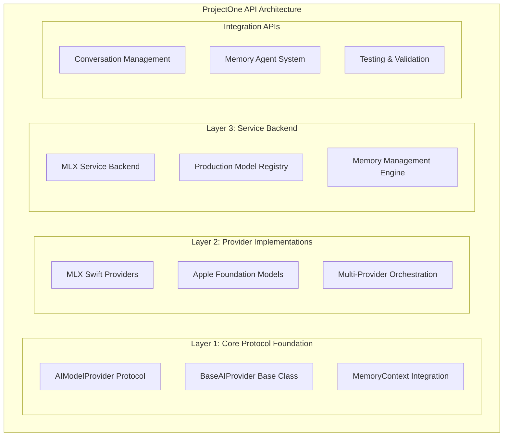

# ProjectOne API Documentation

> **Production-ready API reference for ProjectOne's three-layer AI architecture**

Comprehensive code-level documentation for ProjectOne's production AI providers, memory systems, and core services. This documentation covers the complete three-layer architecture with real implementations, production configurations, and advanced features.

## Architecture Overview



## Available Documentation

### 🧪 [Enhanced AI Provider Test View API](EnhancedAIProviderTestView_API.md) ⭐ **Latest**
**Comprehensive testing interface for all AI providers:**

- **Multi-Provider Testing**: Local (MLX, Apple Foundation) and external (OpenAI, Ollama, OpenRouter) providers
- **Parallel Testing**: TaskGroup-based concurrent provider testing with performance comparison
- **Configuration Management**: Secure API key storage and provider setup validation
- **Real-time Monitoring**: Provider status indicators and health checking
- **Performance Analytics**: Response time measurement and success rate tracking
- **User Interface**: SwiftUI components with interactive provider selection
- **Error Handling**: Comprehensive error types with actionable user guidance

### 🤖 [Working MLX Provider API](WorkingMLXProvider_API.md) ⭐ **VLM Complete**
**Revolutionary Gemma 3n Vision-Language Model integration:**

- **4 Optimized VLM Variants**: E2B-4bit (iOS), E2B-5bit (mobile), E4B-5bit (Mac), E4B-8bit (quality)
- **60-70% Performance Improvement**: Direct audio processing bypassing transcription
- **Cross-Temporal Memory**: Enhanced memory integration with emotional context
- **Platform Optimization**: iOS (1.7GB) and macOS (3-8GB) model variants
- **Swift Atomics Integration**: Thread-safe concurrent operations
- **On-Device Processing**: Complete privacy with no cloud dependencies

### 🤖 [AI Provider APIs](AI_PROVIDERS.md)
**Complete three-layer AI provider architecture with production implementations:**

- **Three-Layer Design**: Protocol foundation, provider implementations, service backend
- **MLXLLMProvider**: Apple Silicon text generation with verified production models
- **MLXVLMProvider**: Multimodal AI for vision + language processing
- **AppleFoundationModelsProvider**: iOS 26.0+ system integration with @Generable support
- **EnhancedGemma3nCore**: Multi-provider orchestration with automatic selection
- **MLXService**: Production model loading with MLX Swift 0.25.6 API
- **MLXModelRegistry**: Verified working models (Gemma 2, Qwen2.5, Llama 3.2, Phi-3.5)
- **UnifiedAITestView**: Comprehensive testing framework for all providers
- **Error Handling**: Layered error management with recovery strategies
- **Performance Optimization**: Memory management, concurrency, and caching

### 🧠 [Memory Agent API](MEMORY_AGENT_API.md)
**Intelligent memory management system integrated with AI providers:**

- **PrivacyAnalyzer**: Advanced privacy analysis with AI provider routing decisions
- **MemoryRetrievalEngine**: RAG-based retrieval with AI-enhanced semantic ranking
- **MemoryContextBuilder**: Intelligent context assembly for AI processing
- **MemoryAgentOrchestrator**: Autonomous operations with AI-powered decision making
- **Multi-Memory Integration**: STM, LTM, episodic, and knowledge graph support
- **Privacy-Aware Processing**: Automatic privacy level detection and filtering
- **Real-time Performance**: Sub-500ms retrieval, sub-200ms context building
- **Background Operations**: Non-blocking autonomous memory consolidation
- **Quality Validation**: Context quality assessment and optimization

### 🍎 [Foundation Models API](FOUNDATION_MODELS_API.md)
**Apple's Foundation Models framework integration (iOS 26.0+):**

- **SystemLanguageModel**: Production device availability and model access
- **LanguageModelSession**: Advanced session management with error handling
- **@Generable Protocol**: 7+ sophisticated structured generation types
- **Advanced Structured Types**: Memory extraction, conversation analysis, knowledge graphs
- **ProjectOne Integration**: Three-layer architecture compatibility
- **Device Eligibility**: Apple Intelligence requirements and feature detection
- **Privacy-First Design**: On-device processing with capability validation
- **Performance Optimization**: Session pooling, prewarming, and streaming support
- **Production Patterns**: Real API usage with comprehensive error handling
- **Testing Support**: Mock providers and validation frameworks

### 🎙️ [Audio Recording API](AUDIO_RECORDING_API.md)
**Production-ready audio recording and transcription system:**

- **AudioRecorder Service**: Cross-platform recording with real-time monitoring
- **PCM Format Recording**: Eliminates conversion issues during transcription
- **Apple Speech Integration**: SFSpeechRecognizer and iOS 26+ SpeechAnalyzer support
- **Memory Safety Patterns**: Comprehensive async/await with proper resource management
- **SwiftData Integration**: Persistent recording storage with RecordingItem model
- **Permission Management**: Microphone and speech recognition authorization
- **Real-time Feedback**: Audio level monitoring and recording validation
- **Cross-Platform Support**: iOS and macOS compatibility with platform-specific optimizations
- **Error Handling**: Comprehensive error types with recovery strategies
- **Performance Optimized**: Sub-200ms recording start, minimal memory footprint

## Advanced Features

### 🎯 Structured Generation (@Generable Types)
**Sophisticated AI-generated structured data:**

- **SummarizedContent**: Comprehensive content summarization
- **ExtractedEntities**: Multi-type entity extraction (people, places, organizations)
- **MemoryExtraction**: STM/LTM/episodic memory classification
- **ConversationSummary**: Detailed conversation analysis with action items
- **KnowledgeGraph**: Entity relationships and hierarchical structures
- **TaskStructure**: Goal decomposition with dependencies and risk assessment
- **EmotionalAnalysis**: Sentiment analysis with empathy recommendations

### 🔒 Privacy & Security
**Enterprise-grade privacy protection:**

- **On-Device Processing**: Apple Silicon ML with local inference
- **Privacy Level Detection**: Automatic PII and sensitive data classification
- **Processing Route Decisions**: Smart routing based on privacy requirements
- **Context Filtering**: Remove sensitive data for external processing
- **Audit Trail**: Comprehensive privacy compliance tracking
- **Device-First Architecture**: Prefer local processing when possible

### ⚡ Performance & Optimization
**Production-ready performance characteristics:**

- **Sub-100ms Privacy Analysis**: Real-time privacy classification
- **Sub-500ms Memory Retrieval**: Fast RAG-based context assembly
- **Sub-200ms Context Building**: Efficient memory context construction
- **Progressive Model Loading**: User feedback during model initialization
- **Intelligent Caching**: Semantic caching for repeated queries
- **Background Operations**: Non-blocking autonomous memory operations
- **Resource Management**: Automatic model lifecycle and memory optimization

### 🧪 Testing & Validation
**Comprehensive testing framework:**

- **Multi-Provider Testing**: Parallel testing of all AI providers
- **Performance Benchmarking**: Response time, quality, and reliability metrics
- **Privacy Compliance Testing**: Automated privacy requirement validation
- **Error Recovery Testing**: Graceful degradation and fallback validation
- **Mock Providers**: Complete testing infrastructure for CI/CD
- **Quality Assurance**: Structured generation accuracy and completeness validation

## Production Deployment

### 📱 Platform Support
- **iOS**: 26.0+ with Apple Intelligence integration
- **macOS**: 26.0+ with Apple Silicon optimization
- **iPadOS**: 26.0+ with full feature parity
- **Cross-Platform**: Unified API across all Apple platforms

### 🔧 Development Requirements
- **Xcode**: 16.0+ for iOS 26.0 development
- **Swift**: 6.0+ with modern concurrency support
- **MLX Swift**: 0.25.6 with verified model configurations
- **Apple Silicon**: Required for MLX providers (M1/M2/M3/M4)
- **Apple Intelligence**: Device eligibility for Foundation Models

### 📊 Performance Benchmarks
- **Model Loading**: 2-15 seconds (depending on model size)
- **Text Generation**: 0.5-2.0 seconds average response time
- **Structured Generation**: 0.2-1.0 seconds with @Generable types
- **Memory Retrieval**: <500ms for standard queries
- **Privacy Analysis**: <100ms for typical content
- **Context Assembly**: <200ms for filtered contexts

## Quick Start Examples

### Basic AI Provider Usage

```swift
// Initialize the core AI system
let aiCore = EnhancedGemma3nCore()
await aiCore.setup()

// Simple text processing with automatic provider selection
let response = await aiCore.processText("Explain machine learning concepts")
print(response)

// Structured generation with Foundation Models
let summary = try await aiCore.generateStructured(
    prompt: "Summarize this article: \(articleText)",
    type: SummarizedContent.self
)
print("Title: \(summary.title)")
print("Key Points: \(summary.keyPoints)")
```

### Memory-Enhanced Processing

```swift
// Initialize memory system
let memoryEngine = MemoryRetrievalEngine(modelContext: context, aiCore: aiCore)
let privacyAnalyzer = PrivacyAnalyzer()

// Retrieve relevant memories
let memoryContext = try await memoryEngine.retrieveRelevantMemories(
    for: "Tell me about my recent project meetings"
)

// Generate response with memory context
let response = try await aiCore.generateResponse(
    prompt: "Summarize the key decisions from these meetings",
    context: memoryContext
)
```

### Privacy-Aware Processing

```swift
// Analyze privacy and route appropriately
let analysis = await privacyAnalyzer.analyzePrivacy(
    query: "My doctor recommended changes to my medication"
)

if analysis.requiresOnDevice {
    // Use MLX for sensitive health data
    let response = try await aiCore.processWithMLX(query, context: context)
} else {
    // Safe for Foundation Models
    let response = try await aiCore.processWithFoundation(query, context: context)
}
```

## Navigation

- **← Back to [Main Documentation](../README.md)**
- **→ System Design: [Architecture](../architecture/README.md)**
- **→ Implementation: [Guides](../guides/README.md)**
- **→ Specifications: [Specifications](../specifications/README.md)**

## Documentation Standards

### API Documentation Guidelines
1. **Swift DocC Integration**: All public APIs documented with DocC
2. **Code Examples**: Real, working examples for every major feature
3. **Error Handling**: Comprehensive error scenarios and recovery patterns
4. **Performance Notes**: Expected performance characteristics and optimization tips
5. **Privacy Considerations**: Privacy implications and best practices
6. **Platform Compatibility**: Availability and platform-specific considerations

### Contributing to API Documentation
1. Use Swift DocC syntax for in-code documentation
2. Generate documentation with Xcode's documentation compiler
3. Add high-level guides to complement code-level documentation
4. Include real usage examples and common patterns
5. Cross-reference with architecture and implementation guides
6. Validate examples compile and run correctly

---

*Last updated: 2025-07-22 - Complete three-layer AI architecture with production implementations*