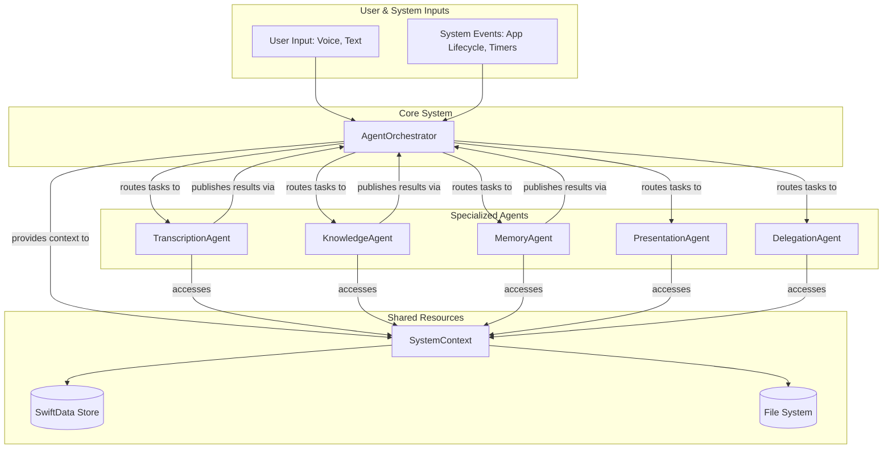

# ADR-004: Agent-Centric Architecture

**Status**: Proposed
**Date**: 2025-07-16

## Context

The current architecture, while well-documented, centralizes a significant amount of logic within the `Gemma3nCore` component. This monolithic approach, responsible for coordinating transcription, knowledge graph management, and memory systems, presents challenges for future scalability, testability, and focused development. As the system's capabilities grow, this central component could become a bottleneck and a source of high complexity.

The project's goal is to build a sophisticated, multi-faceted AI system. A more modular, decoupled architecture is needed to manage this complexity effectively.

## Decision

We will refactor the system to an **agent-centric architecture**.

This new architecture will be composed of three primary components:
1.  **`Agent` Protocol**: A standardized contract for all specialized, autonomous agents.
2.  **`AgentOrchestrator`**: A lightweight central coordinator that routes tasks and events to the appropriate agents. It replaces the monolithic logic of `Gemma3nCore`.
3.  **`SystemContext`**: A shared, read-only container providing agents with safe access to system-wide resources like data stores and file systems.

This shifts the system from a hierarchical command structure to a collaborative ecosystem of expert agents.

## Architecture Details

### High-Level Flow



### Core Protocols and Classes

#### 1. Agent Protocol Definition

All agents will conform to this protocol, ensuring a standardized interface for the orchestrator.

```swift
import Combine

/// A specific type of input or event an agent can handle.
enum AgentTask {
    case audioReceived(url: URL)
    case textReceived(string: String)
    case noteProcessed(note: ProcessedNote)
    case systemConsolidationTick
    case userQuery(query: String)
}

/// The result of an agent's operation, published back to the orchestrator.
enum AgentResult {
    case success(message: String)
    case failure(error: Error)
    case newNote(note: ProcessedNote)
    case knowledgeUpdate(entities: [Entity], relationships: [Relationship])
}

/// The core protocol for all specialized agents.
protocol Agent: AnyObject {
    /// A unique identifier for the agent.
    var id: UUID { get }
    
    /// A human-readable name for debugging and management.
    var name: String { get }
    
    /// The orchestrator uses this to determine which agent should handle a task.
    func canHandle(task: AgentTask) -> Bool
    
    /// Executes the given task.
    /// - Parameters:
    ///   - task: The task to perform.
    ///   - context: Provides access to shared system resources.
    ///   - publisher: A subject to publish results back to the orchestrator.
    func execute(task: AgentTask, context: SystemContext, publisher: PassthroughSubject<AgentResult, Never>) async
}
```

#### 2. Agent Orchestrator

The new lightweight center of the application.

```swift
import Combine

class AgentOrchestrator: ObservableObject {
    private var agents: [Agent] = []
    private let systemContext: SystemContext
    private let resultsPublisher = PassthroughSubject<AgentResult, Never>()
    private var cancellables = Set<AnyCancellable>()

    init() {
        self.systemContext = SystemContext() // Initialize shared resources
        self.registerAgents()
        self.listenForResults()
    }

    private func registerAgents() {
        agents = [
            TranscriptionAgent(),
            KnowledgeAgent(),
            MemoryAgent(),
            // Future agents will be registered here
        ]
    }
    
    /// The main entry point for all inputs into the system.
    func submit(task: AgentTask) {
        let capableAgents = agents.filter { $0.canHandle(task: task) }
        for agent in capableAgents {
            Task {
                await agent.execute(task: task, context: systemContext, publisher: resultsPublisher)
            }
        }
    }
    
    private func listenForResults() {
        resultsPublisher
            .sink { [weak self] result in
                // Chain tasks based on agent results.
                // e.g., a new note from TranscriptionAgent triggers the KnowledgeAgent.
                switch result {
                case .newNote(let note):
                    self?.submit(task: .noteProcessed(note: note))
                default:
                    break // Handle other results
                }
            }
            .store(in: &cancellables)
    }
}
```

### Mapping of Existing Services to Agents

-   **`TranscriptionEngine`** logic moves to `TranscriptionAgent`.
-   **`KnowledgeGraphService`** logic moves to `KnowledgeAgent`.
-   **`MemoryConsolidationEngine`** logic moves to `MemoryAgent`.
-   **UI-facing logic** can be handled by a `PresentationAgent`.
-   **External API calls** can be handled by a `DelegationAgent`.

## Consequences

### Positive
-   **Improved Modularity**: Logic is encapsulated within independent agents, reducing coupling.
-   **Enhanced Testability**: Each agent can be tested in isolation with a mock `SystemContext`.
-   **Reduced Complexity**: Developers can focus on a single agent's domain without needing to understand the entire system.
-   **Greater Extensibility**: Adding new functionality becomes a matter of creating a new agent and registering it, rather than modifying a large central class.
-   **Clearer Data Flow**: The publish/subscribe model between agents and the orchestrator makes the flow of data and control explicit.

### Negative
-   **Initial Refactoring Effort**: Migrating the existing logic from services to agents will require a significant one-time effort.
-   **Potential for Messaging Overhead**: Communication between agents is indirect (via the orchestrator), which can be slightly less performant than direct calls, though this is unlikely to be a bottleneck.

This architectural shift provides a more robust, scalable, and maintainable foundation for the project's long-term vision.
