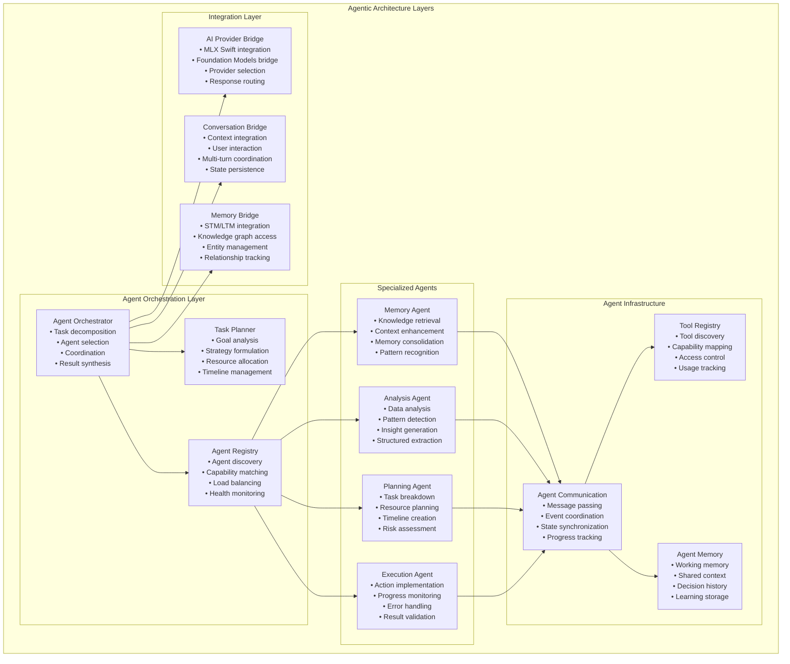

# Agentic Architecture Patterns

## Executive Summary

ProjectOne implements sophisticated **Agentic Architecture Patterns** that transform the system from a simple AI assistant into an intelligent, autonomous agent capable of proactive reasoning, multi-step task execution, and adaptive behavior. The architecture supports goal-oriented planning, tool usage, memory-driven decision making, and emergent intelligence through structured agent interactions.

**Key Capabilities:**
- **Autonomous Reasoning**: Goal-oriented planning and execution
- **Tool Integration**: Dynamic tool selection and usage
- **Memory-Driven Decisions**: Context-aware agent behavior
- **Multi-Agent Coordination**: Specialized agents working together
- **Emergent Intelligence**: Complex behaviors from simple agent interactions
- **Privacy-First Agency**: All agent operations happen on-device

## Architecture Overview



## Core Agent Patterns

### 1. Agent Base Architecture

Foundation for all specialized agents:

```swift
/// Protocol defining core agent capabilities
public protocol Agent: AnyObject {
    
    // MARK: - Identity & Capabilities
    var agentId: UUID { get }
    var name: String { get }
    var description: String { get }
    var capabilities: Set<AgentCapability> { get }
    var currentStatus: AgentStatus { get }
    
    // MARK: - Core Operations
    func canHandle(task: AgentTask) -> Bool
    func execute(task: AgentTask, context: AgentContext) async throws -> AgentResult
    func initialize() async throws
    func shutdown() async
    
    // MARK: - Communication
    func sendMessage(_ message: AgentMessage, to recipient: UUID) async throws
    func receiveMessage(_ message: AgentMessage) async throws
    
    // MARK: - Learning & Adaptation
    func learn(from result: AgentResult, context: AgentContext) async
    func adapt(to feedback: AgentFeedback) async
}

/// Base implementation providing common agent infrastructure
public class BaseAgent: Agent, ObservableObject {
    
    // MARK: - Agent Identity
    public let agentId = UUID()
    public let name: String
    public let description: String
    public let capabilities: Set<AgentCapability>
    
    // MARK: - Agent State
    @Published public private(set) var currentStatus: AgentStatus = .idle
    @Published public private(set) var currentTask: AgentTask?
    @Published public private(set) var workingMemory: [String: Any] = [:]
    @Published public private(set) var performanceMetrics: AgentMetrics
    
    // MARK: - Infrastructure
    private let logger: Logger
    private let communicationManager: AgentCommunicationManager
    private let toolRegistry: ToolRegistry
    private let memoryManager: AgentMemoryManager
    
    // MARK: - Initialization
    
    public init(
        name: String,
        description: String,
        capabilities: Set<AgentCapability>,
        communicationManager: AgentCommunicationManager,
        toolRegistry: ToolRegistry,
        memoryManager: AgentMemoryManager
    ) {
        self.name = name
        self.description = description
        self.capabilities = capabilities
        self.communicationManager = communicationManager
        self.toolRegistry = toolRegistry
        self.memoryManager = memoryManager
        self.performanceMetrics = AgentMetrics()
        self.logger = Logger(subsystem: "com.jaredlikes.ProjectOne", category: "Agent.\(name)")
        
        // Register for communication
        Task {
            await communicationManager.register(agent: self)
        }
    }
    
    // MARK: - Task Execution Framework
    
    public func execute(task: AgentTask, context: AgentContext) async throws -> AgentResult {
        logger.info("Executing task: \(task.title)")
        
        await updateStatus(.working)
        currentTask = task
        
        let startTime = Date()
        
        do {
            // Pre-execution setup
            try await setupExecution(task: task, context: context)
            
            // Core execution (implemented by subclasses)
            let result = try await performExecution(task: task, context: context)
            
            // Post-execution cleanup and learning
            await finalizeExecution(task: task, result: result, context: context)
            
            // Update metrics
            let executionTime = Date().timeIntervalSince(startTime)
            await updateMetrics(executionTime: executionTime, success: true)
            
            await updateStatus(.idle)
            currentTask = nil
            
            return result
            
        } catch {
            let executionTime = Date().timeIntervalSince(startTime)
            await updateMetrics(executionTime: executionTime, success: false)
            
            await updateStatus(.error)
            
            logger.error("Task execution failed: \(error.localizedDescription)")
            throw AgentError.executionFailed(error.localizedDescription)
        }
    }
    
    // MARK: - Abstract Methods (Override in Subclasses)
    
    /// Core execution logic - must be implemented by subclasses
    open func performExecution(task: AgentTask, context: AgentContext) async throws -> AgentResult {
        throw AgentError.notImplemented("performExecution must be implemented by subclass")
    }
    
    /// Task capability assessment - can be overridden for custom logic
    open func canHandle(task: AgentTask) -> Bool {
        return capabilities.contains { capability in
            task.requiredCapabilities.contains(capability)
        }
    }
    
    // MARK: - Communication
    
    public func sendMessage(_ message: AgentMessage, to recipient: UUID) async throws {
        try await communicationManager.sendMessage(message, from: agentId, to: recipient)
    }
    
    public func receiveMessage(_ message: AgentMessage) async throws {
        await processIncomingMessage(message)
    }
    
    // MARK: - Learning & Adaptation
    
    public func learn(from result: AgentResult, context: AgentContext) async {
        // Store successful patterns
        if result.success {
            await memoryManager.storeSuccessPattern(
                agentId: agentId,
                task: currentTask,
                context: context,
                result: result
            )
        }
        
        // Extract learning insights
        await extractLearningInsights(from: result, context: context)
    }
    
    public func adapt(to feedback: AgentFeedback) async {
        logger.info("Adapting to feedback: \(feedback.type)")
        
        switch feedback.type {
        case .performance:
            await adaptPerformance(feedback: feedback)
        case .quality:
            await adaptQuality(feedback: feedback)
        case .efficiency:
            await adaptEfficiency(feedback: feedback)
        case .userSatisfaction:
            await adaptUserExperience(feedback: feedback)
        }
    }
    
    // MARK: - Private Implementation
    
    private func setupExecution(task: AgentTask, context: AgentContext) async throws {
        // Load relevant memories
        let relevantMemories = await memoryManager.retrieveRelevantMemories(
            for: task,
            agentId: agentId
        )
        
        // Setup working memory
        workingMemory = [
            "task": task,
            "context": context,
            "memories": relevantMemories,
            "startTime": Date()
        ]
        
        // Validate required tools are available
        for tool in task.requiredTools {
            guard await toolRegistry.isAvailable(tool) else {
                throw AgentError.toolUnavailable(tool)
            }
        }
    }
    
    private func finalizeExecution(task: AgentTask, result: AgentResult, context: AgentContext) async {
        // Learn from execution
        await learn(from: result, context: context)
        
        // Clean up working memory
        workingMemory.removeAll()
        
        // Update agent memory with execution results
        await memoryManager.storeExecutionResult(
            agentId: agentId,
            task: task,
            result: result,
            context: context
        )
    }
    
    @MainActor
    private func updateStatus(_ status: AgentStatus) {
        currentStatus = status
    }
    
    private func updateMetrics(executionTime: TimeInterval, success: Bool) async {
        await MainActor.run {
            performanceMetrics.totalExecutions += 1
            performanceMetrics.totalExecutionTime += executionTime
            performanceMetrics.averageExecutionTime = performanceMetrics.totalExecutionTime / Double(performanceMetrics.totalExecutions)
            
            if success {
                performanceMetrics.successfulExecutions += 1
            }
            
            performanceMetrics.successRate = Double(performanceMetrics.successfulExecutions) / Double(performanceMetrics.totalExecutions)
        }
    }
}
```

### 2. Specialized Agent Implementations

#### MemoryAgent - Knowledge Retrieval & Enhancement

```swift
public class MemoryAgent: BaseAgent {
    
    // MARK: - Specialized Capabilities
    private let memoryService: MemoryService
    private let knowledgeGraph: KnowledgeGraphService
    private let contextBuilder: MemoryContextBuilder
    
    public init(memoryService: MemoryService, knowledgeGraph: KnowledgeGraphService) {
        self.memoryService = memoryService
        self.knowledgeGraph = knowledgeGraph
        self.contextBuilder = MemoryContextBuilder()
        
        super.init(
            name: "Memory Agent",
            description: "Specialized agent for memory retrieval, context enhancement, and knowledge management",
            capabilities: [
                .memoryRetrieval,
                .contextEnhancement,
                .knowledgeExtraction,
                .patternRecognition,
                .memoryConsolidation
            ],
            communicationManager: AgentCommunicationManager.shared,
            toolRegistry: ToolRegistry.shared,
            memoryManager: AgentMemoryManager.shared
        )
    }
    
    // MARK: - Core Execution
    
    override func performExecution(task: AgentTask, context: AgentContext) async throws -> AgentResult {
        switch task.type {
        case .memoryRetrieval:
            return try await performMemoryRetrieval(task: task, context: context)
        case .contextEnhancement:
            return try await performContextEnhancement(task: task, context: context)
        case .knowledgeExtraction:
            return try await performKnowledgeExtraction(task: task, context: context)
        case .memoryConsolidation:
            return try await performMemoryConsolidation(task: task, context: context)
        default:
            throw AgentError.unsupportedTaskType(task.type)
        }
    }
    
    // MARK: - Memory Operations
    
    private func performMemoryRetrieval(task: AgentTask, context: AgentContext) async throws -> AgentResult {
        let query = task.parameters["query"] as? String ?? ""
        
        logger.info("Retrieving memories for query: \(query)")
        
        // Retrieve from different memory systems
        async let stmResults = memoryService.retrieveSTM(query: query, limit: 10)
        async let ltmResults = memoryService.retrieveLTM(query: query, limit: 5)
        async let episodicResults = memoryService.retrieveEpisodic(query: query, limit: 3)
        
        let (stm, ltm, episodic) = try await (stmResults, ltmResults, episodicResults)
        
        // Build comprehensive memory context
        let memoryContext = MemoryContext(
            entities: [],
            relationships: [],
            shortTermMemories: stm,
            longTermMemories: ltm,
            episodicMemories: episodic,
            relevantNotes: [],
            timestamp: Date(),
            userQuery: query,
            containsPersonalData: detectPersonalData(in: query)
        )
        
        return AgentResult(
            success: true,
            data: ["memoryContext": memoryContext],
            confidence: calculateRetrievalConfidence(stm: stm, ltm: ltm, episodic: episodic),
            executionTime: 0, // Will be set by base class
            metadata: ["totalMemories": stm.count + ltm.count + episodic.count]
        )
    }
    
    private func performContextEnhancement(task: AgentTask, context: AgentContext) async throws -> AgentResult {
        let baseContext = task.parameters["context"] as? MemoryContext
        let enhancementType = task.parameters["enhancementType"] as? String ?? "general"
        
        guard let baseContext = baseContext else {
            throw AgentError.invalidParameters("Missing base context for enhancement")
        }
        
        logger.info("Enhancing context with type: \(enhancementType)")
        
        // Enhance based on type
        let enhancedContext = try await contextBuilder.enhanceContext(
            baseContext,
            type: enhancementType,
            knowledgeGraph: knowledgeGraph
        )
        
        return AgentResult(
            success: true,
            data: ["enhancedContext": enhancedContext],
            confidence: 0.9,
            executionTime: 0,
            metadata: ["enhancementType": enhancementType]
        )
    }
    
    private func performKnowledgeExtraction(task: AgentTask, context: AgentContext) async throws -> AgentResult {
        let text = task.parameters["text"] as? String ?? ""
        let extractionTypes = task.parameters["types"] as? [String] ?? ["entities", "relationships"]
        
        logger.info("Extracting knowledge from text: \(text.prefix(50))...")
        
        var extractedData: [String: Any] = [:]
        
        // Extract different types of knowledge
        for type in extractionTypes {
            switch type {
            case "entities":
                let entities = await extractEntities(from: text)
                extractedData["entities"] = entities
            case "relationships":
                let relationships = await extractRelationships(from: text)
                extractedData["relationships"] = relationships
            case "concepts":
                let concepts = await extractConcepts(from: text)
                extractedData["concepts"] = concepts
            case "facts":
                let facts = await extractFacts(from: text)
                extractedData["facts"] = facts
            default:
                logger.warning("Unknown extraction type: \(type)")
            }
        }
        
        return AgentResult(
            success: true,
            data: extractedData,
            confidence: 0.85,
            executionTime: 0,
            metadata: ["textLength": text.count, "extractionTypes": extractionTypes]
        )
    }
    
    private func performMemoryConsolidation(task: AgentTask, context: AgentContext) async throws -> AgentResult {
        logger.info("Performing memory consolidation")
        
        // Identify STM entries ready for consolidation
        let stmEntries = await memoryService.getSTMForConsolidation()
        var consolidationResults: [String: Any] = [:]
        
        for entry in stmEntries {
            if shouldConsolidate(entry) {
                let ltmEntry = try await consolidateToLTM(entry)
                consolidationResults[entry.id.uuidString] = ltmEntry
                
                // Remove from STM
                await memoryService.removeSTMEntry(entry.id)
            }
        }
        
        return AgentResult(
            success: true,
            data: ["consolidatedEntries": consolidationResults],
            confidence: 0.95,
            executionTime: 0,
            metadata: ["processedEntries": stmEntries.count, "consolidated": consolidationResults.count]
        )
    }
    
    // MARK: - Helper Methods
    
    private func calculateRetrievalConfidence(stm: [STMEntry], ltm: [LTMEntry], episodic: [EpisodicMemoryEntry]) -> Double {
        let totalMemories = stm.count + ltm.count + episodic.count
        
        if totalMemories == 0 { return 0.0 }
        if totalMemories >= 10 { return 0.95 }
        if totalMemories >= 5 { return 0.8 }
        return 0.6
    }
    
    private func detectPersonalData(in query: String) -> Bool {
        // Implementation for personal data detection
        let personalPatterns = ["my", "I am", "my name", "personal", "private"]
        return personalPatterns.contains { pattern in
            query.lowercased().contains(pattern)
        }
    }
    
    private func shouldConsolidate(_ entry: STMEntry) -> Bool {
        // Consolidation criteria
        let age = Date().timeIntervalSince(entry.timestamp)
        let ageThreshold: TimeInterval = 24 * 60 * 60 // 24 hours
        
        return entry.importance > 0.7 && age > ageThreshold
    }
    
    private func consolidateToLTM(_ stmEntry: STMEntry) async throws -> LTMEntry {
        return LTMEntry(
            id: UUID(),
            content: stmEntry.content,
            consolidationDate: Date(),
            category: determineLTMCategory(stmEntry),
            importance: stmEntry.importance,
            consolidationLevel: .initial,
            sourceContext: "STM consolidation"
        )
    }
}
```

#### PlanningAgent - Task Decomposition & Strategy

```swift
public class PlanningAgent: BaseAgent {
    
    // MARK: - Specialized Capabilities
    private let taskAnalyzer: TaskAnalyzer
    private let resourceManager: ResourceManager
    private let strategyGenerator: StrategyGenerator
    
    public init() {
        self.taskAnalyzer = TaskAnalyzer()
        self.resourceManager = ResourceManager()
        self.strategyGenerator = StrategyGenerator()
        
        super.init(
            name: "Planning Agent",
            description: "Specialized agent for task decomposition, resource planning, and strategy formulation",
            capabilities: [
                .taskDecomposition,
                .resourcePlanning,
                .strategyFormulation,
                .riskAssessment,
                .timelineCreation
            ],
            communicationManager: AgentCommunicationManager.shared,
            toolRegistry: ToolRegistry.shared,
            memoryManager: AgentMemoryManager.shared
        )
    }
    
    override func performExecution(task: AgentTask, context: AgentContext) async throws -> AgentResult {
        switch task.type {
        case .taskDecomposition:
            return try await performTaskDecomposition(task: task, context: context)
        case .resourcePlanning:
            return try await performResourcePlanning(task: task, context: context)
        case .strategyFormulation:
            return try await performStrategyFormulation(task: task, context: context)
        case .riskAssessment:
            return try await performRiskAssessment(task: task, context: context)
        default:
            throw AgentError.unsupportedTaskType(task.type)
        }
    }
    
    // MARK: - Planning Operations
    
    private func performTaskDecomposition(task: AgentTask, context: AgentContext) async throws -> AgentResult {
        let goalDescription = task.parameters["goal"] as? String ?? ""
        let complexity = task.parameters["complexity"] as? String ?? "medium"
        
        logger.info("Decomposing task: \(goalDescription)")
        
        // Analyze the goal
        let analysis = await taskAnalyzer.analyze(goal: goalDescription, complexity: complexity)
        
        // Generate subtasks
        let subtasks = await generateSubtasks(from: analysis)
        
        // Create dependency graph
        let dependencies = await createDependencyGraph(for: subtasks)
        
        // Estimate timelines
        let timeline = await createTimeline(for: subtasks, dependencies: dependencies)
        
        let taskStructure = TaskStructure(
            primaryGoal: goalDescription,
            successCriteria: analysis.successCriteria,
            dependencies: dependencies.map { $0.description },
            subtasks: subtasks,
            requiredResources: analysis.requiredResources,
            estimatedDuration: timeline.totalDuration,
            riskFactors: analysis.riskFactors
        )
        
        return AgentResult(
            success: true,
            data: ["taskStructure": taskStructure],
            confidence: 0.88,
            executionTime: 0,
            metadata: [
                "subtaskCount": subtasks.count,
                "complexity": complexity,
                "estimatedHours": timeline.totalHours
            ]
        )
    }
    
    private func performResourcePlanning(task: AgentTask, context: AgentContext) async throws -> AgentResult {
        let requiredResources = task.parameters["requiredResources"] as? [String] ?? []
        let constraints = task.parameters["constraints"] as? [String: Any] ?? [:]
        
        logger.info("Planning resources for \(requiredResources.count) requirements")
        
        // Check resource availability
        var resourcePlan: [String: ResourceAllocation] = [:]
        
        for resource in requiredResources {
            let availability = await resourceManager.checkAvailability(resource)
            let allocation = await resourceManager.planAllocation(
                resource: resource,
                availability: availability,
                constraints: constraints
            )
            resourcePlan[resource] = allocation
        }
        
        // Identify conflicts and alternatives
        let conflicts = await identifyResourceConflicts(plan: resourcePlan)
        let alternatives = await generateResourceAlternatives(for: conflicts)
        
        return AgentResult(
            success: true,
            data: [
                "resourcePlan": resourcePlan,
                "conflicts": conflicts,
                "alternatives": alternatives
            ],
            confidence: 0.85,
            executionTime: 0,
            metadata: ["resourceCount": requiredResources.count, "conflictCount": conflicts.count]
        )
    }
    
    private func performStrategyFormulation(task: AgentTask, context: AgentContext) async throws -> AgentResult {
        let goal = task.parameters["goal"] as? String ?? ""
        let constraints = task.parameters["constraints"] as? [String] ?? []
        let preferences = task.parameters["preferences"] as? [String: Any] ?? [:]
        
        logger.info("Formulating strategy for: \(goal)")
        
        // Generate multiple strategy options
        let strategies = await strategyGenerator.generateStrategies(
            goal: goal,
            constraints: constraints,
            preferences: preferences,
            context: context
        )
        
        // Evaluate strategies
        let evaluations = await evaluateStrategies(strategies, context: context)
        
        // Recommend best strategy
        let recommendedStrategy = selectBestStrategy(strategies: strategies, evaluations: evaluations)
        
        return AgentResult(
            success: true,
            data: [
                "strategies": strategies,
                "evaluations": evaluations,
                "recommendation": recommendedStrategy
            ],
            confidence: 0.9,
            executionTime: 0,
            metadata: ["strategyCount": strategies.count, "topScore": evaluations.values.max() ?? 0.0]
        )
    }
    
    private func performRiskAssessment(task: AgentTask, context: AgentContext) async throws -> AgentResult {
        let plan = task.parameters["plan"] as? TaskStructure
        let timeframe = task.parameters["timeframe"] as? String ?? "medium"
        
        guard let plan = plan else {
            throw AgentError.invalidParameters("Missing plan for risk assessment")
        }
        
        logger.info("Assessing risks for plan: \(plan.primaryGoal)")
        
        // Identify potential risks
        let identifiedRisks = await identifyRisks(for: plan, timeframe: timeframe)
        
        // Assess risk impact and probability
        let riskAssessments = await assessRisks(identifiedRisks)
        
        // Generate mitigation strategies
        let mitigationStrategies = await generateMitigationStrategies(for: riskAssessments)
        
        // Create risk matrix
        let riskMatrix = createRiskMatrix(assessments: riskAssessments)
        
        return AgentResult(
            success: true,
            data: [
                "identifiedRisks": identifiedRisks,
                "assessments": riskAssessments,
                "mitigationStrategies": mitigationStrategies,
                "riskMatrix": riskMatrix
            ],
            confidence: 0.92,
            executionTime: 0,
            metadata: ["riskCount": identifiedRisks.count, "highRiskCount": riskMatrix.highRiskCount]
        )
    }
}
```

### 3. Agent Orchestration

#### AgentOrchestrator - Multi-Agent Coordination

```swift
public class AgentOrchestrator: ObservableObject {
    
    // MARK: - Dependencies
    private let agentRegistry: AgentRegistry
    private let taskPlanner: TaskPlanner
    private let communicationManager: AgentCommunicationManager
    private let logger = Logger(subsystem: "com.jaredlikes.ProjectOne", category: "AgentOrchestrator")
    
    // MARK: - State
    @Published public private(set) var activeOrchestrations: [OrchestrationSession] = []
    @Published public private(set) var systemLoad: Double = 0.0
    @Published public private(set) var totalTasksCompleted: Int = 0
    
    // MARK: - Configuration
    public struct Configuration {
        let maxConcurrentOrchestrations: Int = 5
        let taskTimeoutInterval: TimeInterval = 300 // 5 minutes
        let enableLoadBalancing: Bool = true
        let enableFailover: Bool = true
        let logLevel: LogLevel = .info
    }
    
    private let configuration: Configuration
    
    // MARK: - Initialization
    
    public init(
        agentRegistry: AgentRegistry,
        taskPlanner: TaskPlanner,
        configuration: Configuration = Configuration()
    ) {
        self.agentRegistry = agentRegistry
        self.taskPlanner = taskPlanner
        self.communicationManager = AgentCommunicationManager()
        self.configuration = configuration
    }
    
    // MARK: - Orchestration
    
    /// Execute a complex task using multiple agents
    public func executeComplexTask(_ complexTask: ComplexTask) async throws -> ComplexTaskResult {
        logger.info("Starting complex task orchestration: \(complexTask.title)")
        
        // Create orchestration session
        let session = OrchestrationSession(
            sessionId: UUID(),
            complexTask: complexTask,
            startedAt: Date()
        )
        
        await MainActor.run {
            activeOrchestrations.append(session)
        }
        
        do {
            // Phase 1: Task Analysis & Decomposition
            let taskStructure = try await decomposeComplexTask(complexTask, session: session)
            
            // Phase 2: Agent Assignment & Planning
            let executionPlan = try await createExecutionPlan(taskStructure, session: session)
            
            // Phase 3: Coordinated Execution
            let executionResults = try await executeCoordinatedPlan(executionPlan, session: session)
            
            // Phase 4: Result Synthesis & Validation
            let finalResult = try await synthesizeResults(executionResults, session: session)
            
            // Update metrics
            await updateCompletionMetrics(session: session, success: true)
            
            return finalResult
            
        } catch {
            logger.error("Complex task orchestration failed: \(error.localizedDescription)")
            await updateCompletionMetrics(session: session, success: false)
            throw error
            
        } finally {
            // Clean up session
            await MainActor.run {
                activeOrchestrations.removeAll { $0.sessionId == session.sessionId }
            }
        }
    }
    
    // MARK: - Task Decomposition
    
    private func decomposeComplexTask(_ complexTask: ComplexTask, session: OrchestrationSession) async throws -> TaskStructure {
        logger.info("Decomposing complex task into manageable subtasks")
        
        // Find suitable planning agent
        let planningAgents = await agentRegistry.getAgents(withCapability: .taskDecomposition)
        guard let planningAgent = selectBestAgent(from: planningAgents, for: .taskDecomposition) else {
            throw OrchestrationError.noSuitableAgent(.taskDecomposition)
        }
        
        // Create decomposition task
        let decompositionTask = AgentTask(
            id: UUID(),
            type: .taskDecomposition,
            title: "Decompose: \(complexTask.title)",
            description: "Break down complex task into executable subtasks",
            parameters: [
                "goal": complexTask.description,
                "complexity": complexTask.complexity.rawValue,
                "constraints": complexTask.constraints,
                "timeframe": complexTask.timeframe
            ],
            requiredCapabilities: [.taskDecomposition],
            requiredTools: [],
            priority: .high,
            deadline: Date().addingTimeInterval(60) // 1 minute for planning
        )
        
        // Execute decomposition
        let context = AgentContext(
            orchestrationId: session.sessionId,
            parentTask: complexTask,
            availableResources: await gatherAvailableResources(),
            globalContext: session.workingMemory
        )
        
        let result = try await planningAgent.execute(task: decompositionTask, context: context)
        
        guard let taskStructure = result.data["taskStructure"] as? TaskStructure else {
            throw OrchestrationError.invalidResult("Task structure not found in planning result")
        }
        
        session.taskStructure = taskStructure
        return taskStructure
    }
    
    // MARK: - Execution Planning
    
    private func createExecutionPlan(_ taskStructure: TaskStructure, session: OrchestrationSession) async throws -> ExecutionPlan {
        logger.info("Creating execution plan for \(taskStructure.subtasks.count) subtasks")
        
        var assignedTasks: [AssignedTask] = []
        var executionStages: [ExecutionStage] = []
        
        // Analyze dependencies and create execution stages
        let dependencyGraph = await analyzeDependencies(taskStructure.subtasks)
        let stages = await createExecutionStages(from: dependencyGraph)
        
        for stage in stages {
            var stageAssignments: [AssignedTask] = []
            
            for subtask in stage.tasks {
                // Find suitable agent for this subtask
                let suitableAgents = await findSuitableAgents(for: subtask)
                guard let bestAgent = selectOptimalAgent(from: suitableAgents, for: subtask) else {
                    throw OrchestrationError.noSuitableAgent(.custom("No agent found for subtask: \(subtask.title)"))
                }
                
                let assignedTask = AssignedTask(
                    task: convertToAgentTask(subtask),
                    assignedAgent: bestAgent,
                    stage: stage.stageNumber,
                    dependencies: subtask.dependencies,
                    estimatedDuration: subtask.estimatedTime
                )
                
                stageAssignments.append(assignedTask)
            }
            
            executionStages.append(ExecutionStage(
                stageNumber: stage.stageNumber,
                assignedTasks: stageAssignments,
                canRunInParallel: stage.canRunInParallel,
                estimatedDuration: stage.estimatedDuration
            ))
        }
        
        let executionPlan = ExecutionPlan(
            planId: UUID(),
            taskStructure: taskStructure,
            stages: executionStages,
            totalEstimatedDuration: executionStages.reduce(0) { $0 + $1.estimatedDuration },
            createdAt: Date()
        )
        
        session.executionPlan = executionPlan
        return executionPlan
    }
    
    // MARK: - Coordinated Execution
    
    private func executeCoordinatedPlan(_ plan: ExecutionPlan, session: OrchestrationSession) async throws -> [AgentResult] {
        logger.info("Executing coordinated plan with \(plan.stages.count) stages")
        
        var allResults: [AgentResult] = []
        
        for stage in plan.stages {
            logger.info("Executing stage \(stage.stageNumber) with \(stage.assignedTasks.count) tasks")
            
            let stageResults: [AgentResult]
            
            if stage.canRunInParallel {
                // Execute tasks in parallel
                stageResults = try await executeTasksInParallel(stage.assignedTasks, session: session)
            } else {
                // Execute tasks sequentially
                stageResults = try await executeTasksSequentially(stage.assignedTasks, session: session)
            }
            
            allResults.append(contentsOf: stageResults)
            
            // Update session with intermediate results
            session.updateProgress(stageCompleted: stage.stageNumber, results: stageResults)
            
            // Check for stage failures
            let failures = stageResults.filter { !$0.success }
            if !failures.isEmpty {
                logger.warning("Stage \(stage.stageNumber) had \(failures.count) failures")
                
                if configuration.enableFailover {
                    try await handleStageFailures(failures, stage: stage, session: session)
                } else {
                    throw OrchestrationError.stageExecutionFailed(stage.stageNumber, failures.count)
                }
            }
        }
        
        return allResults
    }
    
    private func executeTasksInParallel(_ tasks: [AssignedTask], session: OrchestrationSession) async throws -> [AgentResult] {
        return try await withThrowingTaskGroup(of: AgentResult.self) { group in
            var results: [AgentResult] = []
            
            // Add all tasks to the group
            for assignedTask in tasks {
                group.addTask {
                    let context = self.createExecutionContext(for: assignedTask, session: session)
                    return try await assignedTask.assignedAgent.execute(task: assignedTask.task, context: context)
                }
            }
            
            // Collect results
            for try await result in group {
                results.append(result)
            }
            
            return results
        }
    }
    
    private func executeTasksSequentially(_ tasks: [AssignedTask], session: OrchestrationSession) async throws -> [AgentResult] {
        var results: [AgentResult] = []
        
        for assignedTask in tasks {
            let context = createExecutionContext(for: assignedTask, session: session)
            let result = try await assignedTask.assignedAgent.execute(task: assignedTask.task, context: context)
            results.append(result)
            
            // Update session with intermediate result
            session.addIntermediateResult(result, for: assignedTask)
        }
        
        return results
    }
    
    // MARK: - Result Synthesis
    
    private func synthesizeResults(_ results: [AgentResult], session: OrchestrationSession) async throws -> ComplexTaskResult {
        logger.info("Synthesizing results from \(results.count) agent executions")
        
        // Find synthesis agent
        let synthesisAgents = await agentRegistry.getAgents(withCapability: .resultSynthesis)
        guard let synthesisAgent = selectBestAgent(from: synthesisAgents, for: .resultSynthesis) else {
            // Fallback to manual synthesis
            return await performManualSynthesis(results, session: session)
        }
        
        // Create synthesis task
        let synthesisTask = AgentTask(
            id: UUID(),
            type: .resultSynthesis,
            title: "Synthesize Complex Task Results",
            description: "Combine and validate results from multiple agent executions",
            parameters: [
                "results": results,
                "originalTask": session.complexTask,
                "taskStructure": session.taskStructure as Any
            ],
            requiredCapabilities: [.resultSynthesis],
            requiredTools: [],
            priority: .high,
            deadline: Date().addingTimeInterval(120) // 2 minutes for synthesis
        )
        
        let context = AgentContext(
            orchestrationId: session.sessionId,
            parentTask: session.complexTask,
            availableResources: await gatherAvailableResources(),
            globalContext: session.workingMemory
        )
        
        let synthesisResult = try await synthesisAgent.execute(task: synthesisTask, context: context)
        
        // Extract final result
        let finalContent = synthesisResult.data["synthesizedContent"] as? String ?? ""
        let qualityMetrics = synthesisResult.data["qualityMetrics"] as? [String: Double] ?? [:]
        let recommendations = synthesisResult.data["recommendations"] as? [String] ?? []
        
        return ComplexTaskResult(
            taskId: session.complexTask.id,
            success: synthesisResult.success,
            content: finalContent,
            confidence: synthesisResult.confidence,
            totalExecutionTime: Date().timeIntervalSince(session.startedAt),
            agentResults: results,
            qualityMetrics: qualityMetrics,
            recommendations: recommendations,
            completedAt: Date()
        )
    }
    
    // MARK: - Helper Methods
    
    private func selectBestAgent(from agents: [Agent], for capability: AgentCapability) -> Agent? {
        return agents.max { agent1, agent2 in
            let score1 = calculateAgentScore(agent1, for: capability)
            let score2 = calculateAgentScore(agent2, for: capability)
            return score1 < score2
        }
    }
    
    private func calculateAgentScore(_ agent: Agent, for capability: AgentCapability) -> Double {
        // Score based on:
        // - Agent availability (30%)
        // - Performance metrics (40%)
        // - Specialization match (30%)
        
        let availabilityScore = agent.currentStatus == .idle ? 1.0 : 0.3
        let performanceScore = 0.8 // TODO: Get from agent metrics
        let specializationScore = agent.capabilities.contains(capability) ? 1.0 : 0.0
        
        return (availabilityScore * 0.3) + (performanceScore * 0.4) + (specializationScore * 0.3)
    }
    
    private func createExecutionContext(for assignedTask: AssignedTask, session: OrchestrationSession) -> AgentContext {
        return AgentContext(
            orchestrationId: session.sessionId,
            parentTask: session.complexTask,
            availableResources: [:], // TODO: Implement resource tracking
            globalContext: session.workingMemory
        )
    }
    
    private func updateCompletionMetrics(session: OrchestrationSession, success: Bool) async {
        await MainActor.run {
            if success {
                totalTasksCompleted += 1
            }
            
            // Update system load
            let activeSessionCount = activeOrchestrations.count
            systemLoad = Double(activeSessionCount) / Double(configuration.maxConcurrentOrchestrations)
        }
    }
}
```

## Supporting Data Structures

### Core Agent Types

```swift
// MARK: - Agent Core Types

public enum AgentCapability: String, CaseIterable, Hashable {
    // Memory & Knowledge
    case memoryRetrieval = "memory_retrieval"
    case contextEnhancement = "context_enhancement" 
    case knowledgeExtraction = "knowledge_extraction"
    case patternRecognition = "pattern_recognition"
    case memoryConsolidation = "memory_consolidation"
    
    // Planning & Strategy
    case taskDecomposition = "task_decomposition"
    case resourcePlanning = "resource_planning"
    case strategyFormulation = "strategy_formulation"
    case riskAssessment = "risk_assessment"
    case timelineCreation = "timeline_creation"
    
    // Analysis & Processing
    case dataAnalysis = "data_analysis"
    case patternDetection = "pattern_detection"
    case insightGeneration = "insight_generation"
    case structuredExtraction = "structured_extraction"
    case qualityAssessment = "quality_assessment"
    
    // Execution & Coordination
    case taskExecution = "task_execution"
    case progressMonitoring = "progress_monitoring"
    case errorHandling = "error_handling"
    case resultValidation = "result_validation"
    case agentCoordination = "agent_coordination"
    
    // Communication & Synthesis
    case messageRouting = "message_routing"
    case eventCoordination = "event_coordination"
    case resultSynthesis = "result_synthesis"
    case reportGeneration = "report_generation"
    case conversationManagement = "conversation_management"
}

public enum AgentStatus: String, CaseIterable {
    case idle = "idle"
    case initializing = "initializing"
    case working = "working"
    case waiting = "waiting"
    case error = "error"
    case maintenance = "maintenance"
    case shutdown = "shutdown"
}

public struct AgentTask {
    public let id: UUID
    public let type: AgentTaskType
    public let title: String
    public let description: String
    public let parameters: [String: Any]
    public let requiredCapabilities: Set<AgentCapability>
    public let requiredTools: [String]
    public let priority: TaskPriority
    public let deadline: Date?
    public let createdAt: Date
    
    public enum TaskPriority: Int, CaseIterable {
        case low = 1
        case medium = 2
        case high = 3
        case urgent = 4
        case critical = 5
    }
}

public enum AgentTaskType: String, CaseIterable {
    case memoryRetrieval = "memory_retrieval"
    case contextEnhancement = "context_enhancement"
    case knowledgeExtraction = "knowledge_extraction"
    case taskDecomposition = "task_decomposition"
    case resourcePlanning = "resource_planning"
    case strategyFormulation = "strategy_formulation"
    case riskAssessment = "risk_assessment"
    case dataAnalysis = "data_analysis"
    case taskExecution = "task_execution"
    case resultSynthesis = "result_synthesis"
    case qualityAssessment = "quality_assessment"
    case reportGeneration = "report_generation"
}

public struct AgentResult {
    public let success: Bool
    public let data: [String: Any]
    public let confidence: Double
    public let executionTime: TimeInterval
    public let metadata: [String: Any]
    public let error: Error?
    
    public init(
        success: Bool,
        data: [String: Any] = [:],
        confidence: Double = 1.0,
        executionTime: TimeInterval = 0.0,
        metadata: [String: Any] = [:],
        error: Error? = nil
    ) {
        self.success = success
        self.data = data
        self.confidence = confidence
        self.executionTime = executionTime
        self.metadata = metadata
        self.error = error
    }
}

public struct AgentContext {
    public let orchestrationId: UUID?
    public let parentTask: Any?
    public let availableResources: [String: Any]
    public let globalContext: [String: Any]
    public let timestamp: Date
    
    public init(
        orchestrationId: UUID? = nil,
        parentTask: Any? = nil,
        availableResources: [String: Any] = [:],
        globalContext: [String: Any] = [:]
    ) {
        self.orchestrationId = orchestrationId
        self.parentTask = parentTask
        self.availableResources = availableResources
        self.globalContext = globalContext
        self.timestamp = Date()
    }
}

public struct AgentMetrics {
    public var totalExecutions: Int = 0
    public var successfulExecutions: Int = 0
    public var totalExecutionTime: TimeInterval = 0.0
    public var averageExecutionTime: TimeInterval = 0.0
    public var successRate: Double = 0.0
    public var lastExecutionAt: Date?
    public var performanceScore: Double = 0.0
}
```

### Complex Task Management

```swift
// MARK: - Complex Task Types

public struct ComplexTask {
    public let id: UUID
    public let title: String
    public let description: String
    public let complexity: TaskComplexity
    public let constraints: [String]
    public let timeframe: String
    public let successCriteria: [String]
    public let requiredCapabilities: Set<AgentCapability>
    public let createdAt: Date
    
    public enum TaskComplexity: String, CaseIterable {
        case simple = "simple"
        case moderate = "moderate"
        case complex = "complex"
        case veryComplex = "very_complex"
    }
}

public struct ComplexTaskResult {
    public let taskId: UUID
    public let success: Bool
    public let content: String
    public let confidence: Double
    public let totalExecutionTime: TimeInterval
    public let agentResults: [AgentResult]
    public let qualityMetrics: [String: Double]
    public let recommendations: [String]
    public let completedAt: Date
}

public class OrchestrationSession: ObservableObject, Identifiable {
    public let id = UUID()
    public let sessionId: UUID
    public let complexTask: ComplexTask
    public let startedAt: Date
    
    @Published public var taskStructure: TaskStructure?
    @Published public var executionPlan: ExecutionPlan?
    @Published public var currentStage: Int = 0
    @Published public var progress: Double = 0.0
    @Published public var workingMemory: [String: Any] = [:]
    @Published public var intermediateResults: [AgentResult] = []
    
    public init(sessionId: UUID, complexTask: ComplexTask, startedAt: Date) {
        self.sessionId = sessionId
        self.complexTask = complexTask
        self.startedAt = startedAt
    }
    
    public func updateProgress(stageCompleted: Int, results: [AgentResult]) {
        currentStage = stageCompleted
        intermediateResults.append(contentsOf: results)
        
        // Calculate progress based on completed stages
        if let plan = executionPlan {
            progress = Double(stageCompleted) / Double(plan.stages.count)
        }
    }
    
    public func addIntermediateResult(_ result: AgentResult, for task: AssignedTask) {
        intermediateResults.append(result)
        workingMemory["result_\(task.task.id.uuidString)"] = result
    }
}

public struct ExecutionPlan {
    public let planId: UUID
    public let taskStructure: TaskStructure
    public let stages: [ExecutionStage]
    public let totalEstimatedDuration: TimeInterval
    public let createdAt: Date
}

public struct ExecutionStage {
    public let stageNumber: Int
    public let assignedTasks: [AssignedTask]
    public let canRunInParallel: Bool
    public let estimatedDuration: TimeInterval
    public let dependencies: [UUID]
    
    public init(
        stageNumber: Int,
        assignedTasks: [AssignedTask],
        canRunInParallel: Bool,
        estimatedDuration: TimeInterval,
        dependencies: [UUID] = []
    ) {
        self.stageNumber = stageNumber
        self.assignedTasks = assignedTasks
        self.canRunInParallel = canRunInParallel
        self.estimatedDuration = estimatedDuration
        self.dependencies = dependencies
    }
}

public struct AssignedTask {
    public let task: AgentTask
    public let assignedAgent: Agent
    public let stage: Int
    public let dependencies: [String]
    public let estimatedDuration: String
    public let assignedAt: Date
    
    public init(
        task: AgentTask,
        assignedAgent: Agent,
        stage: Int,
        dependencies: [String],
        estimatedDuration: String
    ) {
        self.task = task
        self.assignedAgent = assignedAgent
        self.stage = stage
        self.dependencies = dependencies
        self.estimatedDuration = estimatedDuration
        self.assignedAt = Date()
    }
}
```

## Error Handling

```swift
// MARK: - Agent Errors

public enum AgentError: Error, LocalizedError {
    case notImplemented(String)
    case executionFailed(String)
    case invalidParameters(String)
    case toolUnavailable(String)
    case communicationFailed(String)
    case memoryAccessFailed(String)
    case timeoutExceeded(TimeInterval)
    case capabilityMismatch([AgentCapability])
    case resourceUnavailable(String)
    case unsupportedTaskType(AgentTaskType)
    
    public var errorDescription: String? {
        switch self {
        case .notImplemented(let method):
            return "Method not implemented: \(method)"
        case .executionFailed(let reason):
            return "Agent execution failed: \(reason)"
        case .invalidParameters(let reason):
            return "Invalid parameters: \(reason)"
        case .toolUnavailable(let tool):
            return "Required tool unavailable: \(tool)"
        case .communicationFailed(let reason):
            return "Agent communication failed: \(reason)"
        case .memoryAccessFailed(let reason):
            return "Memory access failed: \(reason)"
        case .timeoutExceeded(let duration):
            return "Operation timed out after \(duration) seconds"
        case .capabilityMismatch(let required):
            return "Agent lacks required capabilities: \(required.map { $0.rawValue }.joined(separator: ", "))"
        case .resourceUnavailable(let resource):
            return "Required resource unavailable: \(resource)"
        case .unsupportedTaskType(let type):
            return "Unsupported task type: \(type.rawValue)"
        }
    }
}

public enum OrchestrationError: Error, LocalizedError {
    case noSuitableAgent(AgentCapability)
    case invalidResult(String)
    case stageExecutionFailed(Int, Int)
    case planningFailed(String)
    case synthesisTimeout(TimeInterval)
    case dependencyViolation(String)
    case resourceConflict(String)
    case maxConcurrencyExceeded(Int)
    
    public var errorDescription: String? {
        switch self {
        case .noSuitableAgent(let capability):
            return "No suitable agent found for capability: \(capability.rawValue)"
        case .invalidResult(let reason):
            return "Invalid orchestration result: \(reason)"
        case .stageExecutionFailed(let stage, let failures):
            return "Stage \(stage) execution failed with \(failures) failures"
        case .planningFailed(let reason):
            return "Execution planning failed: \(reason)"
        case .synthesisTimeout(let duration):
            return "Result synthesis timed out after \(duration) seconds"
        case .dependencyViolation(let reason):
            return "Task dependency violation: \(reason)"
        case .resourceConflict(let resource):
            return "Resource conflict detected: \(resource)"
        case .maxConcurrencyExceeded(let limit):
            return "Maximum concurrency exceeded: \(limit)"
        }
    }
}
```

## Usage Examples

### Simple Agent Task Execution

```swift
// Create memory agent
let memoryAgent = MemoryAgent(
    memoryService: MemoryService(),
    knowledgeGraph: KnowledgeGraphService()
)

// Create retrieval task
let retrievalTask = AgentTask(
    id: UUID(),
    type: .memoryRetrieval,
    title: "Retrieve AI Architecture Memories",
    description: "Find relevant memories about AI architecture discussions",
    parameters: ["query": "AI architecture patterns and best practices"],
    requiredCapabilities: [.memoryRetrieval],
    requiredTools: [],
    priority: .medium,
    deadline: nil
)

// Execute task
do {
    let context = AgentContext()
    let result = try await memoryAgent.execute(task: retrievalTask, context: context)
    
    if let memoryContext = result.data["memoryContext"] as? MemoryContext {
        print("Retrieved \(memoryContext.shortTermMemories.count) STM entries")
        print("Retrieved \(memoryContext.longTermMemories.count) LTM entries")
        print("Confidence: \(result.confidence)")
    }
} catch {
    print("Memory retrieval failed: \(error)")
}
```

### Complex Multi-Agent Orchestration

```swift
// Initialize orchestration system
let orchestrator = AgentOrchestrator(
    agentRegistry: AgentRegistry.shared,
    taskPlanner: TaskPlanner()
)

// Create complex task
let complexTask = ComplexTask(
    id: UUID(),
    title: "Comprehensive Project Analysis",
    description: "Analyze project architecture, extract insights, create improvement recommendations, and generate actionable plan",
    complexity: .complex,
    constraints: ["privacy_first", "on_device_only"],
    timeframe: "2_hours",
    successCriteria: [
        "Complete architecture analysis",
        "Actionable recommendations identified",
        "Implementation plan created",
        "Risk assessment completed"
    ],
    requiredCapabilities: [
        .dataAnalysis, .knowledgeExtraction,
        .taskDecomposition, .strategyFormulation,
        .riskAssessment, .reportGeneration
    ],
    createdAt: Date()
)

// Execute complex task
do {
    let result = try await orchestrator.executeComplexTask(complexTask)
    
    print("Complex task completed successfully!")
    print("Total execution time: \(result.totalExecutionTime) seconds")
    print("Confidence: \(result.confidence)")
    print("Agent executions: \(result.agentResults.count)")
    print("Quality metrics: \(result.qualityMetrics)")
    print("Recommendations: \(result.recommendations.count)")
    
} catch {
    print("Complex task failed: \(error)")
}
```

### Agent Communication Example

```swift
// Create analysis agent
let analysisAgent = AnalysisAgent()

// Create planning agent  
let planningAgent = PlanningAgent()

// Setup communication
let communicationManager = AgentCommunicationManager()
await communicationManager.register(agent: analysisAgent)
await communicationManager.register(agent: planningAgent)

// Analysis agent sends results to planning agent
let analysisMessage = AgentMessage(
    id: UUID(),
    type: .dataTransfer,
    content: "Analysis complete",
    data: [
        "insights": ["Pattern A detected", "Risk B identified"],
        "confidence": 0.92,
        "recommendations": ["Action 1", "Action 2"]
    ],
    priority: .high,
    createdAt: Date()
)

try await analysisAgent.sendMessage(analysisMessage, to: planningAgent.agentId)
```

This agentic architecture enables ProjectOne to exhibit intelligent, autonomous behavior while maintaining privacy and performance. The system can break down complex requests into manageable tasks, coordinate multiple specialized agents, and synthesize results into coherent, actionable outcomes.