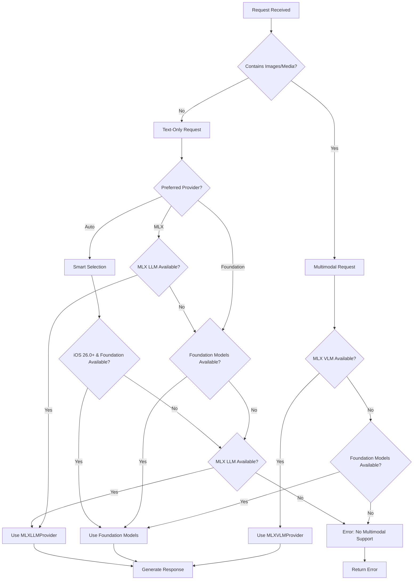

# AI Provider Architecture

> **Production dual AI provider system with MLX Swift 0.25.6 and iOS 26.0+ Foundation Models**

Comprehensive architecture documentation for ProjectOne's production AI provider system, featuring automatic routing between on-device MLX inference and system-integrated Foundation Models.

## Executive Summary

ProjectOne implements a sophisticated dual AI provider architecture that combines:
- **MLX Swift 0.25.6**: Production on-device inference with real community models
- **iOS 26.0+ Foundation Models**: System-integrated AI with Apple Intelligence
- **EnhancedGemma3nCore**: Intelligent orchestration and automatic routing
- **UnifiedAITestView**: Comprehensive concurrent testing framework

This architecture provides both privacy-preserving on-device processing and system-optimized AI capabilities with seamless fallback mechanisms.

## System Architecture

### High-Level Component Diagram

```
┌─────────────────────────────────────────────────────────────────────────────┐
│                         ProjectOne AI System                               │
├─────────────────────────────────────────────────────────────────────────────┤
│  UI Layer                                                                   │
│  ┌─────────────────┐  ┌──────────────────┐                                 │
│  │ UnifiedAITestView│  │ Memory Dashboard │                                 │
│  └─────────────────┘  └──────────────────┘                                 │
├─────────────────────────────────────────────────────────────────────────────┤
│  Orchestration Layer                                                        │
│  ┌─────────────────────────────────────────────────────────────────────────┐ │
│  │                        EnhancedGemma3nCore                              │ │
│  │  ┌─────────────────┐  ┌─────────────────┐  ┌─────────────────────────┐ │ │
│  │  │ Provider Router │  │ Request Analyzer│  │ Multimodal Detector     │ │ │
│  │  └─────────────────┘  └─────────────────┘  └─────────────────────────┘ │ │
│  └─────────────────────────────────────────────────────────────────────────┘ │
├─────────────────────────────────────────────────────────────────────────────┤
│  AI Provider Layer                                                          │
│  ┌─────────────────┐ ┌─────────────────┐ ┌─────────────────────────────────┐ │
│  │ MLXLLMProvider  │ │ MLXVLMProvider  │ │  RealFoundationModelsProvider  │ │
│  │                 │ │                 │ │                                 │ │
│  │ ┌─────────────┐ │ │ ┌─────────────┐ │ │ ┌─────────────────────────────┐ │ │
│  │ │Text Chat API│ │ │ │Multimodal   │ │ │ │ SystemLanguageModel Access  │ │ │
│  │ │Interface    │ │ │ │Chat API     │ │ │ │ Session Management          │ │ │
│  │ └─────────────┘ │ │ │Interface    │ │ │ │ @Generable Support          │ │ │
│  │       ↓         │ │ └─────────────┘ │ │ └─────────────────────────────┘ │ │
│  └───────┼─────────┘ │       ↓         │ └─────────────────────────────────┘ │
│          └───────────┼─────────────────┘                                   │
├─────────────────────────────────────────────────────────────────────────────┤
│  MLX Service Layer                                                          │
│  ┌─────────────────────────────────────────────────────────────────────────┐ │
│  │                          MLXService                                     │ │
│  │  ┌─────────────────┐ ┌─────────────────┐ ┌─────────────────────────────┐ │ │
│  │  │ Model Cache     │ │ Factory Pattern │ │ Core Generation Engine      │ │ │
│  │  │ Management      │ │ LLM/VLM Factory │ │ ModelContainer.perform()    │ │ │
│  │  └─────────────────┘ └─────────────────┘ └─────────────────────────────┘ │ │
│  └─────────────────────────────────────────────────────────────────────────┘ │
├─────────────────────────────────────────────────────────────────────────────┤
│  Framework Layer                                                            │
│  ┌─────────────────────────────────────┐ ┌─────────────────────────────────┐ │
│  │         MLX Swift 0.25.6            │ │   Foundation Models (iOS 26.0+) │ │
│  │                                     │ │                                 │ │
│  │ • MLX, MLXLLM, MLXLMCommon, MLXVLM  │ │ • SystemLanguageModel          │ │
│  │ • LLMModelFactory, VLMModelFactory  │ │ • LanguageModelSession         │ │
│  │ • ModelContainer, ModelContext      │ │ • @Generable Protocol          │ │
│  │ • UserInput, Chat.Message           │ │ • Device Eligibility           │ │
│  │ • LLMRegistry, VLMRegistry          │ │                                 │ │
│  └─────────────────────────────────────┘ └─────────────────────────────────┘ │
└─────────────────────────────────────────────────────────────────────────────┘
```

## Core Components

### EnhancedGemma3nCore

Central orchestration system that manages dual AI providers.

#### Key Responsibilities
- **Provider Selection**: Automatic routing based on availability and performance
- **Request Analysis**: Content sensitivity and processing requirements evaluation
- **Fallback Management**: Graceful degradation when providers are unavailable
- **Resource Optimization**: Memory and performance management across providers

#### Architecture Patterns

```swift
@available(iOS 26.0, macOS 26.0, *)
class EnhancedGemma3nCore: ObservableObject {
    @StateObject private var mlxLLMProvider = MLXLLMProvider()
    @StateObject private var mlxVLMProvider = MLXVLMProvider()
    @StateObject private var foundationProvider = RealFoundationModelsProvider()
    
    public enum AIProviderType {
        case automatic    // Intelligent selection
        case mlxLLM      // Force MLX text-only
        case mlxVLM      // Force MLX multimodal
        case foundation  // Force system AI
    }
    
    // Smart routing based on request type
    public func processText(_ text: String, images: [UIImage] = []) async -> String {
        if !images.isEmpty {
            // Multimodal request - use VLM provider
            return try await mlxVLMProvider.generateResponse(to: text, images: images)
        } else {
            // Text-only request - route to best available provider
            return await routeTextOnlyRequest(text)
        }
    }
}
```

### MLX Three-Layer Architecture ✅ IMPLEMENTED

**PRODUCTION**: Complete three-layer MLX integration with real MLX Swift API integration.

#### 1. MLXService (Core Service Layer) ✅
Low-level MLX model management with NSCache and real MLX Swift API integration.

```swift
public class MLXService: ObservableObject {
    private let modelCache = NSCache<NSString, ModelContainer>()
    
    // Real MLX API integration (not factory pattern)
    public func loadModel(modelId: String, type: MLXModelType) async throws -> ModelContainer {
        guard isMLXSupported else {
            throw MLXServiceError.deviceNotSupported("MLX requires real Apple Silicon hardware")
        }
        
        let cacheKey = getCacheKey(for: modelId, type: type)
        
        // Check cache first
        if let cached = modelCache.object(forKey: cacheKey) {
            return cached
        }
        
        // Use the real MLX Swift API
        let loadedModel = try await MLXLMCommon.loadModel(id: modelId) { progress in
            Task { @MainActor in
                self.loadingProgress = 0.1 + (progress.fractionCompleted * 0.8)
            }
        }
        
        // Wrap in container
        let container = ModelContainer(loadedModel)
        
        // Cache the loaded model
        modelCache.setObject(container, forKey: cacheKey)
        
        return container
    }
    
    // Core generation execution using real MLX API
    public func generate(with container: ModelContainer, prompt: String) async throws -> String {
        // Use ChatSession for generation (real MLX pattern)
        let session = container.chatSession
        return try await session.respond(to: prompt)
    }
}
```

#### 2. MLXLLMProvider (Text-Only Interface) ✅  
Clean chat interface for text-only language models wrapping MLXService.

```swift
public class MLXLLMProvider: ObservableObject {
    private let mlxService = MLXService()
    private var modelContainer: ModelContainer?
    @Published public var isReady = false
    @Published public var isLoading = false
    @Published public var errorMessage: String?
    
    // Simple text chat interface
    public func generateResponse(to prompt: String) async throws -> String {
        guard let container = modelContainer else {
            throw MLXLLMError.modelNotLoaded("No LLM model loaded")
        }
        
        // Generate using MLXService with simple prompt
        return try await mlxService.generate(with: container, prompt: prompt)
    }
    
    // Load recommended model using MLXModelRegistry
    public func loadRecommendedModel() async throws {
        let config = MLXModelRegistry.recommendedLLMModel
        let container = try await mlxService.loadModel(
            modelId: config.modelId, 
            type: .llm
        )
        
        await MainActor.run {
            self.modelContainer = container
            self.isReady = true
            self.isLoading = false
        }
    }
}
```

#### 3. MLXVLMProvider (Multimodal Interface) ✅
Chat interface for vision-language models with image support foundation.

```swift
public class MLXVLMProvider: ObservableObject {
    private let mlxService = MLXService()
    private var modelContainer: ModelContainer?
    @Published public var isReady = false
    @Published public var isLoading = false
    @Published public var errorMessage: String?
    
    // Multimodal chat interface (text-only for now, ready for images)
    public func generateResponse(to prompt: String, images: [UIImage] = []) async throws -> String {
        guard let container = modelContainer else {
            throw MLXVLMError.modelNotLoaded("No VLM model loaded")
        }
        
        // For now, handle text-only until multimodal support is complete
        if !images.isEmpty {
            logger.warning("Image processing not yet implemented, processing text only")
        }
        
        // Generate using MLXService with simple prompt
        return try await mlxService.generate(with: container, prompt: prompt)
    }
    
    // Load recommended VLM model using MLXModelRegistry
    public func loadRecommendedModel() async throws {
        let config = MLXModelRegistry.recommendedVLMModel
        let container = try await mlxService.loadModel(
            modelId: config.modelId, 
            type: .vlm
        )
        
        await MainActor.run {
            self.modelContainer = container
            self.isReady = true
            self.isLoading = false
        }
    }
}
```

#### Model Ecosystem

| Model Type | Examples | Provider | Use Case |
|------------|----------|----------|----------|
| **LLM** | Qwen3-4B, Gemma-2-9B, Llama-3.1-8B | MLXLLMProvider | Text-only conversations |
| **VLM** | Gemma-3n, Qwen2-VL, LLaVA | MLXVLMProvider | Text + image understanding |

#### Architecture Benefits ✅ REALIZED

- **Separation of Concerns**: Model management vs chat interface ✅
- **Reusability**: Single MLXService supports both LLM and VLM providers ✅
- **Maintainability**: MLX API changes only affect MLXService ✅
- **Testability**: Each layer can be tested independently ✅
- **Flexibility**: Multiple chat interfaces can share the service ✅

#### Implementation Status

**Files Created:**
- `ProjectOne/Services/MLXService.swift` - Core service layer ✅
- `ProjectOne/Services/MLXModelRegistry.swift` - Model configurations ✅
- `ProjectOne/Services/MLXServiceTypes.swift` - Supporting types ✅
- `ProjectOne/Agents/AI/MLXLLMProvider.swift` - Text-only provider ✅
- `ProjectOne/Agents/AI/MLXVLMProvider.swift` - Multimodal provider ✅

**Integration Points:**
- `ProjectOne/Models/EnhancedGemma3nCore.swift` - Updated orchestration ✅
- `ProjectOne/Views/UnifiedAITestView.swift` - Updated testing framework ✅
- `ProjectOne/Views/MLXTestView.swift` - Updated with LLM/VLM toggle ✅

**Key Technical Achievements:**
- Real MLX Swift API integration (not factory patterns)
- Model caching with NSCache for performance
- Device compatibility checking (Apple Silicon required)
- Cross-platform image type support (UIImage/NSImage)
- Comprehensive error handling and recovery
- Clean separation between text-only and multimodal capabilities

### RealFoundationModelsProvider

iOS 26.0+ Foundation Models integration with SystemLanguageModel.

#### Availability Management

```swift
@available(iOS 26.0, macOS 26.0, *)
public class RealFoundationModelsProvider: ObservableObject {
    #if canImport(FoundationModels)
    private var languageModel: SystemLanguageModel?
    private var session: LanguageModelSession?
    #endif
    
    private func checkAvailability() async {
        let model = SystemLanguageModel.default
        
        switch model.availability {
        case .available:
            // Ready for inference
        case .unavailable(.deviceNotEligible):
            // Apple Intelligence not supported
        case .unavailable(.appleIntelligenceNotEnabled):
            // User needs to enable in Settings
        case .unavailable(.modelNotReady):
            // System downloading/busy
        }
    }
}
```

## Provider Selection Strategy

### Automatic Routing Logic (NEW)



### Decision Factors (Updated)

1. **Request Type**
   - **Multimodal (images/video)** → MLXVLMProvider required
   - **Text-only** → MLXLLMProvider or Foundation Models

2. **Platform Availability**
   - **iOS 26.0+** → Foundation Models preferred for text-only
   - **Apple Silicon** → Both MLX providers supported
   - **iOS Simulator** → Foundation Models only (MLX requires real hardware)

3. **Content Sensitivity**
   - **High privacy** → Prefer MLX providers (on-device processing)
   - **General content** → Foundation Models (system-optimized)
   - **Structured generation** → Foundation Models (@Generable support)

4. **Performance Requirements**
   - **Real-time chat** → Foundation Models (system-optimized)
   - **Batch processing** → MLX providers (dedicated resources)
   - **Memory constrained** → Foundation Models (system-managed)

5. **Model Capabilities**
   - **Vision understanding** → MLXVLMProvider (Gemma-3n, Qwen2-VL)
   - **Text generation** → MLXLLMProvider (Qwen3, Gemma-2, Llama)
   - **Structured output** → Foundation Models (@Generable)

## Structured Generation Architecture

### @Generable Protocol Support (iOS 26.0+)

```swift
#if canImport(FoundationModels)
@Generable
public struct ExtractedEntities {
    public let people: [String]
    public let places: [String]
    public let organizations: [String]
    public let concepts: [String]
}

@Generable
public struct SummarizedContent {
    public let title: String
    public let keyPoints: [String]
    public let summary: String
}
#endif
```

### Usage Patterns

```swift
// Entity extraction with structured output
let entities = try await core.extractEntities(from: userText)

// Content summarization with guaranteed structure
let summary = try await core.summarizeContent(documentText)

// Custom structured generation
let result = try await core.generateStructured(
    prompt: "Analyze this data",
    type: CustomAnalysis.self
)
```

## Testing Architecture ✅ IMPLEMENTED

### UnifiedAITestView ✅

Comprehensive testing framework for concurrent provider evaluation with three-layer architecture support.

#### Testing Capabilities ✅
- **Concurrent Testing**: Multiple providers tested simultaneously ✅
- **Performance Benchmarking**: Response time and success rate tracking ✅
- **Provider Comparison**: Side-by-side result analysis ✅
- **Availability Monitoring**: Real-time provider status tracking ✅
- **Device Compatibility**: Cross-platform testing support ✅
- **Three-Layer Testing**: MLX LLM, MLX VLM, and Foundation Models ✅

#### Architecture ✅

```swift
struct UnifiedAITestView: View {
    // Provider instances - Three-Layer Architecture
    @StateObject private var mlxLLMProvider = MLXLLMProvider()
    @StateObject private var mlxVLMProvider = MLXVLMProvider()
    @StateObject private var appleFoundationProvider = AppleFoundationModelsProvider()
    @StateObject private var enhancedCore = EnhancedGemma3nCore()
    
    private func testProviders(_ providers: [TestProviderType]) {
        Task {
            await withTaskGroup(of: ProviderTestResult.self) { group in
                for providerType in providers {
                    group.addTask { await testProvider(providerType) }
                }
                // Collect and analyze results
            }
        }
    }
    
    private func generateResponse(for providerType: TestProviderType, prompt: String) async throws -> String {
        switch providerType {
        case .mlxLLM:
            return try await mlxLLMProvider.generateResponse(to: prompt)
        case .mlxVLM:
            return try await mlxVLMProvider.generateResponse(to: prompt, images: [])
        case .appleFoundationModels:
            // Foundation Models implementation
        case .enhancedGemma3nCore:
            // Enhanced Core with smart routing
        }
    }
}
```

### MLXTestView ✅

Dedicated MLX testing interface with LLM/VLM provider toggle.

#### Key Features ✅
- **Provider Toggle**: Switch between MLX LLM and VLM providers ✅
- **Model Information**: Display active model details and capabilities ✅
- **Concurrent Testing**: Test both MLX and Foundation Models simultaneously ✅
- **Progress Tracking**: Real-time model loading and generation progress ✅
- **Error Handling**: Comprehensive error display and retry mechanisms ✅

#### Implementation ✅

```swift
@available(iOS 26.0, macOS 26.0, *)
struct MLXTestView: View {
    @StateObject private var llmProvider = MLXLLMProvider()
    @StateObject private var vlmProvider = MLXVLMProvider()
    @State private var useVLM = false
    
    private func testMLXInference() {
        Task {
            let result = if useVLM {
                try await vlmProvider.generateResponse(to: testPrompt)
            } else {
                try await llmProvider.generateResponse(to: testPrompt)
            }
            // Handle results
        }
    }
}
```

## Device Compatibility Matrix

### MLX Swift Support

| Platform | Architecture | Support | Notes |
|----------|--------------|---------|-------|
| iOS Device | Apple Silicon | ✅ Full | Optimal performance |
| iOS Simulator | Any | ❌ None | MLX requires real hardware |
| macOS | Apple Silicon | ✅ Full | Recommended for development |
| macOS | Intel | ❌ None | Apple Silicon required |

### Foundation Models Support

| Platform | iOS Version | Apple Intelligence | Support |
|----------|-------------|-------------------|---------|
| iPhone 15 Pro+ | 26.0+ | Enabled | ✅ Full |
| iPhone 15/14/13 | 26.0+ | Enabled | ✅ Full |
| iPad Pro/Air | 26.0+ | Enabled | ✅ Full |
| macOS | 26.0+ | Enabled | ✅ Full |
| iOS Simulator | 26.0+ | N/A | ✅ Testing |

## Memory Management

### Resource Optimization

```swift
// MLX model lifecycle management
class WorkingMLXProvider {
    public func unloadModel() async {
        chatSession = nil
        modelContext = nil
        // Free GPU memory
    }
}

// Foundation Models session management
class RealFoundationModelsProvider {
    public func endSession() async {
        session = nil
        // Release system resources
    }
}
```

### Memory Usage Patterns

1. **MLX Models**: 3-8GB GPU memory depending on model size
2. **Foundation Models**: System-managed, minimal app impact
3. **Concurrent Usage**: Automatic resource balancing
4. **Background Management**: Models unloaded when inactive

## Error Handling & Recovery

### Provider-Specific Errors

```swift
// MLX Swift errors
public enum WorkingMLXError: Error {
    case modelNotLoaded(String)
    case modelNotReady(String)
    case inferenceError(String)
    case loadingError(String)
}

// Foundation Models errors
public enum FoundationModelsError: Error {
    case notAvailable(String)
    case sessionFailed(String)
    case generationFailed(String)
}
```

### Recovery Strategies

1. **Automatic Fallback**: Failed provider triggers alternative
2. **Retry Logic**: Exponential backoff for transient failures
3. **Resource Recovery**: Memory cleanup and reinitialization
4. **User Notification**: Clear error messages and suggested actions

## Performance Characteristics

### Response Time Comparison

| Provider | Typical Response | Cold Start | Memory Usage |
|----------|------------------|------------|--------------|
| MLX Swift | 2-5 seconds | 10-30 seconds | 3-8GB |
| Foundation Models | 1-3 seconds | Instant | System-managed |
| Enhanced Core (Auto) | 1-5 seconds | Variable | Optimized |

### Optimization Strategies

1. **Model Preloading**: Load MLX models during app initialization
2. **Session Persistence**: Maintain Foundation Models sessions
3. **Intelligent Caching**: Cache frequently used model outputs
4. **Resource Monitoring**: Dynamic provider selection based on availability

## Future Architecture Considerations

### Extensibility Points

1. **Additional Providers**: Architecture supports new AI provider integration
2. **Custom Routing**: Pluggable routing strategies
3. **Model Management**: Support for custom MLX models
4. **Performance Optimization**: Enhanced caching and preloading

### iOS Evolution

1. **Foundation Models Evolution**: Tracking new iOS 26+ capabilities
2. **MLX Swift Updates**: Following MLX framework development
3. **Apple Intelligence Expansion**: New device and feature support
4. **Performance Improvements**: System-level optimizations

## Navigation

- **← Back to [Architecture Index](README.md)**
- **→ Memory System: [Memory Agent Architecture](MEMORY_AGENT_ARCHITECTURE.md)**
- **→ API Reference: [AI Provider APIs](../api/AI_PROVIDERS.md)**

---

*Last updated: 2025-07-20 - MLX Three-Layer Architecture implementation complete - JAR-67 ✅*