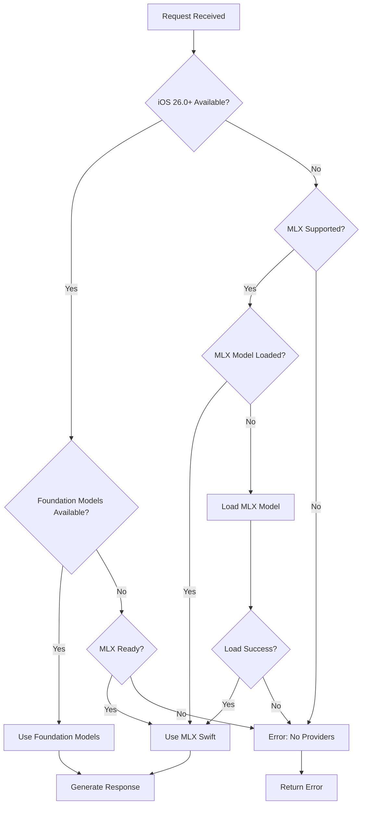

# AI Provider Architecture

> **Production dual AI provider system with MLX Swift 0.25.6 and iOS 26.0+ Foundation Models**

Comprehensive architecture documentation for ProjectOne's production AI provider system, featuring automatic routing between on-device MLX inference and system-integrated Foundation Models.

## Executive Summary

ProjectOne implements a sophisticated dual AI provider architecture that combines:
- **MLX Swift 0.25.6**: Production on-device inference with real community models
- **iOS 26.0+ Foundation Models**: System-integrated AI with Apple Intelligence
- **EnhancedGemma3nCore**: Intelligent orchestration and automatic routing
- **UnifiedAITestView**: Comprehensive concurrent testing framework

This architecture provides both privacy-preserving on-device processing and system-optimized AI capabilities with seamless fallback mechanisms.

## System Architecture

### High-Level Component Diagram

```
┌─────────────────────────────────────────────────────────────────┐
│                    ProjectOne AI System                         │
├─────────────────────────────────────────────────────────────────┤
│  UI Layer                                                       │
│  ┌─────────────────┐  ┌──────────────────┐                     │
│  │ UnifiedAITestView│  │ Memory Dashboard │                     │
│  └─────────────────┘  └──────────────────┘                     │
├─────────────────────────────────────────────────────────────────┤
│  Orchestration Layer                                            │
│  ┌─────────────────────────────────────────────────────────────┐ │
│  │              EnhancedGemma3nCore                            │ │
│  │  ┌─────────────────┐  ┌─────────────────┐                  │ │
│  │  │ Provider Router │  │ Request Analyzer│                  │ │
│  │  └─────────────────┘  └─────────────────┘                  │ │
│  └─────────────────────────────────────────────────────────────┘ │
├─────────────────────────────────────────────────────────────────┤
│  AI Provider Layer                                              │
│  ┌─────────────────────┐  ┌─────────────────────────────────────┐ │
│  │   WorkingMLXProvider│  │  RealFoundationModelsProvider      │ │
│  │                     │  │                                     │ │
│  │ ┌─────────────────┐ │  │ ┌─────────────────────────────────┐ │ │
│  │ │ Model Manager   │ │  │ │ SystemLanguageModel Access    │ │ │
│  │ │ Chat Session    │ │  │ │ Session Management            │ │ │
│  │ │ Stream Handler  │ │  │ │ @Generable Support            │ │ │
│  │ └─────────────────┘ │  │ └─────────────────────────────────┘ │ │
│  └─────────────────────┘  └─────────────────────────────────────┘ │
├─────────────────────────────────────────────────────────────────┤
│  Framework Layer                                                │
│  ┌─────────────────────┐  ┌─────────────────────────────────────┐ │
│  │    MLX Swift 0.25.6 │  │     Foundation Models (iOS 26.0+)  │ │
│  │                     │  │                                     │ │
│  │ • MLXLMCommon       │  │ • SystemLanguageModel              │ │
│  │ • ChatSession       │  │ • LanguageModelSession             │ │
│  │ • ModelContext      │  │ • @Generable Protocol              │ │
│  │ • Community Models  │  │ • Device Eligibility               │ │
│  └─────────────────────┘  └─────────────────────────────────────┘ │
└─────────────────────────────────────────────────────────────────┘
```

## Core Components

### EnhancedGemma3nCore

Central orchestration system that manages dual AI providers.

#### Key Responsibilities
- **Provider Selection**: Automatic routing based on availability and performance
- **Request Analysis**: Content sensitivity and processing requirements evaluation
- **Fallback Management**: Graceful degradation when providers are unavailable
- **Resource Optimization**: Memory and performance management across providers

#### Architecture Patterns

```swift
@available(iOS 26.0, macOS 26.0, *)
class EnhancedGemma3nCore: ObservableObject {
    @StateObject private var mlxProvider = WorkingMLXProvider()
    @StateObject private var foundationProvider = RealFoundationModelsProvider()
    
    public enum AIProviderType {
        case automatic  // Intelligent selection
        case mlx       // Force on-device
        case foundation // Force system AI
    }
}
```

### WorkingMLXProvider

Production MLX Swift implementation with real community models.

#### Model Ecosystem

| Model | Size | Memory | Use Case |
|-------|------|--------|----------|
| Qwen3-4B | 4B params | ~3GB | General purpose, mobile-optimized |
| Gemma-2-2B | 2B params | ~3GB | Lightweight, fast inference |
| Gemma-2-9B | 9B params | ~6-8GB | High-quality responses, desktop |
| Llama-3.1-8B | 8B params | ~6-8GB | Instruction following, reasoning |
| Mistral-7B | 7B params | ~6-8GB | Conversational, creative tasks |

#### Architecture Details

```swift
public class WorkingMLXProvider: ObservableObject {
    private var chatSession: ChatSession?
    private var modelContext: ModelContext?
    
    // Real MLX Swift API integration
    public func loadModel(_ model: MLXModel) async throws {
        let loadedModel = try await MLXLMCommon.loadModel(id: model.rawValue) { progress in
            // Real progress tracking
        }
        self.chatSession = ChatSession(loadedModel)
    }
}
```

### RealFoundationModelsProvider

iOS 26.0+ Foundation Models integration with SystemLanguageModel.

#### Availability Management

```swift
@available(iOS 26.0, macOS 26.0, *)
public class RealFoundationModelsProvider: ObservableObject {
    #if canImport(FoundationModels)
    private var languageModel: SystemLanguageModel?
    private var session: LanguageModelSession?
    #endif
    
    private func checkAvailability() async {
        let model = SystemLanguageModel.default
        
        switch model.availability {
        case .available:
            // Ready for inference
        case .unavailable(.deviceNotEligible):
            // Apple Intelligence not supported
        case .unavailable(.appleIntelligenceNotEnabled):
            // User needs to enable in Settings
        case .unavailable(.modelNotReady):
            // System downloading/busy
        }
    }
}
```

## Provider Selection Strategy

### Automatic Routing Logic



### Decision Factors

1. **Platform Availability**
   - iOS 26.0+ → Foundation Models preferred
   - Apple Silicon → MLX Swift supported
   - iOS Simulator → Foundation Models only

2. **Content Sensitivity**
   - High sensitivity → Prefer MLX (on-device)
   - General content → Foundation Models (system-optimized)
   - Structured generation → Foundation Models (@Generable)

3. **Performance Requirements**
   - Real-time → Foundation Models (system-optimized)
   - Batch processing → MLX Swift (dedicated resources)
   - Memory constrained → Lighter MLX models

## Structured Generation Architecture

### @Generable Protocol Support (iOS 26.0+)

```swift
#if canImport(FoundationModels)
@Generable
public struct ExtractedEntities {
    public let people: [String]
    public let places: [String]
    public let organizations: [String]
    public let concepts: [String]
}

@Generable
public struct SummarizedContent {
    public let title: String
    public let keyPoints: [String]
    public let summary: String
}
#endif
```

### Usage Patterns

```swift
// Entity extraction with structured output
let entities = try await core.extractEntities(from: userText)

// Content summarization with guaranteed structure
let summary = try await core.summarizeContent(documentText)

// Custom structured generation
let result = try await core.generateStructured(
    prompt: "Analyze this data",
    type: CustomAnalysis.self
)
```

## Testing Architecture

### UnifiedAITestView

Comprehensive testing framework for concurrent provider evaluation.

#### Testing Capabilities
- **Concurrent Testing**: Multiple providers tested simultaneously
- **Performance Benchmarking**: Response time and success rate tracking
- **Provider Comparison**: Side-by-side result analysis
- **Availability Monitoring**: Real-time provider status tracking
- **Device Compatibility**: Cross-platform testing support

#### Architecture

```swift
struct UnifiedAITestView: View {
    @StateObject private var mlxProvider = WorkingMLXProvider()
    @StateObject private var foundationProvider = RealFoundationModelsProvider()
    
    private func testProviders(_ providers: [AIProviderType]) {
        Task {
            await withTaskGroup(of: ProviderTestResult.self) { group in
                for provider in providers {
                    group.addTask { await testProvider(provider) }
                }
                // Collect and analyze results
            }
        }
    }
}
```

## Device Compatibility Matrix

### MLX Swift Support

| Platform | Architecture | Support | Notes |
|----------|--------------|---------|-------|
| iOS Device | Apple Silicon | ✅ Full | Optimal performance |
| iOS Simulator | Any | ❌ None | MLX requires real hardware |
| macOS | Apple Silicon | ✅ Full | Recommended for development |
| macOS | Intel | ❌ None | Apple Silicon required |

### Foundation Models Support

| Platform | iOS Version | Apple Intelligence | Support |
|----------|-------------|-------------------|---------|
| iPhone 15 Pro+ | 26.0+ | Enabled | ✅ Full |
| iPhone 15/14/13 | 26.0+ | Enabled | ✅ Full |
| iPad Pro/Air | 26.0+ | Enabled | ✅ Full |
| macOS | 26.0+ | Enabled | ✅ Full |
| iOS Simulator | 26.0+ | N/A | ✅ Testing |

## Memory Management

### Resource Optimization

```swift
// MLX model lifecycle management
class WorkingMLXProvider {
    public func unloadModel() async {
        chatSession = nil
        modelContext = nil
        // Free GPU memory
    }
}

// Foundation Models session management
class RealFoundationModelsProvider {
    public func endSession() async {
        session = nil
        // Release system resources
    }
}
```

### Memory Usage Patterns

1. **MLX Models**: 3-8GB GPU memory depending on model size
2. **Foundation Models**: System-managed, minimal app impact
3. **Concurrent Usage**: Automatic resource balancing
4. **Background Management**: Models unloaded when inactive

## Error Handling & Recovery

### Provider-Specific Errors

```swift
// MLX Swift errors
public enum WorkingMLXError: Error {
    case modelNotLoaded(String)
    case modelNotReady(String)
    case inferenceError(String)
    case loadingError(String)
}

// Foundation Models errors
public enum FoundationModelsError: Error {
    case notAvailable(String)
    case sessionFailed(String)
    case generationFailed(String)
}
```

### Recovery Strategies

1. **Automatic Fallback**: Failed provider triggers alternative
2. **Retry Logic**: Exponential backoff for transient failures
3. **Resource Recovery**: Memory cleanup and reinitialization
4. **User Notification**: Clear error messages and suggested actions

## Performance Characteristics

### Response Time Comparison

| Provider | Typical Response | Cold Start | Memory Usage |
|----------|------------------|------------|--------------|
| MLX Swift | 2-5 seconds | 10-30 seconds | 3-8GB |
| Foundation Models | 1-3 seconds | Instant | System-managed |
| Enhanced Core (Auto) | 1-5 seconds | Variable | Optimized |

### Optimization Strategies

1. **Model Preloading**: Load MLX models during app initialization
2. **Session Persistence**: Maintain Foundation Models sessions
3. **Intelligent Caching**: Cache frequently used model outputs
4. **Resource Monitoring**: Dynamic provider selection based on availability

## Future Architecture Considerations

### Extensibility Points

1. **Additional Providers**: Architecture supports new AI provider integration
2. **Custom Routing**: Pluggable routing strategies
3. **Model Management**: Support for custom MLX models
4. **Performance Optimization**: Enhanced caching and preloading

### iOS Evolution

1. **Foundation Models Evolution**: Tracking new iOS 26+ capabilities
2. **MLX Swift Updates**: Following MLX framework development
3. **Apple Intelligence Expansion**: New device and feature support
4. **Performance Improvements**: System-level optimizations

## Navigation

- **← Back to [Architecture Index](README.md)**
- **→ Memory System: [Memory Agent Architecture](MEMORY_AGENT_ARCHITECTURE.md)**
- **→ API Reference: [AI Provider APIs](../api/AI_PROVIDERS.md)**

---

*Last updated: 2025-07-19 - Production AI provider architecture complete*