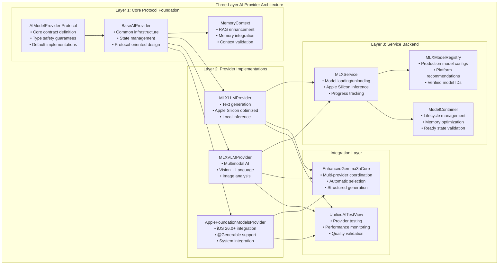

# AI Provider Architecture v2: Three-Layer Design

## Executive Summary

ProjectOne's AI Provider Architecture v2 implements a sophisticated **Three-Layer Design** that separates concerns into Core Protocol Layer, Provider Implementation Layer, and Service Backend Layer. This architecture enables multiple AI providers (MLX Swift, Apple Foundation Models) to work seamlessly together while maintaining type safety, performance optimization, and clean abstraction boundaries.

**Architecture Benefits:**
- **Type Safety**: Protocol-oriented design prevents runtime crashes
- **Modularity**: Clean separation allows independent provider development
- **Testability**: Mock implementations enable comprehensive testing
- **Extensibility**: New providers easily integrate without breaking existing code
- **Performance**: Efficient provider selection and model management

## Architecture Overview



## Layer 1: Core Protocol Foundation

### AIModelProvider Protocol

The foundational contract that all AI providers must implement:

```swift
/// Protocol for AI model providers in the Memory Agent system
public protocol AIModelProvider: AnyObject {
    
    // MARK: - Core Properties
    var identifier: String { get }              // Unique provider ID
    var displayName: String { get }             // User-friendly name
    var isAvailable: Bool { get }               // Runtime availability
    var supportsPersonalData: Bool { get }      // Privacy capability
    var isOnDevice: Bool { get }                // Local processing
    var estimatedResponseTime: TimeInterval { get } // Performance metric
    var maxContextLength: Int { get }           // Context window size
    
    // MARK: - Core Operations
    func generateResponse(prompt: String, context: MemoryContext) async throws -> AIModelResponse
    func prepare() async throws                 // Model initialization
    func cleanup() async                        // Resource cleanup
    func canHandle(contextSize: Int) -> Bool    // Capacity check
}
```

**Key Design Principles:**
- **Protocol Extensions**: Default implementations reduce boilerplate
- **Type Safety**: No fatalError patterns - compile-time validation
- **Async/Await**: Modern Swift concurrency throughout
- **Memory Context**: RAG enhancement built into core contract

### BaseAIProvider Implementation

Abstract base class providing common functionality:

```swift
public class BaseAIProvider: AIModelProvider, ObservableObject {
    
    // MARK: - Common Infrastructure
    internal let logger: Logger
    
    // Published properties for SwiftUI integration
    @Published public var isModelLoaded = false
    @Published public var modelLoadingStatus: ModelLoadingStatus = .notStarted
    @Published public var loadingProgress: Double = 0.0
    @Published public var statusMessage: String = ""
    @Published public var isAvailable: Bool = false
    @Published public var lastUpdated: Date = Date()
    
    // Processing queue for concurrent operations
    internal let processingQueue = DispatchQueue(label: "ai-provider", qos: .userInitiated)
    
    // MARK: - Template Methods (Protocol Extension Pattern)
    
    /// Safe default implementation - no fatalError
    internal func generateModelResponse(_ prompt: String) async throws -> String {
        throw AIModelProviderError.processingFailed("Subclass must implement generateModelResponse(_:)")
    }
    
    /// Thread-safe state updates
    @MainActor
    public func updateAvailability(_ available: Bool) {
        isAvailable = available
        lastUpdated = Date()
        objectWillChange.send()
    }
}
```

**Core Features:**
- **Observable Properties**: SwiftUI reactive state management
- **Thread Safety**: @MainActor for UI updates, background queues for processing
- **Protocol Extensions**: Safe defaults instead of fatalError crashes
- **Logging**: Structured logging for debugging and monitoring

### MemoryContext Integration

RAG enhancement through structured memory context:

```swift
public struct MemoryContext {
    let entities: [Entity]                      // Knowledge graph entities
    let relationships: [Relationship]           // Entity relationships
    let shortTermMemories: [STMEntry]          // Recent context
    let longTermMemories: [LTMEntry]           // Consolidated knowledge
    let episodicMemories: [EpisodicMemoryEntry] // Temporal events
    let relevantNotes: [ProcessedNote]         // Supporting documents
    let timestamp: Date                         // Context creation time
    let userQuery: String                       // Original user request
    let containsPersonalData: Bool             // Privacy flag
}
```

## Layer 2: Provider Implementations

### MLXLLMProvider - Text Generation

Apple Silicon optimized text generation:

```swift
public class MLXLLMProvider: BaseAIProvider {
    
    // MARK: - Protocol Implementation
    public override var identifier: String { "mlx-llm" }
    public override var displayName: String { "MLX Language Model" }
    public override var maxContextLength: Int { 4096 }
    public override var estimatedResponseTime: TimeInterval { 0.8 }
    
    // MARK: - MLX-Specific Properties
    private let mlxService = MLXService()
    private var modelContainer: ModelContainer?
    private var currentConfiguration: MLXModelConfiguration?
    
    // MARK: - Reactive State Management
    @Published public var isReady = false
    @Published public var isLoading = false
    @Published public var errorMessage: String?
    
    // MARK: - Core Operations
    
    /// Load a specific model configuration
    public func loadModel(_ configuration: MLXModelConfiguration) async throws {
        guard configuration.type == .llm else {
            throw MLXLLMError.invalidModelType("Configuration is not for LLM model")
        }
        
        guard isSupported else {
            throw MLXLLMError.deviceNotSupported("MLX requires Apple Silicon hardware")
        }
        
        // Load through service layer with progress tracking
        let container = try await mlxService.loadModel(modelId: configuration.modelId, type: .llm)
        
        // Validate and store
        self.modelContainer = container
        self.currentConfiguration = configuration
        
        guard container.isReady else {
            throw MLXLLMError.modelNotReady("Container loaded but model not ready")
        }
        
        await MainActor.run {
            isReady = true
        }
    }
    
    /// Generate text response
    override internal func generateModelResponse(_ prompt: String) async throws -> String {
        guard let container = modelContainer else {
            throw MLXLLMError.modelNotLoaded("No LLM model loaded")
        }
        
        return try await mlxService.generate(with: container, prompt: prompt)
    }
    
    /// Streaming response for real-time UI
    public func streamResponse(to prompt: String) -> AsyncThrowingStream<String, Error> {
        return AsyncThrowingStream { continuation in
            Task {
                do {
                    guard let container = modelContainer else {
                        continuation.finish(throwing: MLXLLMError.modelNotLoaded("No LLM model loaded"))
                        return
                    }
                    
                    // Forward stream from service layer
                    for try await chunk in mlxService.streamGenerate(with: container, prompt: prompt) {
                        continuation.yield(chunk)
                    }
                    
                    continuation.finish()
                } catch {
                    continuation.finish(throwing: error)
                }
            }
        }
    }
}
```

### MLXVLMProvider - Multimodal AI

Vision-language model provider for image + text processing:

```swift
public class MLXVLMProvider: BaseAIProvider {
    
    // MARK: - Protocol Implementation
    public override var identifier: String { "mlx-vlm" }
    public override var displayName: String { "MLX Vision-Language Model" }
    public override var maxContextLength: Int { 2048 }
    public override var estimatedResponseTime: TimeInterval { 1.2 }
    
    // MARK: - Multimodal Capabilities
    public var supportsImageAnalysis: Bool { true }
    public var maxImageCount: Int { 4 }
    public var supportedImageFormats: [String] { ["jpg", "jpeg", "png", "heic"] }
    
    // MARK: - VLM-Specific Operations
    
    /// Generate response with image inputs
    public func generateResponse(to prompt: String, images: [PlatformImage]) async throws -> String {
        guard let container = modelContainer else {
            throw MLXVLMError.modelNotLoaded("No VLM model loaded")
        }
        
        guard !images.isEmpty else {
            throw MLXVLMError.noImagesProvided("VLM requires at least one image")
        }
        
        guard images.count <= maxImageCount else {
            throw MLXVLMError.tooManyImages("Maximum \(maxImageCount) images supported")
        }
        
        // Process through service layer
        return try await mlxService.generateWithImages(
            container: container,
            prompt: prompt,
            images: images
        )
    }
    
    /// Analyze single image
    public func analyzeImage(_ image: PlatformImage, question: String = "What do you see?") async throws -> String {
        return try await generateResponse(to: question, images: [image])
    }
}
```

### AppleFoundationModelsProvider - Structured Generation

iOS 26.0+ system integration with @Generable support:

```swift
@available(iOS 26.0, macOS 26.0, *)
public class AppleFoundationModelsProvider: BaseAIProvider {
    
    // MARK: - Protocol Implementation
    public override var identifier: String { "apple-foundation-models" }
    public override var displayName: String { "Apple Foundation Models" }
    public override var estimatedResponseTime: TimeInterval { 0.2 }
    public override var maxContextLength: Int { 8192 }
    
    // MARK: - Foundation Models Integration
    #if canImport(FoundationModels)
    private var languageModel: SystemLanguageModel?
    private var session: LanguageModelSession?
    #endif
    
    // MARK: - Structured Generation
    
    /// Generate with @Generable type safety
    public func generateWithGuidance<T: Generable>(prompt: String, type: T.Type) async throws -> T {
        #if canImport(FoundationModels)
        guard isAvailable, let model = languageModel else {
            throw AIModelProviderError.providerUnavailable("Foundation Models not available")
        }
        
        // Create session for guided generation
        let guidedSession = LanguageModelSession(
            model: model,
            instructions: "Generate structured responses following the provided schema exactly."
        )
        
        // Use real Foundation Models API
        let response = try await guidedSession.respond(to: prompt, generating: type)
        return response.content
        
        #else
        throw AIModelProviderError.providerUnavailable("Foundation Models framework not available")
        #endif
    }
    
    // MARK: - Advanced Features
    
    /// Get model capabilities
    public func getCapabilities() -> FoundationModelCapabilities {
        #if canImport(FoundationModels)
        if let model = languageModel, isAvailable {
            return FoundationModelCapabilities(
                supportsTextGeneration: true,
                supportsGuidedGeneration: true,
                supportsToolCalling: true,
                supportsStreamingGeneration: true,
                maxContextLength: maxContextLength,
                supportedLanguages: Array(model.supportedLanguages.map { $0.languageCode?.identifier ?? "en" })
            )
        }
        #endif
        
        return FoundationModelCapabilities.unavailable
    }
}
```

## Layer 3: Service Backend

### MLXService - Apple Silicon ML Backend

Core service handling MLX Swift operations:

```swift
public class MLXService: ObservableObject {
    
    // MARK: - State Management
    @Published public var isLoading = false
    @Published public var loadingProgress: Double = 0.0
    @Published public var errorMessage: String?
    
    // MARK: - Model Loading
    
    /// Load model with proper MLX Swift 0.25.6 API
    public func loadModel(modelId: String, type: MLXModelType) async throws -> ModelContainer {
        logger.info("Loading MLX model: \(modelId)")
        
        await MainActor.run {
            isLoading = true
            loadingProgress = 0.0
            errorMessage = nil
        }
        
        // Progressive loading with callbacks
        let modelContext: ModelContext
        switch type {
        case .llm:
            modelContext = try await MLXLMCommon.loadModel(
                configuration: .init(id: modelId)
            ) { [weak self] progress in
                Task { @MainActor in
                    self?.loadingProgress = progress
                }
            }
        case .vlm:
            modelContext = try await MLXVLM.loadModel(
                configuration: .init(id: modelId)
            ) { [weak self] progress in
                Task { @MainActor in
                    self?.loadingProgress = progress
                }
            }
        }
        
        // Validate and wrap
        let container = ModelContainer(
            modelContext: modelContext,
            modelId: modelId,
            type: type
        )
        
        await MainActor.run {
            isLoading = false
            loadingProgress = 1.0
        }
        
        return container
    }
    
    /// Generate text response
    public func generate(with container: ModelContainer, prompt: String) async throws -> String {
        guard container.isReady else {
            throw MLXServiceError.modelNotReady("Model container not ready")
        }
        
        // Use appropriate MLX Swift API
        switch container.type {
        case .llm:
            return try await MLXLMCommon.generate(
                promptTokens: container.modelContext.encode(text: prompt),
                parameters: .init(temperature: 0.7, topP: 0.9),
                model: container.modelContext
            ) { _ in }
        case .vlm:
            throw MLXServiceError.invalidOperation("Use generateWithImages for VLM models")
        }
    }
    
    /// Stream generation for real-time responses
    public func streamGenerate(with container: ModelContainer, prompt: String) -> AsyncThrowingStream<String, Error> {
        return AsyncThrowingStream { continuation in
            Task {
                do {
                    // MLX Swift streaming implementation
                    for try await token in container.modelContext.generateStream(prompt: prompt) {
                        continuation.yield(token.text)
                    }
                    continuation.finish()
                } catch {
                    continuation.finish(throwing: error)
                }
            }
        }
    }
}
```

### MLXModelRegistry - Production Model Configurations

Verified model configurations for production use:

```swift
public struct MLXModelRegistry {
    
    // MARK: - Production LLM Models
    public static let llmModels: [MLXModelConfiguration] = [
        
        // Gemma 2 Models (Most Reliable)
        MLXModelConfiguration(
            name: "Gemma 2 2B Instruct",
            modelId: "mlx-community/gemma-2-2b-it-4bit",
            type: .llm,
            memoryRequirement: "~1.5GB RAM",
            recommendedPlatform: .iOS,
            quantization: "4-bit",
            description: "Compact, efficient Gemma 2 model perfect for mobile devices"
        ),
        
        // Qwen Models (Excellent Performance)
        MLXModelConfiguration(
            name: "Qwen2.5 7B Instruct",
            modelId: "mlx-community/Qwen2.5-7B-Instruct-4bit",
            type: .llm,
            memoryRequirement: "~4GB RAM",
            recommendedPlatform: .macOS,
            quantization: "4-bit",
            description: "Excellent balance of quality and performance"
        ),
        
        // ... additional verified models
    ]
    
    // MARK: - Platform-Specific Recommendations
    
    /// Get recommended model for current platform
    public static func getRecommendedModel(for type: MLXModelType) -> MLXModelConfiguration? {
        #if os(iOS)
        // iOS recommendations - prioritize efficiency
        let platformModels = models(for: Platform.iOS).filter { $0.type == type }
        return platformModels.first { $0.name.contains("Gemma 2 2B") } ??
               platformModels.first { $0.name.contains("Qwen2.5 3B") } ??
               platformModels.first
        #else
        // macOS recommendations - prioritize quality
        let platformModels = models(for: Platform.macOS).filter { $0.type == type }
        return platformModels.first { $0.name.contains("Qwen2.5 7B") } ??
               platformModels.first { $0.name.contains("Gemma 2 9B") } ??
               platformModels.first
        #endif
    }
}
```

### ModelContainer - Lifecycle Management

Model wrapper with lifecycle and state management:

```swift
public class ModelContainer {
    
    // MARK: - Properties
    public let modelContext: ModelContext
    public let modelId: String
    public let type: MLXModelType
    public let loadedAt: Date
    
    // MARK: - State
    public private(set) var isReady: Bool = false
    public private(set) var memoryUsage: Int = 0
    public private(set) var lastUsed: Date
    
    // MARK: - Lifecycle
    
    public init(modelContext: ModelContext, modelId: String, type: MLXModelType) {
        self.modelContext = modelContext
        self.modelId = modelId
        self.type = type
        self.loadedAt = Date()
        self.lastUsed = Date()
        
        // Validate readiness
        self.isReady = validateModelReadiness()
        self.memoryUsage = calculateMemoryUsage()
    }
    
    /// Validate model is ready for inference
    private func validateModelReadiness() -> Bool {
        // Check if model context is properly initialized
        guard modelContext.isLoaded else { return false }
        
        // Perform basic inference test
        do {
            let testTokens = modelContext.encode(text: "Hello")
            return !testTokens.isEmpty
        } catch {
            return false
        }
    }
    
    /// Update last used timestamp
    public func markUsed() {
        lastUsed = Date()
    }
    
    /// Get model information
    public var info: String {
        return "\(modelId) (\(type.rawValue), \(memoryUsage)MB, ready: \(isReady))"
    }
}
```

## Integration Patterns

### Multi-Provider Coordination

EnhancedGemma3nCore coordinates multiple providers:

```swift
@available(iOS 26.0, macOS 26.0, *)
class EnhancedGemma3nCore: ObservableObject {
    
    // MARK: - Provider Management
    @StateObject private var mlxLLMProvider = MLXLLMProvider()
    @StateObject private var mlxVLMProvider = MLXVLMProvider()
    @StateObject private var foundationProvider = AppleFoundationModelsProvider()
    
    // MARK: - Smart Provider Selection
    
    /// Select best provider based on request type and capabilities
    private func selectBestProvider(for text: String, images: [PlatformImage] = []) -> AIProviderType {
        // Multimodal requests require VLM
        if !images.isEmpty {
            return mlxVLMProvider.isReady ? .mlxVLM : .automatic
        }
        
        // Text requests - prefer Foundation Models for system integration
        if foundationProvider.isAvailable {
            return .foundation
        } else if mlxLLMProvider.isReady {
            return .mlxLLM
        } else {
            return .automatic
        }
    }
    
    /// Process with automatic provider selection
    public func processText(_ text: String, images: [PlatformImage] = []) async -> String {
        let provider = selectBestProvider(for: text, images: images)
        
        do {
            switch provider {
            case .mlxLLM:
                return try await mlxLLMProvider.generateResponse(to: text)
            case .mlxVLM:
                return try await mlxVLMProvider.generateResponse(to: text, images: images)
            case .foundation:
                return try await foundationProvider.generateModelResponse(text)
            case .automatic:
                return try await processWithAutomatic(text, images: images)
            }
        } catch {
            return "Error: \(error.localizedDescription)"
        }
    }
    
    /// Advanced structured generation
    public func generateStructured<T: Generable>(prompt: String, type: T.Type) async throws -> T {
        guard foundationProvider.isAvailable else {
            throw EnhancedGemmaError.foundationNotAvailable
        }
        
        return try await foundationProvider.generateWithGuidance(prompt: prompt, type: type)
    }
}
```

### Testing Architecture

UnifiedAITestView provides comprehensive provider testing:

```swift
struct UnifiedAITestView: View {
    
    // MARK: - Provider States
    @StateObject private var mlxLLMProvider = MLXLLMProvider()
    @StateObject private var mlxVLMProvider = MLXVLMProvider()
    @StateObject private var foundationProvider = AppleFoundationModelsProvider()
    
    // MARK: - Test Results
    @State private var testResults: [ProviderTestResult] = []
    @State private var isRunningTests = false
    
    var body: some View {
        NavigationView {
            List {
                // Provider Status Section
                Section("Provider Status") {
                    ProviderStatusRow(
                        name: "MLX LLM",
                        status: mlxLLMProvider.isReady ? .ready : .loading,
                        model: mlxLLMProvider.getModelInfo()?.displayName
                    )
                    
                    ProviderStatusRow(
                        name: "MLX VLM",
                        status: mlxVLMProvider.isReady ? .ready : .loading,
                        model: mlxVLMProvider.getModelInfo()?.displayName
                    )
                    
                    ProviderStatusRow(
                        name: "Foundation Models",
                        status: foundationProvider.isAvailable ? .ready : .unavailable,
                        model: "System Model"
                    )
                }
                
                // Test Controls
                Section("Performance Testing") {
                    Button("Run Comprehensive Tests") {
                        Task {
                            await runComprehensiveTests()
                        }
                    }
                    .disabled(isRunningTests)
                    
                    if isRunningTests {
                        ProgressView("Running tests...")
                    }
                }
                
                // Test Results
                if !testResults.isEmpty {
                    Section("Test Results") {
                        ForEach(testResults) { result in
                            TestResultRow(result: result)
                        }
                    }
                }
            }
            .navigationTitle("AI Provider Testing")
        }
    }
    
    // MARK: - Test Execution
    
    private func runComprehensiveTests() async {
        isRunningTests = true
        testResults.removeAll()
        
        // Test each provider with parallel execution
        async let mlxLLMTest = testProvider(mlxLLMProvider, type: .textGeneration)
        async let mlxVLMTest = testProvider(mlxVLMProvider, type: .multimodal)
        async let foundationTest = testProvider(foundationProvider, type: .structured)
        
        let results = await [mlxLLMTest, mlxVLMTest, foundationTest]
        
        await MainActor.run {
            testResults = results
            isRunningTests = false
        }
    }
    
    private func testProvider<T: BaseAIProvider>(_ provider: T, type: TestType) async -> ProviderTestResult {
        let startTime = Date()
        
        do {
            let testPrompt = generateTestPrompt(for: type)
            let response = try await provider.generateModelResponse(testPrompt)
            let duration = Date().timeIntervalSince(startTime)
            
            return ProviderTestResult(
                providerName: provider.displayName,
                testType: type,
                success: true,
                duration: duration,
                responseLength: response.count,
                errorMessage: nil
            )
        } catch {
            let duration = Date().timeIntervalSince(startTime)
            
            return ProviderTestResult(
                providerName: provider.displayName,
                testType: type,
                success: false,
                duration: duration,
                responseLength: 0,
                errorMessage: error.localizedDescription
            )
        }
    }
}
```

## Performance Optimizations

### Memory Management

- **Progressive Loading**: Models load with progress feedback
- **Lazy Initialization**: Providers only initialize when needed
- **Automatic Cleanup**: Proper resource deallocation
- **Memory Monitoring**: Track model memory usage

### Concurrency Patterns

- **Actor Isolation**: @MainActor for UI updates
- **Background Processing**: Dedicated queues for AI operations
- **Async Streams**: Real-time response streaming
- **Parallel Execution**: Multiple providers can run simultaneously

### Caching Strategies

- **Model Persistence**: Keep loaded models in memory when possible
- **Response Caching**: Cache frequent responses
- **Context Optimization**: Efficient memory context building
- **Provider Selection Caching**: Remember optimal provider choices

## Error Handling

### Layered Error Handling

Each layer has specific error responsibilities:

1. **Protocol Layer**: Type validation and contract enforcement
2. **Provider Layer**: Model-specific errors and state management
3. **Service Layer**: Low-level ML framework errors and resource management

### Error Recovery Strategies

- **Graceful Degradation**: Fall back to alternative providers
- **Retry Logic**: Automatic retry with exponential backoff
- **User Feedback**: Clear error messages and recovery suggestions
- **Logging**: Comprehensive error tracking and analysis

## Future Extensibility

### Adding New Providers

1. **Implement AIModelProvider Protocol**: Core contract compliance
2. **Extend BaseAIProvider**: Leverage common infrastructure
3. **Create Service Backend**: Handle provider-specific operations
4. **Register with EnhancedGemma3nCore**: Enable automatic selection
5. **Add Test Coverage**: Include in UnifiedAITestView

### Advanced Features

- **Custom Model Training**: Fine-tuning capabilities
- **Cross-Provider Ensembles**: Combine multiple providers for better results
- **Adaptive Selection**: ML-based provider selection optimization
- **Performance Analytics**: Detailed provider performance tracking

This three-layer architecture provides a robust, extensible foundation for AI provider management while maintaining clean separation of concerns, type safety, and optimal performance across all Apple platforms.