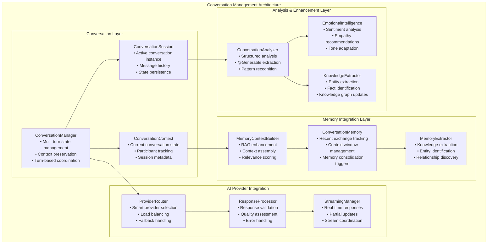

# Conversation Management Architecture

## Executive Summary

ProjectOne's Conversation Management Architecture provides intelligent, context-aware conversation handling that integrates seamlessly with the three-layer AI provider system. The architecture supports multi-turn conversations, context preservation, memory integration, and advanced features like conversation summarization, emotional analysis, and knowledge extraction.

**Key Capabilities:**
- **Multi-turn Context**: Maintains conversation state across multiple exchanges
- **Memory Integration**: Seamlessly integrates with STM, LTM, and episodic memory systems
- **Structured Analysis**: Uses @Generable types for conversation summarization and analysis
- **Privacy-First**: All conversation processing happens on-device
- **Cross-Provider Support**: Works with MLX Swift and Apple Foundation Models

## Architecture Overview



## Core Components

### ConversationManager

Central coordinator for all conversation activities:

```swift
@available(iOS 26.0, macOS 26.0, *)
public class ConversationManager: ObservableObject {
    
    // MARK: - Dependencies
    private let aiCore: EnhancedGemma3nCore
    private let memoryContextBuilder: MemoryContextBuilder
    private let conversationAnalyzer: ConversationAnalyzer
    private let logger = Logger(subsystem: "com.jaredlikes.ProjectOne", category: "ConversationManager")
    
    // MARK: - Published State
    @Published public var currentSession: ConversationSession?
    @Published public var isProcessing = false
    @Published public var activeProvider: String = "None"
    @Published public var conversationQuality: Double = 0.0
    @Published public var lastAnalysis: ConversationSummary?
    
    // MARK: - Configuration
    public struct Configuration {
        let maxContextLength: Int = 8192
        let maxTurnsInContext: Int = 10
        let memoryConsolidationThreshold: Int = 5
        let enableEmotionalAnalysis: Bool = true
        let enableKnowledgeExtraction: Bool = true
        let enableStructuredGeneration: Bool = true
        let privacyMode: Bool = true
    }
    
    public let configuration: Configuration
    
    // MARK: - Initialization
    
    public init(aiCore: EnhancedGemma3nCore, configuration: Configuration = Configuration()) {
        self.aiCore = aiCore
        self.configuration = configuration
        self.memoryContextBuilder = MemoryContextBuilder()
        self.conversationAnalyzer = ConversationAnalyzer(aiCore: aiCore)
        
        logger.info("ConversationManager initialized with privacy mode: \(configuration.privacyMode)")
    }
    
    // MARK: - Session Management
    
    /// Start a new conversation session
    public func startNewSession() async {
        logger.info("Starting new conversation session")
        
        let session = ConversationSession(
            sessionId: UUID(),
            startedAt: Date(),
            configuration: configuration
        )
        
        await MainActor.run {
            currentSession = session
            conversationQuality = 0.0
            lastAnalysis = nil
        }
    }
    
    /// Process user message and generate response
    public func processMessage(_ message: ConversationMessage) async throws -> ConversationResponse {
        guard let session = currentSession else {
            throw ConversationError.noActiveSession
        }
        
        await MainActor.run {
            isProcessing = true
        }
        
        defer {
            Task { @MainActor in
                isProcessing = false
            }
        }
        
        do {
            // Add message to session
            session.addMessage(message)
            
            // Build memory context for RAG enhancement
            let memoryContext = await memoryContextBuilder.buildContext(
                for: message.content,
                session: session,
                configuration: configuration
            )
            
            // Generate response using AI providers
            let response = try await generateResponse(
                for: message,
                context: memoryContext,
                session: session
            )
            
            // Add response to session
            let responseMessage = ConversationMessage(
                content: response.content,
                role: .assistant,
                timestamp: Date(),
                metadata: ConversationMessage.Metadata(
                    provider: response.provider,
                    processingTime: response.processingTime,
                    confidence: response.confidence
                )
            )
            
            session.addMessage(responseMessage)
            
            // Trigger background analysis if appropriate
            if session.messages.count % configuration.memoryConsolidationThreshold == 0 {
                Task {
                    await performBackgroundAnalysis(session: session)
                }
            }
            
            await MainActor.run {
                activeProvider = response.provider
                conversationQuality = calculateConversationQuality(session: session)
            }
            
            return response
            
        } catch {
            logger.error("Failed to process message: \(error.localizedDescription)")
            throw error
        }
    }
    
    /// Stream response for real-time UI updates
    public func streamResponse(for message: ConversationMessage) -> AsyncThrowingStream<ConversationResponseChunk, Error> {
        return AsyncThrowingStream { continuation in
            Task {
                do {
                    guard let session = currentSession else {
                        continuation.finish(throwing: ConversationError.noActiveSession)
                        return
                    }
                    
                    // Build context
                    let memoryContext = await memoryContextBuilder.buildContext(
                        for: message.content,
                        session: session,
                        configuration: configuration
                    )
                    
                    // Stream from AI provider
                    for try await chunk in aiCore.streamResponse(to: message.content, context: memoryContext) {
                        let responseChunk = ConversationResponseChunk(
                            content: chunk,
                            isPartial: true,
                            timestamp: Date()
                        )
                        continuation.yield(responseChunk)
                    }
                    
                    continuation.finish()
                    
                } catch {
                    continuation.finish(throwing: error)
                }
            }
        }
    }
    
    // MARK: - Analysis & Intelligence
    
    /// Perform comprehensive conversation analysis
    public func analyzeCurrentConversation() async throws -> ConversationSummary {
        guard let session = currentSession else {
            throw ConversationError.noActiveSession
        }
        
        logger.info("Analyzing conversation with \(session.messages.count) messages")
        
        // Extract conversation text
        let conversationText = session.messages
            .map { "\($0.role.displayName): \($0.content)" }
            .joined(separator: "\n\n")
        
        // Use structured generation for analysis
        let summary = try await aiCore.summarizeConversation(conversationText)
        
        await MainActor.run {
            lastAnalysis = summary
        }
        
        return summary
    }
    
    /// Extract emotional context from conversation
    public func analyzeEmotionalContext() async throws -> EmotionalAnalysis {
        guard let session = currentSession,
              configuration.enableEmotionalAnalysis else {
            throw ConversationError.featureNotEnabled("Emotional analysis disabled")
        }
        
        let conversationText = session.messages
            .filter { $0.role == .user }
            .map { $0.content }
            .joined(separator: " ")
        
        return try await aiCore.analyzeEmotionalContext(from: conversationText)
    }
    
    /// Extract knowledge and entities from conversation
    public func extractKnowledge() async throws -> KnowledgeGraph {
        guard let session = currentSession,
              configuration.enableKnowledgeExtraction else {
            throw ConversationError.featureNotEnabled("Knowledge extraction disabled")
        }
        
        let conversationText = session.messages
            .map { $0.content }
            .joined(separator: " ")
        
        return try await aiCore.extractKnowledgeGraph(from: conversationText)
    }
    
    // MARK: - Private Methods
    
    private func generateResponse(
        for message: ConversationMessage,
        context: MemoryContext,
        session: ConversationSession
    ) async throws -> ConversationResponse {
        
        let startTime = Date()
        
        // Select best provider based on conversation context
        let providerType = selectOptimalProvider(for: message, session: session)
        
        // Generate response
        let aiResponse = try await aiCore.generateResponse(
            prompt: message.content,
            context: context,
            preferredProvider: providerType
        )
        
        let processingTime = Date().timeIntervalSince(startTime)
        
        return ConversationResponse(
            content: aiResponse.content,
            confidence: aiResponse.confidence,
            provider: aiResponse.modelUsed,
            processingTime: processingTime,
            metadata: ConversationResponse.Metadata(
                contextSize: context.estimatedTokenCount,
                memoryEnhanced: !context.isEmpty,
                personalDataUsed: context.containsPersonalData
            )
        )
    }
    
    private func selectOptimalProvider(
        for message: ConversationMessage,
        session: ConversationSession
    ) -> AIProviderType {
        
        // Analyze message characteristics
        let messageLength = message.content.count
        let hasImages = !message.attachments.filter { $0.type == .image }.isEmpty
        let requiresStructuredOutput = message.content.lowercased().contains("summarize") ||
                                     message.content.lowercased().contains("extract") ||
                                     message.content.lowercased().contains("analyze")
        
        // Provider selection logic
        if hasImages {
            return .mlxVLM  // Multimodal required
        } else if requiresStructuredOutput && configuration.enableStructuredGeneration {
            return .foundation  // @Generable types
        } else if messageLength > 2000 {
            return .mlxLLM  // Better for long context
        } else {
            return .automatic  // Let system decide
        }
    }
    
    private func calculateConversationQuality(session: ConversationSession) -> Double {
        // Quality metrics based on:
        // - Response relevance
        // - Context utilization
        // - User engagement patterns
        // - Error rates
        
        guard !session.messages.isEmpty else { return 0.0 }
        
        let totalMessages = session.messages.count
        let assistantMessages = session.messages.filter { $0.role == .assistant }
        let avgConfidence = assistantMessages.reduce(0.0) { $0 + ($1.metadata?.confidence ?? 0.5) } / Double(assistantMessages.count)
        let avgResponseTime = assistantMessages.reduce(0.0) { $0 + ($1.metadata?.processingTime ?? 2.0) } / Double(assistantMessages.count)
        
        // Weighted quality score
        let confidenceScore = avgConfidence * 0.4
        let speedScore = min(1.0, 2.0 / avgResponseTime) * 0.3  // Faster is better, cap at 2s
        let engagementScore = min(1.0, Double(totalMessages) / 10.0) * 0.3  // More turns = better engagement
        
        return confidenceScore + speedScore + engagementScore
    }
    
    private func performBackgroundAnalysis(session: ConversationSession) async {
        logger.info("Performing background conversation analysis")
        
        do {
            // Generate conversation summary
            if configuration.enableStructuredGeneration {
                let _ = try await analyzeCurrentConversation()
            }
            
            // Extract knowledge if enabled
            if configuration.enableKnowledgeExtraction {
                let _ = try await extractKnowledge()
            }
            
            // Trigger memory consolidation
            await memoryContextBuilder.consolidateConversationMemory(session: session)
            
        } catch {
            logger.error("Background analysis failed: \(error.localizedDescription)")
        }
    }
}
```

### ConversationSession

Represents an active conversation instance:

```swift
public class ConversationSession: ObservableObject, Identifiable {
    
    // MARK: - Properties
    public let id = UUID()
    public let sessionId: UUID
    public let startedAt: Date
    public let configuration: ConversationManager.Configuration
    
    // MARK: - State
    @Published public private(set) var messages: [ConversationMessage] = []
    @Published public private(set) var participants: Set<ConversationParticipant> = []
    @Published public private(set) var currentTurn: Int = 0
    @Published public private(set) var isActive: Bool = true
    @Published public private(set) var totalTokensUsed: Int = 0
    
    // MARK: - Metadata
    public private(set) var lastActivity: Date
    public private(set) var sessionMetrics: SessionMetrics
    
    public struct SessionMetrics {
        var messageCount: Int = 0
        var averageResponseTime: TimeInterval = 0.0
        var totalProcessingTime: TimeInterval = 0.0
        var averageConfidence: Double = 0.0
        var memoryContextUsage: Int = 0
        var errorCount: Int = 0
    }
    
    // MARK: - Initialization
    
    public init(sessionId: UUID, startedAt: Date, configuration: ConversationManager.Configuration) {
        self.sessionId = sessionId
        self.startedAt = startedAt
        self.configuration = configuration
        self.lastActivity = startedAt
        self.sessionMetrics = SessionMetrics()
        
        // Add system participant
        self.participants.insert(ConversationParticipant(
            id: UUID(),
            role: .assistant,
            name: "ProjectOne AI",
            joinedAt: startedAt
        ))
    }
    
    // MARK: - Message Management
    
    /// Add message to conversation
    public func addMessage(_ message: ConversationMessage) {
        messages.append(message)
        currentTurn += 1
        lastActivity = Date()
        
        // Update metrics
        updateSessionMetrics(for: message)
        
        // Maintain context window
        maintainContextWindow()
        
        objectWillChange.send()
    }
    
    /// Get recent messages for context
    public func getRecentMessages(count: Int? = nil) -> [ConversationMessage] {
        let contextCount = count ?? configuration.maxTurnsInContext
        return Array(messages.suffix(contextCount * 2)) // User + Assistant pairs
    }
    
    /// Get conversation text for analysis
    public func getConversationText() -> String {
        return messages
            .map { "\($0.role.displayName): \($0.content)" }
            .joined(separator: "\n\n")
    }
    
    // MARK: - Context Management
    
    /// Estimate current context size in tokens
    public func estimateContextSize() -> Int {
        return messages.reduce(0) { total, message in
            total + (message.content.count / 4) // Rough token estimation
        }
    }
    
    /// Check if context window is approaching limits
    public func isContextNearLimit() -> Bool {
        return estimateContextSize() > (configuration.maxContextLength * 3 / 4)
    }
    
    // MARK: - Private Methods
    
    private func updateSessionMetrics(for message: ConversationMessage) {
        sessionMetrics.messageCount += 1
        
        if message.role == .assistant {
            if let metadata = message.metadata {
                // Update response time
                let newTotal = sessionMetrics.totalProcessingTime + metadata.processingTime
                sessionMetrics.totalProcessingTime = newTotal
                sessionMetrics.averageResponseTime = newTotal / Double(sessionMetrics.messageCount)
                
                // Update confidence
                let assistantMessageCount = messages.filter { $0.role == .assistant }.count
                let totalConfidence = sessionMetrics.averageConfidence * Double(assistantMessageCount - 1)
                sessionMetrics.averageConfidence = (totalConfidence + metadata.confidence) / Double(assistantMessageCount)
            }
        }
    }
    
    private func maintainContextWindow() {
        guard estimateContextSize() > configuration.maxContextLength else { return }
        
        // Keep recent messages, remove older ones
        let targetSize = configuration.maxContextLength * 2 / 3
        var currentSize = estimateContextSize()
        var removeCount = 0
        
        for message in messages {
            if currentSize <= targetSize { break }
            currentSize -= (message.content.count / 4)
            removeCount += 1
        }
        
        if removeCount > 0 {
            messages.removeFirst(removeCount)
            Logger(subsystem: "com.jaredlikes.ProjectOne", category: "ConversationSession")
                .info("Removed \(removeCount) messages to maintain context window")
        }
    }
}
```

### ConversationMessage

Individual message within a conversation:

```swift
public struct ConversationMessage: Identifiable, Codable {
    
    // MARK: - Properties
    public let id = UUID()
    public let content: String
    public let role: ConversationRole
    public let timestamp: Date
    public let attachments: [MessageAttachment]
    public let metadata: Metadata?
    
    // MARK: - Supporting Types
    
    public enum ConversationRole: String, Codable, CaseIterable {
        case user = "user"
        case assistant = "assistant"
        case system = "system"
        
        public var displayName: String {
            switch self {
            case .user: return "User"
            case .assistant: return "Assistant"
            case .system: return "System"
            }
        }
    }
    
    public struct MessageAttachment: Identifiable, Codable {
        public let id = UUID()
        public let type: AttachmentType
        public let data: Data
        public let filename: String?
        public let mimeType: String?
        
        public enum AttachmentType: String, Codable {
            case image = "image"
            case audio = "audio"
            case document = "document"
        }
    }
    
    public struct Metadata: Codable {
        public let provider: String?
        public let processingTime: TimeInterval?
        public let confidence: Double?
        public let tokensUsed: Int?
        public let memoryEnhanced: Bool?
        public let personalDataUsed: Bool?
    }
    
    // MARK: - Initialization
    
    public init(
        content: String,
        role: ConversationRole,
        timestamp: Date = Date(),
        attachments: [MessageAttachment] = [],
        metadata: Metadata? = nil
    ) {
        self.content = content
        self.role = role
        self.timestamp = timestamp
        self.attachments = attachments
        self.metadata = metadata
    }
    
    // MARK: - Computed Properties
    
    public var hasAttachments: Bool {
        return !attachments.isEmpty
    }
    
    public var hasImages: Bool {
        return attachments.contains { $0.type == .image }
    }
    
    public var estimatedTokenCount: Int {
        return content.count / 4 // Rough estimation
    }
}
```

### MemoryContextBuilder

Builds enhanced memory context for RAG:

```swift
public class MemoryContextBuilder {
    
    private let logger = Logger(subsystem: "com.jaredlikes.ProjectOne", category: "MemoryContextBuilder")
    
    // MARK: - Context Building
    
    /// Build comprehensive memory context for conversation
    public func buildContext(
        for query: String,
        session: ConversationSession,
        configuration: ConversationManager.Configuration
    ) async -> MemoryContext {
        
        logger.info("Building memory context for query: \(query.prefix(50))...")
        
        // Gather conversation history
        let recentMessages = session.getRecentMessages(count: 5)
        let conversationContext = extractConversationContext(from: recentMessages)
        
        // Build memory context
        return MemoryContext(
            entities: [], // TODO: Integrate with knowledge graph
            relationships: [], // TODO: Integrate with relationships
            shortTermMemories: buildSTMContext(from: conversationContext),
            longTermMemories: [], // TODO: Integrate with LTM system
            episodicMemories: [], // TODO: Integrate with episodic memory
            relevantNotes: [], // TODO: Integrate with notes system
            timestamp: Date(),
            userQuery: query,
            containsPersonalData: detectPersonalData(in: query)
        )
    }
    
    /// Consolidate conversation into memory systems
    public func consolidateConversationMemory(session: ConversationSession) async {
        logger.info("Consolidating conversation memory for session \(session.sessionId)")
        
        // Extract key information from conversation
        let conversationText = session.getConversationText()
        
        // TODO: Integrate with memory consolidation system
        // - Create STM entries for recent exchanges
        // - Identify LTM candidates
        // - Extract entities and relationships
        // - Create episodic memories for significant events
    }
    
    // MARK: - Private Methods
    
    private func extractConversationContext(from messages: [ConversationMessage]) -> [STMEntry] {
        return messages.map { message in
            STMEntry(
                id: UUID(),
                content: "\(message.role.displayName): \(message.content)",
                timestamp: message.timestamp,
                memoryType: .conversation,
                importance: calculateImportance(for: message),
                decayRate: 0.1, // Conversation context decays relatively quickly
                contextTags: ["conversation", message.role.rawValue],
                containsPersonalData: detectPersonalData(in: message.content)
            )
        }
    }
    
    private func buildSTMContext(from conversationContext: [STMEntry]) -> [STMEntry] {
        // Return recent conversation context as STM
        return Array(conversationContext.suffix(10)) // Keep last 10 exchanges
    }
    
    private func calculateImportance(for message: ConversationMessage) -> Double {
        var importance: Double = 0.5 // Base importance
        
        // Adjust based on message characteristics
        if message.role == .user {
            importance += 0.2 // User messages are slightly more important
        }
        
        if message.hasAttachments {
            importance += 0.2 // Messages with attachments are more significant
        }
        
        if message.content.count > 200 {
            importance += 0.1 // Longer messages might be more detailed/important
        }
        
        return min(1.0, importance) // Cap at 1.0
    }
    
    private func detectPersonalData(in content: String) -> Bool {
        let personalDataPatterns = [
            "my name is",
            "I am",
            "I live",
            "my address",
            "my phone",
            "my email"
        ]
        
        let lowercaseContent = content.lowercased()
        return personalDataPatterns.contains { pattern in
            lowercaseContent.contains(pattern)
        }
    }
}
```

## Data Models

### ConversationResponse

Response from AI provider with conversation metadata:

```swift
public struct ConversationResponse {
    
    // MARK: - Properties
    public let content: String
    public let confidence: Double
    public let provider: String
    public let processingTime: TimeInterval
    public let metadata: Metadata
    
    // MARK: - Supporting Types
    
    public struct Metadata {
        public let contextSize: Int
        public let memoryEnhanced: Bool
        public let personalDataUsed: Bool
        public let tokensUsed: Int?
        public let qualityScore: Double?
        public let analysisData: ConversationAnalysisData?
    }
    
    public struct ConversationAnalysisData {
        public let emotionalTone: EmotionalTone
        public let topicCategories: [String]
        public let extractedEntities: [String]
        public let suggestedFollowUps: [String]
    }
}

public struct ConversationResponseChunk {
    public let content: String
    public let isPartial: Bool
    public let timestamp: Date
    public let metadata: [String: Any]?
}
```

### ConversationParticipant

Represents participants in a conversation:

```swift
public struct ConversationParticipant: Identifiable, Hashable {
    
    // MARK: - Properties
    public let id: UUID
    public let role: ConversationRole
    public let name: String
    public let joinedAt: Date
    public let metadata: Metadata?
    
    // MARK: - Supporting Types
    
    public struct Metadata {
        public let avatar: Data?
        public let preferences: UserPreferences?
        public let capabilities: [String]?
    }
    
    public struct UserPreferences {
        public let preferredResponseLength: ResponseLength
        public let communicationStyle: CommunicationStyle
        public let topicInterests: [String]
        
        public enum ResponseLength {
            case brief, detailed, comprehensive
        }
        
        public enum CommunicationStyle {
            case formal, casual, friendly, professional
        }
    }
    
    // MARK: - Hashable Conformance
    
    public func hash(into hasher: inout Hasher) {
        hasher.combine(id)
    }
    
    public static func == (lhs: ConversationParticipant, rhs: ConversationParticipant) -> Bool {
        return lhs.id == rhs.id
    }
}
```

## Error Handling

### ConversationError

Comprehensive error handling for conversation operations:

```swift
public enum ConversationError: Error, LocalizedError {
    case noActiveSession
    case sessionExpired(String)
    case messageValidationFailed(String)
    case contextSizeExceeded(Int, Int) // actual, maximum
    case providerUnavailable(String)
    case analysisNotSupported(String)
    case featureNotEnabled(String)
    case memoryContextFailed(String)
    case streamingError(String)
    
    public var errorDescription: String? {
        switch self {
        case .noActiveSession:
            return "No active conversation session"
        case .sessionExpired(let sessionId):
            return "Conversation session expired: \(sessionId)"
        case .messageValidationFailed(let reason):
            return "Message validation failed: \(reason)"
        case .contextSizeExceeded(let actual, let maximum):
            return "Context size exceeded: \(actual) tokens, maximum: \(maximum)"
        case .providerUnavailable(let provider):
            return "AI provider unavailable: \(provider)"
        case .analysisNotSupported(let feature):
            return "Analysis feature not supported: \(feature)"
        case .featureNotEnabled(let feature):
            return "Feature not enabled: \(feature)"
        case .memoryContextFailed(let reason):
            return "Memory context building failed: \(reason)"
        case .streamingError(let reason):
            return "Streaming error: \(reason)"
        }
    }
}
```

## Usage Examples

### Basic Conversation Flow

```swift
// Initialize conversation manager
let conversationManager = ConversationManager(aiCore: enhancedGemma3nCore)

// Start new session
await conversationManager.startNewSession()

// Create user message
let userMessage = ConversationMessage(
    content: "Help me understand the key concepts from our last discussion about AI architecture",
    role: .user
)

// Process message and get response
do {
    let response = try await conversationManager.processMessage(userMessage)
    print("Response: \(response.content)")
    print("Provider: \(response.provider)")
    print("Confidence: \(response.confidence)")
} catch {
    print("Error: \(error)")
}
```

### Streaming Conversation

```swift
// Stream response for real-time updates
for try await chunk in conversationManager.streamResponse(for: userMessage) {
    if chunk.isPartial {
        // Update UI with partial response
        updateUI(with: chunk.content)
    }
}
```

### Conversation Analysis

```swift
// Analyze current conversation
do {
    let summary = try await conversationManager.analyzeCurrentConversation()
    print("Topics: \(summary.mainTopics)")
    print("Key Decisions: \(summary.keyDecisions)")
    print("Action Items: \(summary.actionItems)")
    
    // Extract emotional context
    let emotionalAnalysis = try await conversationManager.analyzeEmotionalContext()
    print("Overall tone: \(emotionalAnalysis.overallTone)")
    print("Emotions detected: \(emotionalAnalysis.specificEmotions)")
    
    // Extract knowledge
    let knowledge = try await conversationManager.extractKnowledge()
    print("Entities: \(knowledge.entities.count)")
    print("Relationships: \(knowledge.relationships.count)")
    
} catch {
    print("Analysis error: \(error)")
}
```

## Performance Considerations

### Memory Management

- **Context Window Management**: Automatically maintains optimal context size
- **Message History Pruning**: Removes old messages when context limit approached
- **Lazy Loading**: Loads conversation history on demand
- **Background Processing**: Analysis runs asynchronously without blocking UI

### Concurrency Optimization

- **Parallel Analysis**: Multiple analysis tasks run concurrently
- **Stream Processing**: Real-time response streaming with backpressure handling
- **Background Consolidation**: Memory consolidation happens asynchronously
- **Provider Load Balancing**: Distributes load across available providers

### Privacy & Security

- **On-Device Processing**: All conversation processing happens locally
- **Personal Data Detection**: Automatic identification of personal information
- **Privacy Mode**: Optional enhanced privacy settings
- **Secure Storage**: Conversation data encrypted at rest

## Future Enhancements

### Advanced Features

- **Multi-Language Support**: Automatic language detection and switching
- **Voice Integration**: Speech-to-text and text-to-speech integration
- **Collaborative Conversations**: Multi-participant conversation support
- **Smart Suggestions**: Proactive conversation suggestions and follow-ups

### AI Enhancements

- **Context Learning**: Improved context understanding over time
- **Personality Adaptation**: AI personality adjustment based on user preferences
- **Domain Specialization**: Specialized conversation modes for different domains
- **Federated Learning**: Cross-conversation learning while preserving privacy

This conversation management architecture provides a robust foundation for intelligent, context-aware conversations while maintaining privacy and performance across all Apple platforms.