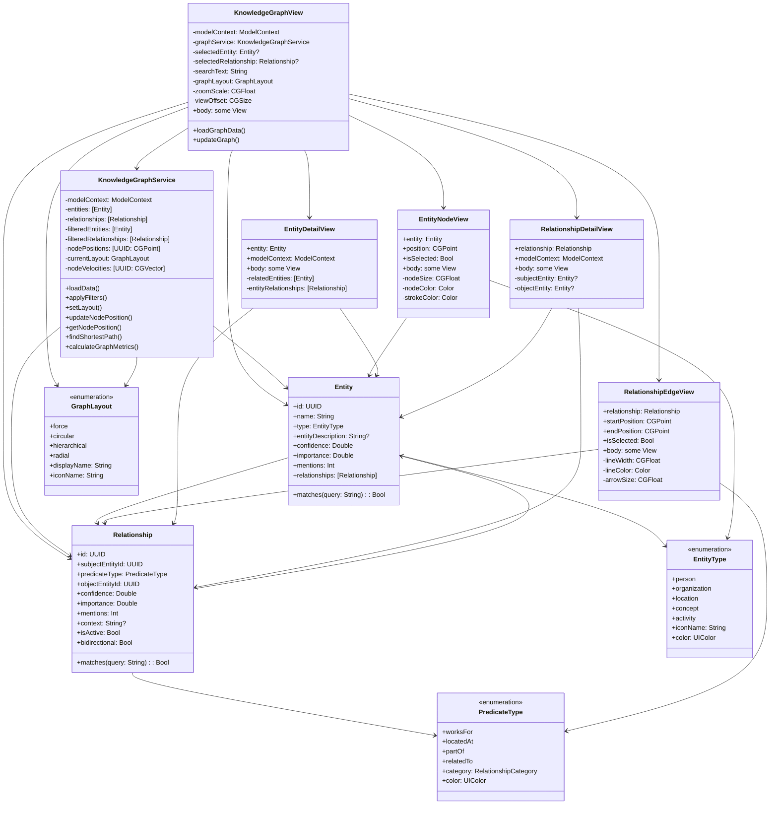

# Knowledge Graph Architecture Documentation

## Overview

The Knowledge Graph system in ProjectOne provides interactive visualization and management of entities and their relationships. This document describes the architecture, object relationships, and data flow patterns implemented as part of Phase 3 development.

## System Architecture

### Core Components

```
┌─────────────────────────────────────────────────────────────────┐
│                    Knowledge Graph System                        │
├─────────────────────────────────────────────────────────────────┤
│  ┌─────────────────┐  ┌─────────────────┐  ┌─────────────────┐ │
│  │   UI Layer      │  │  Service Layer  │  │   Data Layer    │ │
│  │                 │  │                 │  │                 │ │
│  │ • KnowledgeGraphView │ • KnowledgeGraphService │ • Entity      │ │
│  │ • EntityNodeView     │ • Layout Algorithms     │ • Relationship │ │
│  │ • RelationshipEdgeView │ • Filtering Logic    │ • SwiftData    │ │
│  │ • EntityDetailView   │ • Graph Analysis       │   Models       │ │
│  │ • RelationshipDetailView │                   │               │ │
│  └─────────────────┘  └─────────────────┐  └─────────────────┘ │
└─────────────────────────────────────────────────────────────────┘
```

### Object/Class Diagram



## Data Flow Architecture

### 1. Data Loading Flow

```
┌─────────────────┐    ┌─────────────────┐    ┌─────────────────┐
│ KnowledgeGraphView │ → │ KnowledgeGraphService │ → │   SwiftData     │
│                 │    │                 │    │   ModelContext  │
│ .task {         │    │ loadData()      │    │                 │
│   loadGraphData() │    │                 │    │ fetch(Entity)   │
│ }               │    │                 │    │ fetch(Relationship) │
└─────────────────┘    └─────────────────┘    └─────────────────┘
```

### 2. Filtering and Search Flow

```
┌─────────────────┐    ┌─────────────────┐    ┌─────────────────┐
│ User Input      │ → │ KnowledgeGraphService │ → │ Filtered Results │
│                 │    │                 │    │                 │
│ • Search Text   │    │ applyFilters()  │    │ • filteredEntities │
│ • Entity Types  │    │ • Type Filter   │    │ • filteredRelationships │
│ • Relationship  │    │ • Search Filter │    │                 │
│   Categories    │    │ • Visibility    │    │                 │
└─────────────────┘    └─────────────────┘    └─────────────────┘
```

### 3. Layout and Positioning Flow

```
┌─────────────────┐    ┌─────────────────┐    ┌─────────────────┐
│ Layout Selection │ → │ KnowledgeGraphService │ → │ Node Positions  │
│                 │    │                 │    │                 │
│ • GraphLayout   │    │ setLayout()     │    │ nodePositions   │
│ • Canvas Size   │    │ • Force Physics │    │ [UUID: CGPoint] │
│ • User Interaction │    │ • Circular Math │    │                 │
│                 │    │ • Hierarchical  │    │ Real-time       │
│                 │    │ • Radial        │    │ Updates         │
└─────────────────┘    └─────────────────┘    └─────────────────┘
```

### 4. Interaction Flow

```
┌─────────────────┐    ┌─────────────────┐    ┌─────────────────┐
│ User Gestures   │ → │ View Updates    │ → │ Service Updates │
│                 │    │                 │    │                 │
│ • Tap Selection │    │ • selectedEntity │    │ • Position Update │
│ • Drag Node     │    │ • selectedRelationship │ • Velocity Reset │
│ • Zoom/Pan      │    │ • zoomScale     │    │ • Layout Refresh │
│ • Filter Toggle │    │ • viewOffset    │    │                 │
└─────────────────┘    └─────────────────┘    └─────────────────┘
```

## Key Design Patterns

### 1. Observer Pattern
- `KnowledgeGraphService` uses `@Published` properties
- `KnowledgeGraphView` observes changes via `@StateObject`
- Real-time UI updates when data changes

### 2. Strategy Pattern
- `GraphLayout` enum defines different layout strategies
- `KnowledgeGraphService` implements each layout algorithm
- Easy to add new layout types

### 3. Protocol-Oriented Design
- `Entity` and `Relationship` implement search matching
- Extensible for future search capabilities

### 4. Separation of Concerns
- **UI Layer**: SwiftUI views handle presentation
- **Service Layer**: Business logic and data management
- **Data Layer**: SwiftData models and persistence

## Performance Considerations

### 1. Memory Management
- Filtered collections reduce processing overhead
- Node position caching prevents redundant calculations
- Timer-based force simulation with automatic stopping

### 2. Rendering Optimization
- Conditional rendering based on selection state
- Efficient path calculations for edges
- ZStack layering for proper draw order

### 3. Data Efficiency
- Lazy loading of related entities
- Efficient filtering algorithms
- Minimal SwiftData queries

## Integration Points

### 1. SwiftData Integration
```swift
// Entity and Relationship models use SwiftData
@Model final class Entity {
    // SwiftData persistence
}

@Model final class Relationship {
    // SwiftData relationships
}
```

### 2. Audio Processing Integration
```swift
// Knowledge graph populated from transcription
ProcessedNote → Entity extraction → Knowledge Graph
```

### 3. Memory System Integration
```swift
// Entities and relationships feed into memory consolidation
Knowledge Graph → STM/LTM → Memory Analytics
```

## Future Extensibility

### 1. Layout Extensions
- Add new `GraphLayout` cases
- Implement corresponding algorithms in service
- No UI changes required

### 2. Visualization Enhancements
- Custom entity icons based on type
- Relationship strength visualization
- Clustering and grouping features

### 3. Analysis Features
- Graph metrics dashboard
- Community detection
- Shortest path highlighting

### 4. Export/Import
- Graph serialization
- Format conversion
- Sharing capabilities

## Testing Strategy

### 1. Unit Tests
- Service layer logic testing
- Layout algorithm validation
- Filtering functionality verification

### 2. Integration Tests
- SwiftData model interactions
- Service-view communication
- Real-time updates

### 3. UI Tests
- Gesture handling
- Selection states
- Navigation flow

## Configuration and Customization

### 1. Visual Theming
- Color schemes in entity/relationship types
- Size and spacing constants
- Animation timing parameters

### 2. Layout Parameters
- Force simulation constants
- Node positioning algorithms
- Canvas size adaptations

### 3. Filtering Options
- Entity type selections
- Relationship categories
- Search query processing

This architecture provides a solid foundation for the knowledge graph visualization system while maintaining flexibility for future enhancements and integrations within the larger ProjectOne ecosystem.