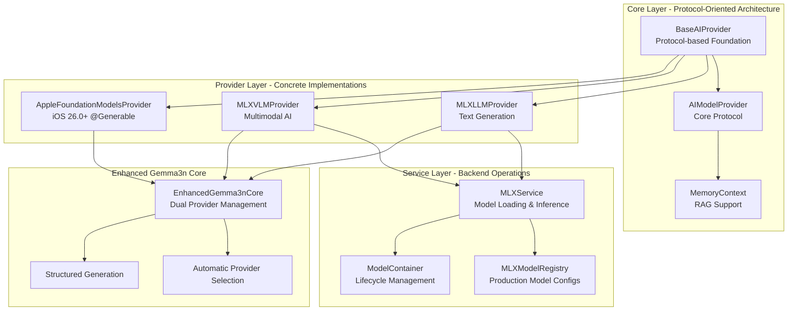
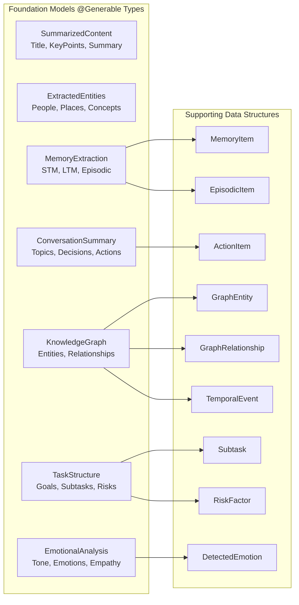
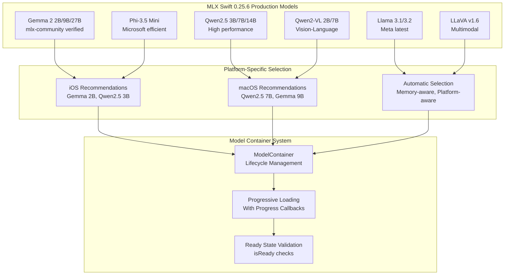
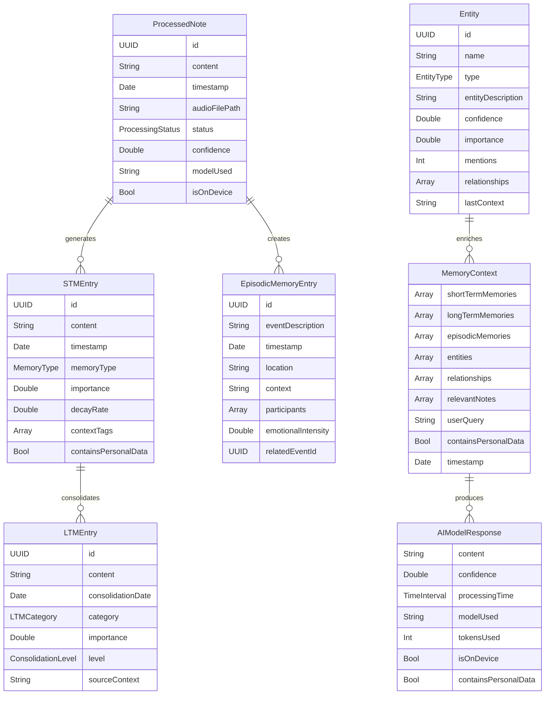
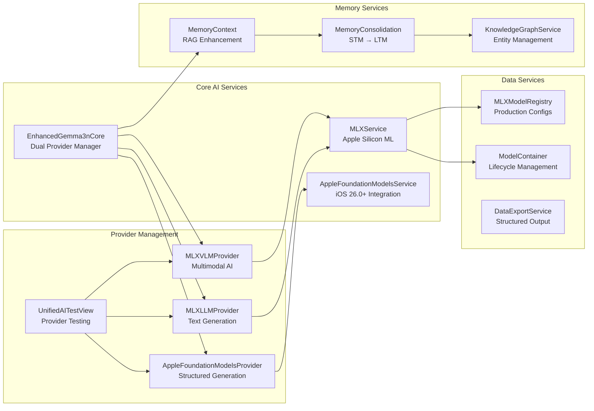
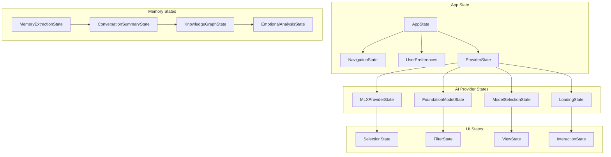

# ProjectOne System Architecture Overview

## Executive Summary

ProjectOne is a sophisticated SwiftUI iOS/macOS personal AI knowledge system that combines advanced AI providers, memory management, knowledge graph construction, and intelligent conversation assistance. The system is built around a **Three-Layer AI Architecture** with MLX Swift for Apple Silicon and Apple Foundation Models for iOS 26.0+.

**Current Status**: Phase 3 Complete (Production-Ready AI Architecture) - Advanced AI Integration with Multiple Providers

## High-Level System Architecture

```
┌─────────────────────────────────────────────────────────────────────────────────┐
│                              ProjectOne System                                  │
├─────────────────────────────────────────────────────────────────────────────────┤
│                                                                                 │
│  ┌─────────────────┐  ┌─────────────────┐  ┌─────────────────┐  ┌─────────────┐ │
│  │   UI Layer      │  │  Service Layer  │  │   Data Layer    │  │ AI/ML Layer │ │
│  │                 │  │                 │  │                 │  │             │ │
│  │ • SwiftUI Views │  │ • EnhancedGemma │  │ • SwiftData     │  │ • MLX Swift │ │
│  │ • Navigation    │  │   3nCore        │  │ • 11 Models     │  │ • Foundation │ │
│  │ • Interactive   │  │ • AudioRecorder │  │ • Relationships │  │   Models    │ │
│  │   Components    │  │ • Memory        │  │ • Persistence   │  │ • @Generable │ │
│  │ • Test Views    │  │   Management    │  │ • Vector Store  │  │ • Dual AI   │ │
│  └─────────────────┘  └─────────────────┘  └─────────────────┘  └─────────────┘ │
│                                                                                 │
├─────────────────────────────────────────────────────────────────────────────────┤
│                         Three-Layer AI Architecture                             │
│  ┌─────────────────┐  ┌─────────────────┐  ┌─────────────────┐  ┌─────────────┐ │
│  │ Core Layer      │  │ Provider Layer  │  │ Service Layer   │  │ Testing     │ │
│  │                 │  │                 │  │                 │  │             │ │
│  │ • BaseAIProvider│  │ • MLXLLMProvider│  │ • MLXService    │  │ • Unified   │ │
│  │ • AIModelProvider│  │ • MLXVLMProvider│  │ • MLXModel      │  │   Test      │ │
│  │ • Protocol      │  │ • FoundationProvider│  │   Registry    │  │   Views     │ │
│  │   Oriented      │  │ • Memory Context│  │ • Model Loading │  │ • Mock      │ │
│  │ • Type Safety   │  │ • Response Types│  │ • Configuration │  │   Providers │ │
│  └─────────────────┘  └─────────────────┘  └─────────────────┘  └─────────────┘ │
│                                                                                 │
├─────────────────────────────────────────────────────────────────────────────────┤
│                            Memory Architecture                                  │
│  ┌─────────────────┐  ┌─────────────────┐  ┌─────────────────┐  ┌─────────────┐ │
│  │ Short-Term      │  │ Working Memory  │  │ Long-Term       │  │ Episodic    │ │
│  │ Memory (STM)    │  │                 │  │ Memory (LTM)    │  │ Memory      │ │
│  │                 │  │ • Active        │  │                 │  │             │ │
│  │ • Recent        │  │   Processing    │  │ • Consolidated  │  │ • Temporal  │ │
│  │   Interactions  │  │ • Current       │  │   Knowledge     │  │   Events    │ │
│  │ • Decay         │  │   Context       │  │ • Patterns      │  │ • Time-     │ │
│  │   Mechanisms    │  │ • Task State    │  │ • Permanent     │  │   based     │ │
│  │ • Context Tags  │  │ • @Generable    │  │   Storage       │  │   Storage   │ │
│  └─────────────────┘  └─────────────────┘  └─────────────────┘  └─────────────┘ │
└─────────────────────────────────────────────────────────────────────────────────┘
```

## Core Components Deep Dive

### 1. Three-Layer AI Provider Architecture



### 2. Advanced @Generable Structured Generation



### 3. Production MLX Swift Integration



## Data Flow Patterns

### 1. Modern AI Processing Pipeline

```
┌─────────────────┐    ┌─────────────────┐    ┌─────────────────┐    ┌─────────────────┐
│ User Input      │ → │ Provider        │ → │ Memory Context  │ → │ AI Response     │
│                 │    │ Selection       │    │ Enhancement     │    │                 │
│ • Text/Audio    │    │ • MLX/Foundation│    │ • STM/LTM/EM   │    │ • Generated     │
│ • Multimodal    │    │ • Auto-routing  │    │ • Entity Context│    │ • Structured    │
│ • Context       │    │ • Load Balancing│    │ • RAG Prompting │    │ • Confident     │
└─────────────────┘    └─────────────────┘    └─────────────────┘    └─────────────────┘
```

### 2. Structured Generation Flow

```
┌─────────────────┐    ┌─────────────────┐    ┌─────────────────┐    ┌─────────────────┐
│ Natural Language│ → │ @Generable      │ → │ Foundation      │ → │ Structured      │
│ Request         │    │ Type Selection  │    │ Models API      │    │ Output          │
│                 │    │                 │    │                 │    │                 │
│ • Extract info  │    │ • MemoryExtraction│    │ • Guided Gen   │    │ • Type-safe     │
│ • Summarize     │    │ • ConvSummary   │    │ • Schema-driven │    │ • Validated     │
│ • Analyze       │    │ • KnowledgeGraph│    │ • Structured    │    │ • Ready to use  │
└─────────────────┘    └─────────────────┘    └─────────────────┘    └─────────────────┘
```

### 3. Memory-Enhanced RAG Flow

```
┌─────────────────┐    ┌─────────────────┐    ┌─────────────────┐    ┌─────────────────┐
│ Query Context   │ → │ Memory Retrieval│ → │ Prompt          │ → │ Enhanced        │
│                 │    │                 │    │ Enhancement     │    │ Response        │
│ • User query    │    │ • STM recent    │    │ • Context-aware │    │ • Personalized  │
│ • Current state │    │ • LTM relevant  │    │ • Memory-guided │    │ • Contextual    │
│ • Session data  │    │ • Episodic events│    │ • Entity-rich  │    │ • Accurate      │
└─────────────────┘    └─────────────────┘    └─────────────────┘    └─────────────────┘
```

## SwiftData Model Architecture

### Enhanced Memory Models



## Service Layer Architecture



## UI Architecture

### 1. Enhanced Navigation Structure

```
ProjectOneApp (iOS 26.0+)
├── ContentView (Master-Detail)
│   ├── NotesListView
│   │   ├── NoteDetailView
│   │   └── TranscriptionDisplayView
│   ├── KnowledgeGraphView
│   │   ├── EntityNodeView
│   │   ├── RelationshipEdgeView
│   │   ├── EntityDetailView
│   │   └── RelationshipDetailView
│   ├── MemoryDashboardView
│   │   ├── STMListView (with context tags)
│   │   ├── LTMListView (with categories)
│   │   ├── EpisodicMemoryView (temporal)
│   │   └── ConsolidationView (automation)
│   └── AIProvidersView (NEW)
│       ├── UnifiedAITestView (provider testing)
│       ├── MLXProviderSettingsView
│       ├── FoundationModelsStatusView
│       └── StructuredGenerationDemo
└── QuickActionBar (Floating)
    ├── AudioControls
    ├── TranscriptionPreview
    └── AIProviderStatus (NEW)
```

### 2. Advanced State Management



## Development Phases

### ✅ Phase 1: Swift Learning Enhancement (Complete)
- Comprehensive Swift learning comments in all AI provider files
- SwiftConceptsGuide.md with real code examples
- Protocol-oriented programming education
- Modern Swift concurrency patterns documentation

### ✅ Phase 2: Critical Architecture Fixes (Complete)
- Fixed MLXService.swift with proper MLX Swift 0.25.6 API integration
- Updated MLXModelRegistry.swift with verified production model configurations
- Replaced fatalError anti-patterns with safe protocol-oriented design
- Enhanced @Generable types with 7 advanced structured generation examples

### ✅ Phase 3: Production Architecture Documentation (In Progress)
- Updated SYSTEM_ARCHITECTURE_OVERVIEW.md to reflect current production state
- Three-layer AI provider architecture documentation
- Advanced memory management and RAG patterns
- Structured generation and @Generable protocol usage

### 🔄 Phase 4: Enhanced Memory Management (Next)
- Advanced memory consolidation algorithms
- Intelligent memory retrieval optimization
- Cross-provider memory sharing
- Performance optimization for large memory stores

### 🔄 Phase 5: Platform Optimization (Future)
- iOS/macOS platform-specific optimizations
- Advanced Swift concurrency best practices
- Performance tuning and memory management
- Production deployment preparation

## Integration Patterns

### 1. Cross-Platform AI Support
- **MLX Swift**: Apple Silicon M1/M2/M3 optimized inference
- **Foundation Models**: iOS 26.0+ system integration with @Generable
- **Automatic Provider Selection**: Memory-aware, platform-aware routing
- **Universal Binary**: Single codebase supporting all Apple devices

### 2. Privacy & Security
- **Local Processing**: All AI processing happens on-device with MLX Swift
- **No External APIs**: Foundation Models and MLX run completely locally
- **Secure Memory**: SwiftData provides encrypted local memory storage
- **Personal Data Protection**: containsPersonalData flags throughout architecture

### 3. Performance Optimization
- **Three-Layer Architecture**: Clean separation for optimal performance
- **Progressive Model Loading**: Models load with progress feedback
- **Memory-Efficient Design**: Proper cleanup and resource management
- **Real-time Generation**: Streaming responses with AsyncThrowingStream

## Error Handling Strategy

### 1. AI Provider Error Handling
- **Device Compatibility**: MLX requires Apple Silicon validation
- **Model Loading**: Comprehensive error recovery for model failures
- **Generation Failures**: Graceful degradation with fallback providers
- **Memory Constraints**: Smart provider selection based on available memory

### 2. Structured Generation Safety
- **Type Safety**: @Generable protocol ensures compile-time validation
- **Schema Validation**: Foundation Models validate structure before generation
- **Fallback Types**: Non-@Generable versions for older iOS versions
- **Error Recovery**: Graceful handling of generation failures

### 3. Memory Context Reliability
- **Context Validation**: Memory context size and relevance checks
- **RAG Safety**: Prompt injection protection and content validation
- **Privacy Protection**: Personal data handling with appropriate flags
- **Performance Monitoring**: Context size optimization and caching

## Testing Architecture

### 1. AI Provider Testing
- **UnifiedAITestView**: Comprehensive provider testing interface
- **Mock Providers**: Testable implementations for unit tests
- **Performance Benchmarks**: Response time and quality metrics
- **Cross-Provider Validation**: Consistency testing across providers

### 2. Structured Generation Testing
- **@Generable Validation**: Type safety and schema compliance tests
- **Output Quality**: Structured generation accuracy measurements
- **Performance Tests**: Generation speed and memory usage optimization
- **Integration Tests**: End-to-end structured generation workflows

### 3. Memory System Testing
- **Memory Context Tests**: RAG enhancement validation
- **Consolidation Tests**: STM to LTM conversion accuracy
- **Retrieval Tests**: Memory search and relevance scoring
- **Performance Tests**: Large memory store efficiency

## Future Extensibility

### 1. AI/ML Enhancements
- **Advanced Models**: Integration of newer MLX Swift models as they become available
- **Multimodal Expansion**: Enhanced vision-language capabilities
- **Custom Training**: Fine-tuning capabilities for personalized models
- **Federated Learning**: Cross-device learning while preserving privacy

### 2. Memory Intelligence
- **Semantic Understanding**: Vector embeddings for better memory retrieval
- **Contextual Awareness**: Enhanced RAG with semantic similarity
- **Predictive Memory**: Proactive memory consolidation and retrieval
- **Cross-Conversation Learning**: Long-term user pattern recognition

### 3. Platform Extensions
- **Apple Watch**: Voice input and quick memory access
- **macOS Menu Bar**: System-wide AI assistance integration
- **iOS Widgets**: Quick memory insights and AI status
- **Shortcuts Integration**: Deep system integration for automation

This architecture provides a comprehensive, production-ready foundation for ProjectOne's advanced AI capabilities while maintaining privacy, performance, and extensibility across all Apple platforms.