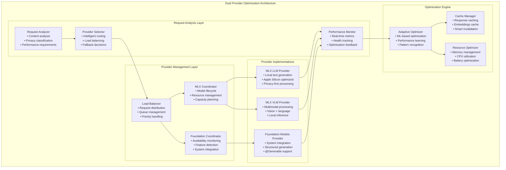

# Dual Provider Optimization Specification

> **Advanced dual AI provider coordination for optimal performance and user experience**

Comprehensive specification for ProjectOne's dual provider optimization system, featuring intelligent provider selection, load balancing, performance optimization, and seamless fallback handling between MLX Swift and Apple Foundation Models.

## Executive Summary

ProjectOne's Dual Provider Optimization System manages the sophisticated coordination between MLX Swift providers (on-device processing) and Apple Foundation Models (system integration) to deliver optimal performance, privacy compliance, and user experience. The system automatically selects the best provider based on request characteristics, system state, and user preferences while maintaining seamless operation.

**Key Capabilities:**
- **Intelligent Provider Selection**: AI-powered routing based on content, privacy, and performance
- **Dynamic Load Balancing**: Real-time load distribution and capacity management  
- **Performance Optimization**: Response time minimization and resource efficiency
- **Seamless Fallback**: Automatic provider switching with graceful degradation
- **Privacy-First Routing**: Automatic privacy-aware provider selection
- **Real-Time Monitoring**: Performance metrics and system health tracking

## System Architecture



## Core Components

### Request Analyzer

**Purpose**: Intelligent analysis of incoming requests to determine optimal processing strategy.

```swift
@available(iOS 26.0, macOS 26.0, *)
class RequestAnalyzer: ObservableObject {
    
    // MARK: - Dependencies
    private let privacyAnalyzer: PrivacyAnalyzer
    private let performancePredictor: PerformancePredictor
    private let contentAnalyzer: ContentAnalyzer
    
    // MARK: - Analysis Results
    @Published public var lastAnalysis: RequestAnalysis?
    @Published public var analysisMetrics: AnalysisMetrics = AnalysisMetrics()
    
    // MARK: - Core Analysis Method
    
    /// Analyze request and provide provider routing recommendations
    public func analyzeRequest(
        _ request: AIRequest,
        systemState: SystemState
    ) async throws -> RequestAnalysis {
        
        let startTime = Date()
        
        // Parallel analysis of different aspects
        async let privacyAnalysis = privacyAnalyzer.analyzePrivacy(
            query: request.prompt,
            context: request.memoryContext
        )
        
        async let contentAnalysis = contentAnalyzer.analyzeContent(
            prompt: request.prompt,
            attachments: request.attachments,
            expectedOutputType: request.expectedOutputType
        )
        
        async let performancePrediction = performancePredictor.predictPerformance(
            for: request,
            systemState: systemState
        )
        
        // Await all analyses
        let (privacy, content, performance) = try await (privacyAnalysis, contentAnalysis, performancePrediction)
        
        // Synthesize analysis results
        let analysis = RequestAnalysis(
            requestId: request.id,
            privacyAnalysis: privacy,
            contentAnalysis: content,
            performancePrediction: performance,
            recommendedProvider: determineOptimalProvider(
                privacy: privacy,
                content: content,
                performance: performance,
                systemState: systemState
            ),
            fallbackProviders: determineFallbackProviders(
                privacy: privacy,
                content: content,
                systemState: systemState
            ),
            optimizationHints: generateOptimizationHints(
                content: content,
                performance: performance
            ),
            analysisTime: Date().timeIntervalSince(startTime)
        )
        
        await MainActor.run {
            lastAnalysis = analysis
            analysisMetrics.updateWith(analysis)
        }
        
        return analysis
    }
    
    // MARK: - Provider Selection Logic
    
    private func determineOptimalProvider(
        privacy: PrivacyAnalysis,
        content: ContentAnalysis,
        performance: PerformancePrediction,
        systemState: SystemState
    ) -> ProviderRecommendation {
        
        var scores: [AIProviderType: Double] = [:]
        
        // Privacy scoring (0.0 to 1.0, higher is better)
        scores[.mlxLLM] = calculatePrivacyScore(privacy, provider: .mlxLLM)
        scores[.mlxVLM] = calculatePrivacyScore(privacy, provider: .mlxVLM)
        scores[.foundation] = calculatePrivacyScore(privacy, provider: .foundation)
        
        // Content compatibility scoring
        let contentScores = calculateContentScores(content, systemState: systemState)
        for (provider, score) in contentScores {
            scores[provider] = (scores[provider] ?? 0.0) + score * 0.3
        }
        
        // Performance scoring
        let performanceScores = calculatePerformanceScores(performance, systemState: systemState)
        for (provider, score) in performanceScores {
            scores[provider] = (scores[provider] ?? 0.0) + score * 0.4
        }
        
        // System availability scoring
        let availabilityScores = calculateAvailabilityScores(systemState)
        for (provider, score) in availabilityScores {
            scores[provider] = (scores[provider] ?? 0.0) + score * 0.3
        }
        
        // Find optimal provider
        let optimalProvider = scores.max { $0.value < $1.value }?.key ?? .automatic
        let confidence = scores[optimalProvider] ?? 0.0
        
        return ProviderRecommendation(
            provider: optimalProvider,
            confidence: confidence,
            reasoning: generateRecommendationReasoning(
                provider: optimalProvider,
                scores: scores,
                privacy: privacy,
                content: content
            )
        )
    }
    
    private func calculatePrivacyScore(_ privacy: PrivacyAnalysis, provider: AIProviderType) -> Double {
        switch provider {
        case .mlxLLM, .mlxVLM:
            // MLX providers excel with sensitive data (on-device processing)
            if privacy.level >= .sensitive {
                return 1.0
            } else if privacy.level >= .personal {
                return 0.8
            } else {
                return 0.6
            }
            
        case .foundation:
            // Foundation Models work well with non-sensitive data
            if privacy.level <= .contextual {
                return 1.0
            } else if privacy.level == .personal {
                return 0.7
            } else {
                return 0.2  // Not suitable for sensitive data
            }
            
        case .automatic:
            return 0.5  // Neutral baseline
        }
    }
    
    private func calculateContentScores(
        _ content: ContentAnalysis,
        systemState: SystemState
    ) -> [AIProviderType: Double] {
        
        var scores: [AIProviderType: Double] = [:]
        
        // Multimodal content requires VLM
        if content.hasImages || content.hasVideo {
            scores[.mlxVLM] = 1.0
            scores[.mlxLLM] = 0.0
            scores[.foundation] = 0.3  // Limited multimodal support
        } else {
            scores[.mlxLLM] = 0.9
            scores[.mlxVLM] = 0.7
            scores[.foundation] = 1.0
        }
        
        // Structured output favors Foundation Models
        if content.requiresStructuredOutput {
            scores[.foundation] = (scores[.foundation] ?? 0.0) + 0.3
        }
        
        // Long context favors MLX (better context handling)
        if content.estimatedTokens > 4000 {
            scores[.mlxLLM] = (scores[.mlxLLM] ?? 0.0) + 0.2
            scores[.mlxVLM] = (scores[.mlxVLM] ?? 0.0) + 0.2
        }
        
        // Complex reasoning tasks
        if content.complexityLevel > 0.7 {
            scores[.mlxLLM] = (scores[.mlxLLM] ?? 0.0) + 0.1
            scores[.foundation] = (scores[.foundation] ?? 0.0) + 0.1
        }
        
        return scores
    }
    
    private func calculatePerformanceScores(
        _ performance: PerformancePrediction,
        systemState: SystemState
    ) -> [AIProviderType: Double] {
        
        var scores: [AIProviderType: Double] = [:]
        
        // Response time requirements
        if performance.maxAcceptableLatency < 1.0 {
            // Fast response required - favor Foundation Models
            scores[.foundation] = 1.0
            scores[.mlxLLM] = 0.6
            scores[.mlxVLM] = 0.4
        } else if performance.maxAcceptableLatency < 3.0 {
            // Moderate response time
            scores[.foundation] = 0.9
            scores[.mlxLLM] = 0.8
            scores[.mlxVLM] = 0.6
        } else {
            // Flexible response time - all providers viable
            scores[.foundation] = 0.8
            scores[.mlxLLM] = 0.9
            scores[.mlxVLM] = 0.8
        }
        
        // Battery considerations
        if systemState.batteryLevel < 0.3 {
            // Low battery - favor efficient Foundation Models
            scores[.foundation] = (scores[.foundation] ?? 0.0) + 0.2
            scores[.mlxLLM] = (scores[.mlxLLM] ?? 0.0) - 0.2
            scores[.mlxVLM] = (scores[.mlxVLM] ?? 0.0) - 0.3
        }
        
        // Memory pressure
        if systemState.memoryPressure > 0.7 {
            // High memory pressure - favor lighter models
            scores[.foundation] = (scores[.foundation] ?? 0.0) + 0.15
            scores[.mlxLLM] = (scores[.mlxLLM] ?? 0.0) - 0.1
            scores[.mlxVLM] = (scores[.mlxVLM] ?? 0.0) - 0.2
        }
        
        return scores
    }
    
    private func calculateAvailabilityScores(_ systemState: SystemState) -> [AIProviderType: Double] {
        var scores: [AIProviderType: Double] = [:]
        
        // MLX availability
        scores[.mlxLLM] = systemState.mlxLLMAvailable ? 1.0 : 0.0
        scores[.mlxVLM] = systemState.mlxVLMAvailable ? 1.0 : 0.0
        
        // Foundation Models availability
        scores[.foundation] = systemState.foundationModelsAvailable ? 1.0 : 0.0
        
        return scores
    }
}
```

### Provider Coordinator

**Purpose**: Advanced coordination and optimization of multiple AI providers.

```swift
@available(iOS 26.0, macOS 26.0, *)
class DualProviderCoordinator: ObservableObject {
    
    // MARK: - Provider Management
    @StateObject private var mlxLLMProvider = MLXLLMProvider()
    @StateObject private var mlxVLMProvider = MLXVLMProvider()
    @StateObject private var foundationProvider = AppleFoundationModelsProvider()
    
    // MARK: - Coordination Components
    private let requestAnalyzer: RequestAnalyzer
    private let loadBalancer: LoadBalancer
    private let performanceMonitor: PerformanceMonitor
    private let cacheManager: CacheManager
    
    // MARK: - State Management
    @Published public var isOptimizing = false
    @Published public var currentLoad: [AIProviderType: Double] = [:]
    @Published public var providerHealth: [AIProviderType: ProviderHealth] = [:]
    @Published public var optimizationMetrics: OptimizationMetrics = OptimizationMetrics()
    
    // MARK: - Configuration
    public struct CoordinationConfiguration {
        let enableLoadBalancing: Bool = true
        let enableResponseCaching: Bool = true
        let enableAdaptiveOptimization: Bool = true
        let maxConcurrentRequests: Int = 10
        let healthCheckInterval: TimeInterval = 30.0
        let performanceWindowSize: Int = 100
        let fallbackThreshold: Double = 0.8
        let optimizationLearningRate: Double = 0.1
        
        static let `default` = CoordinationConfiguration()
        static let highPerformance = CoordinationConfiguration(
            maxConcurrentRequests: 20,
            healthCheckInterval: 15.0,
            optimizationLearningRate: 0.2
        )
        static let batteryOptimized = CoordinationConfiguration(
            maxConcurrentRequests: 5,
            healthCheckInterval: 60.0,
            optimizationLearningRate: 0.05
        )
    }
    
    public let configuration: CoordinationConfiguration
    
    public init(configuration: CoordinationConfiguration = .default) {
        self.configuration = configuration
        self.requestAnalyzer = RequestAnalyzer()
        self.loadBalancer = LoadBalancer(configuration: configuration)
        self.performanceMonitor = PerformanceMonitor()
        self.cacheManager = CacheManager()
    }
    
    // MARK: - Primary Coordination Methods
    
    /// Process request with optimal provider selection and coordination
    public func processOptimalRequest(_ request: AIRequest) async throws -> AIResponse {
        // Check cache first
        if configuration.enableResponseCaching,
           let cachedResponse = cacheManager.getCachedResponse(for: request) {
            return cachedResponse
        }
        
        // Analyze request for optimal routing
        let systemState = await getCurrentSystemState()
        let analysis = try await requestAnalyzer.analyzeRequest(request, systemState: systemState)
        
        // Process with recommended provider and fallback handling
        let response = try await processWithProviderAndFallback(
            request: request,
            analysis: analysis,
            systemState: systemState
        )
        
        // Cache successful responses
        if configuration.enableResponseCaching && response.success {
            cacheManager.cacheResponse(response, for: request)
        }
        
        // Update performance metrics
        await updatePerformanceMetrics(request: request, response: response, analysis: analysis)
        
        return response
    }
    
    private func processWithProviderAndFallback(
        request: AIRequest,
        analysis: RequestAnalysis,
        systemState: SystemState
    ) async throws -> AIResponse {
        
        let primaryProvider = analysis.recommendedProvider.provider
        
        do {
            // Try primary provider
            let response = try await processWithProvider(
                request: request,
                provider: primaryProvider,
                analysis: analysis
            )
            
            return response
            
        } catch {
            print("Primary provider (\(primaryProvider)) failed: \(error)")
            
            // Try fallback providers
            for fallbackProvider in analysis.fallbackProviders {
                do {
                    let response = try await processWithProvider(
                        request: request,
                        provider: fallbackProvider.provider,
                        analysis: analysis
                    )
                    
                    return response.withFallbackIndicator(
                        originalProvider: primaryProvider,
                        usedProvider: fallbackProvider.provider
                    )
                    
                } catch {
                    print("Fallback provider (\(fallbackProvider.provider)) failed: \(error)")
                    continue
                }
            }
            
            throw DualProviderError.allProvidersFailed([primaryProvider] + analysis.fallbackProviders.map(\.provider))
        }
    }
    
    private func processWithProvider(
        request: AIRequest,
        provider: AIProviderType,
        analysis: RequestAnalysis
    ) async throws -> AIResponse {
        
        let startTime = Date()
        
        // Apply load balancing if configured\n        if configuration.enableLoadBalancing {\n            try await loadBalancer.acquireSlot(for: provider)\n        }\n        \n        defer {\n            if configuration.enableLoadBalancing {\n                loadBalancer.releaseSlot(for: provider)\n            }\n        }\n        \n        let response: AIResponse\n        \n        switch provider {\n        case .mlxLLM:\n            let mlxResponse = try await mlxLLMProvider.generateResponse(\n                to: request.prompt,\n                context: request.memoryContext\n            )\n            response = AIResponse(\n                content: mlxResponse.content,\n                confidence: mlxResponse.confidence,\n                provider: .mlxLLM,\n                processingTime: Date().timeIntervalSince(startTime),\n                metadata: AIResponseMetadata(\n                    modelUsed: mlxLLMProvider.currentModel?.name,\n                    tokensUsed: mlxResponse.tokensUsed,\n                    memoryContextUsed: request.memoryContext != nil\n                )\n            )\n            \n        case .mlxVLM:\n            let vlmResponse = try await mlxVLMProvider.generateResponse(\n                to: request.prompt,\n                images: request.attachments.compactMap { $0.image },\n                context: request.memoryContext\n            )\n            response = AIResponse(\n                content: vlmResponse.content,\n                confidence: vlmResponse.confidence,\n                provider: .mlxVLM,\n                processingTime: Date().timeIntervalSince(startTime),\n                metadata: AIResponseMetadata(\n                    modelUsed: mlxVLMProvider.currentModel?.name,\n                    tokensUsed: vlmResponse.tokensUsed,\n                    imagesProcessed: request.attachments.count\n                )\n            )\n            \n        case .foundation:\n            if request.expectedOutputType?.isStructuredType == true {\n                // Use structured generation\n                let structuredResponse = try await foundationProvider.generateStructured(\n                    prompt: request.prompt,\n                    outputType: request.expectedOutputType!,\n                    context: request.memoryContext\n                )\n                response = AIResponse(\n                    content: structuredResponse.jsonDescription,\n                    confidence: 0.9,  // Foundation Models typically high confidence\n                    provider: .foundation,\n                    processingTime: Date().timeIntervalSince(startTime),\n                    metadata: AIResponseMetadata(\n                        modelUsed: \"Apple Foundation Models\",\n                        structuredOutput: true\n                    ),\n                    structuredData: structuredResponse\n                )\n            } else {\n                // Use standard text generation\n                let foundationResponse = try await foundationProvider.generateModelResponse(\n                    request.prompt,\n                    context: request.memoryContext\n                )\n                response = AIResponse(\n                    content: foundationResponse,\n                    confidence: 0.85,\n                    provider: .foundation,\n                    processingTime: Date().timeIntervalSince(startTime),\n                    metadata: AIResponseMetadata(\n                        modelUsed: \"Apple Foundation Models\"\n                    )\n                )\n            }\n            \n        case .automatic:\n            // This should not happen with proper analysis, but handle gracefully\n            throw DualProviderError.invalidProviderSelection(provider)\n        }\n        \n        return response\n    }\n    \n    // MARK: - Performance Optimization\n    \n    /// Continuously optimize provider selection based on performance data\n    @MainActor\n    public func startAdaptiveOptimization() {\n        guard configuration.enableAdaptiveOptimization else { return }\n        guard !isOptimizing else { return }\n        \n        isOptimizing = true\n        \n        Task {\n            await runOptimizationLoop()\n        }\n    }\n    \n    @MainActor\n    public func stopAdaptiveOptimization() {\n        isOptimizing = false\n    }\n    \n    private func runOptimizationLoop() async {\n        while isOptimizing {\n            do {\n                // Collect performance data\n                let performanceData = await performanceMonitor.collectMetrics()\n                \n                // Analyze patterns and optimize\n                let optimizations = await analyzeAndOptimize(performanceData)\n                \n                // Apply optimizations\n                await applyOptimizations(optimizations)\n                \n                // Wait for next optimization cycle\n                try await Task.sleep(nanoseconds: UInt64(configuration.healthCheckInterval * 1_000_000_000))\n                \n            } catch {\n                if Task.isCancelled {\n                    break\n                }\n                print(\"Optimization cycle error: \\(error)\")\n                \n                // Back off on errors\n                try? await Task.sleep(nanoseconds: 60_000_000_000) // 1 minute\n            }\n        }\n    }\n    \n    private func analyzeAndOptimize(_ performanceData: PerformanceData) async -> [OptimizationAction] {\n        var actions: [OptimizationAction] = []\n        \n        // Analyze response time patterns\n        if performanceData.averageResponseTime[.foundation] ?? 0.0 > 2.0 &&\n           performanceData.averageResponseTime[.mlxLLM] ?? 0.0 < 1.5 {\n            actions.append(.adjustProviderPreference(.mlxLLM, weight: 0.1))\n        }\n        \n        // Analyze error rates\n        for (provider, errorRate) in performanceData.errorRates {\n            if errorRate > 0.1 {  // 10% error rate threshold\n                actions.append(.reduceProviderWeight(provider, by: 0.2))\n            }\n        }\n        \n        // Analyze cache hit rates\n        if performanceData.cacheHitRate < 0.3 {\n            actions.append(.optimizeCacheStrategy)\n        }\n        \n        // Analyze resource usage\n        for (provider, usage) in performanceData.resourceUsage {\n            if usage.memoryUsage > 0.8 {\n                actions.append(.reduceProviderConcurrency(provider))\n            }\n        }\n        \n        return actions\n    }\n    \n    private func applyOptimizations(_ actions: [OptimizationAction]) async {\n        for action in actions {\n            switch action {\n            case .adjustProviderPreference(let provider, let weight):\n                requestAnalyzer.adjustProviderPreference(provider, weight: weight)\n                \n            case .reduceProviderWeight(let provider, let reduction):\n                requestAnalyzer.reduceProviderWeight(provider, by: reduction)\n                \n            case .optimizeCacheStrategy:\n                cacheManager.optimizeStrategy()\n                \n            case .reduceProviderConcurrency(let provider):\n                loadBalancer.reduceConcurrency(for: provider)\n                \n            case .increaseProviderConcurrency(let provider):\n                loadBalancer.increaseConcurrency(for: provider)\n            }\n        }\n    }\n    \n    // MARK: - System State Monitoring\n    \n    private func getCurrentSystemState() async -> SystemState {\n        return SystemState(\n            mlxLLMAvailable: mlxLLMProvider.isReady,\n            mlxVLMAvailable: mlxVLMProvider.isReady,\n            foundationModelsAvailable: foundationProvider.isAvailable,\n            batteryLevel: await getBatteryLevel(),\n            memoryPressure: await getMemoryPressure(),\n            cpuUsage: await getCPUUsage(),\n            networkConnectivity: await getNetworkConnectivity(),\n            thermalState: await getThermalState()\n        )\n    }\n    \n    private func updatePerformanceMetrics(\n        request: AIRequest,\n        response: AIResponse,\n        analysis: RequestAnalysis\n    ) async {\n        \n        let metric = PerformanceMetric(\n            requestId: request.id,\n            provider: response.provider,\n            responseTime: response.processingTime,\n            success: response.success,\n            confidence: response.confidence,\n            analysisAccuracy: response.provider == analysis.recommendedProvider.provider ? 1.0 : 0.0,\n            timestamp: Date()\n        )\n        \n        await performanceMonitor.recordMetric(metric)\n        \n        await MainActor.run {\n            optimizationMetrics.updateWith(metric)\n        }\n    }\n}\n```\n\n## Load Balancing System\n\n```swift\nclass LoadBalancer {\n    \n    // MARK: - State Management\n    private var providerSlots: [AIProviderType: ProviderSlots] = [:]\n    private var requestQueue: [QueuedRequest] = []\n    private let queueLock = NSLock()\n    \n    public struct ProviderSlots {\n        var maxConcurrent: Int\n        var currentActive: Int\n        var waitingQueue: [UUID]\n        \n        var isAtCapacity: Bool { currentActive >= maxConcurrent }\n        var availableSlots: Int { max(0, maxConcurrent - currentActive) }\n    }\n    \n    public init(configuration: DualProviderCoordinator.CoordinationConfiguration) {\n        // Initialize slots for each provider based on their characteristics\n        providerSlots[.mlxLLM] = ProviderSlots(\n            maxConcurrent: configuration.maxConcurrentRequests / 2,  // MLX can handle moderate concurrency\n            currentActive: 0,\n            waitingQueue: []\n        )\n        \n        providerSlots[.mlxVLM] = ProviderSlots(\n            maxConcurrent: configuration.maxConcurrentRequests / 4,  // VLM is more resource intensive\n            currentActive: 0,\n            waitingQueue: []\n        )\n        \n        providerSlots[.foundation] = ProviderSlots(\n            maxConcurrent: configuration.maxConcurrentRequests,  // Foundation Models can handle high concurrency\n            currentActive: 0,\n            waitingQueue: []\n        )\n    }\n    \n    // MARK: - Load Balancing Methods\n    \n    /// Acquire processing slot for provider\n    func acquireSlot(for provider: AIProviderType) async throws {\n        return try await withCheckedThrowingContinuation { continuation in\n            queueLock.lock()\n            defer { queueLock.unlock() }\n            \n            guard var slots = providerSlots[provider] else {\n                continuation.resume(throwing: LoadBalancingError.unsupportedProvider(provider))\n                return\n            }\n            \n            if !slots.isAtCapacity {\n                // Slot available - acquire immediately\n                slots.currentActive += 1\n                providerSlots[provider] = slots\n                continuation.resume()\n            } else {\n                // No slots available - queue the request\n                let requestId = UUID()\n                slots.waitingQueue.append(requestId)\n                providerSlots[provider] = slots\n                \n                // Store continuation for later resumption\n                queuedRequests[requestId] = QueuedRequest(\n                    id: requestId,\n                    provider: provider,\n                    continuation: continuation,\n                    timestamp: Date()\n                )\n            }\n        }\n    }\n    \n    /// Release processing slot for provider\n    func releaseSlot(for provider: AIProviderType) {\n        queueLock.lock()\n        defer { queueLock.unlock() }\n        \n        guard var slots = providerSlots[provider] else { return }\n        \n        slots.currentActive = max(0, slots.currentActive - 1)\n        \n        // Process waiting queue\n        if !slots.waitingQueue.isEmpty {\n            let nextRequestId = slots.waitingQueue.removeFirst()\n            slots.currentActive += 1\n            \n            // Resume the waiting request\n            if let queuedRequest = queuedRequests.removeValue(forKey: nextRequestId) {\n                queuedRequest.continuation.resume()\n            }\n        }\n        \n        providerSlots[provider] = slots\n    }\n    \n    // MARK: - Dynamic Adjustment\n    \n    /// Reduce concurrency for provider (when under stress)\n    func reduceConcurrency(for provider: AIProviderType) {\n        queueLock.lock()\n        defer { queueLock.unlock() }\n        \n        guard var slots = providerSlots[provider] else { return }\n        \n        slots.maxConcurrent = max(1, slots.maxConcurrent - 1)\n        providerSlots[provider] = slots\n    }\n    \n    /// Increase concurrency for provider (when performing well)\n    func increaseConcurrency(for provider: AIProviderType) {\n        queueLock.lock()\n        defer { queueLock.unlock() }\n        \n        guard var slots = providerSlots[provider] else { return }\n        \n        slots.maxConcurrent += 1\n        providerSlots[provider] = slots\n    }\n    \n    // MARK: - Queue Management\n    \n    /// Get current load statistics\n    func getLoadStatistics() -> [AIProviderType: LoadStatistics] {\n        queueLock.lock()\n        defer { queueLock.unlock() }\n        \n        var statistics: [AIProviderType: LoadStatistics] = [:]\n        \n        for (provider, slots) in providerSlots {\n            statistics[provider] = LoadStatistics(\n                maxConcurrent: slots.maxConcurrent,\n                currentActive: slots.currentActive,\n                queueLength: slots.waitingQueue.count,\n                utilizationRate: Double(slots.currentActive) / Double(slots.maxConcurrent)\n            )\n        }\n        \n        return statistics\n    }\n}\n```\n\n## Performance Monitoring\n\n```swift\nclass PerformanceMonitor: ObservableObject {\n    \n    // MARK: - Metrics Storage\n    private var metrics: [PerformanceMetric] = []\n    private var windowSize: Int = 100\n    private let metricsLock = NSLock()\n    \n    // MARK: - Published Metrics\n    @Published public var currentMetrics: PerformanceMetrics = PerformanceMetrics()\n    @Published public var providerComparison: [AIProviderType: ProviderPerformance] = [:]\n    @Published public var systemHealth: SystemHealth = .healthy\n    \n    // MARK: - Metric Recording\n    \n    func recordMetric(_ metric: PerformanceMetric) async {\n        metricsLock.lock()\n        metrics.append(metric)\n        \n        // Maintain sliding window\n        if metrics.count > windowSize {\n            metrics.removeFirst(metrics.count - windowSize)\n        }\n        metricsLock.unlock()\n        \n        // Update published metrics on main thread\n        await MainActor.run {\n            updateCurrentMetrics()\n        }\n    }\n    \n    private func updateCurrentMetrics() {\n        metricsLock.lock()\n        let recentMetrics = metrics.suffix(windowSize)\n        metricsLock.unlock()\n        \n        // Calculate overall performance\n        currentMetrics = PerformanceMetrics(\n            averageResponseTime: recentMetrics.map(\.responseTime).reduce(0, +) / Double(recentMetrics.count),\n            successRate: Double(recentMetrics.filter(\.success).count) / Double(recentMetrics.count),\n            averageConfidence: recentMetrics.map(\.confidence).reduce(0, +) / Double(recentMetrics.count),\n            totalRequests: recentMetrics.count,\n            lastUpdated: Date()\n        )\n        \n        // Calculate per-provider performance\n        var providerPerf: [AIProviderType: ProviderPerformance] = [:]\n        \n        for provider in AIProviderType.allCases {\n            let providerMetrics = recentMetrics.filter { $0.provider == provider }\n            guard !providerMetrics.isEmpty else { continue }\n            \n            providerPerf[provider] = ProviderPerformance(\n                responseTime: providerMetrics.map(\.responseTime).reduce(0, +) / Double(providerMetrics.count),\n                successRate: Double(providerMetrics.filter(\.success).count) / Double(providerMetrics.count),\n                confidence: providerMetrics.map(\.confidence).reduce(0, +) / Double(providerMetrics.count),\n                requestCount: providerMetrics.count,\n                lastUsed: providerMetrics.map(\.timestamp).max()\n            )\n        }\n        \n        providerComparison = providerPerf\n        \n        // Update system health\n        systemHealth = calculateSystemHealth()\n    }\n    \n    private func calculateSystemHealth() -> SystemHealth {\n        guard !providerComparison.isEmpty else { return .degraded([\"No performance data\"]) }\n        \n        var issues: [String] = []\n        \n        // Check for high error rates\n        for (provider, performance) in providerComparison {\n            if performance.successRate < 0.9 {\n                issues.append(\"\\(provider) has low success rate: \\(Int(performance.successRate * 100))%\")\n            }\n            \n            if performance.responseTime > 5.0 {\n                issues.append(\"\\(provider) has high response time: \\(performance.responseTime)s\")\n            }\n        }\n        \n        // Check overall system performance\n        if currentMetrics.averageResponseTime > 3.0 {\n            issues.append(\"Overall response time is high: \\(currentMetrics.averageResponseTime)s\")\n        }\n        \n        if currentMetrics.successRate < 0.95 {\n            issues.append(\"Overall success rate is low: \\(Int(currentMetrics.successRate * 100))%\")\n        }\n        \n        // Determine health status\n        if issues.isEmpty {\n            return .healthy\n        } else if issues.count <= 2 {\n            return .degraded(issues)\n        } else {\n            return .critical(issues)\n        }\n    }\n    \n    // MARK: - Performance Analysis\n    \n    func collectMetrics() -> PerformanceData {\n        metricsLock.lock()\n        let recentMetrics = metrics.suffix(windowSize)\n        metricsLock.unlock()\n        \n        var responseTimesByProvider: [AIProviderType: Double] = [:]\n        var errorRatesByProvider: [AIProviderType: Double] = [:]\n        var resourceUsageByProvider: [AIProviderType: ResourceUsage] = [:]\n        \n        for provider in AIProviderType.allCases {\n            let providerMetrics = recentMetrics.filter { $0.provider == provider }\n            guard !providerMetrics.isEmpty else { continue }\n            \n            responseTimesByProvider[provider] = providerMetrics.map(\.responseTime).reduce(0, +) / Double(providerMetrics.count)\n            errorRatesByProvider[provider] = 1.0 - (Double(providerMetrics.filter(\.success).count) / Double(providerMetrics.count))\n            \n            // Calculate resource usage (simplified)\n            resourceUsageByProvider[provider] = ResourceUsage(\n                memoryUsage: calculateMemoryUsage(for: provider),\n                cpuUsage: calculateCPUUsage(for: provider),\n                batteryImpact: calculateBatteryImpact(for: provider)\n            )\n        }\n        \n        let cacheHitRate = calculateCacheHitRate()\n        \n        return PerformanceData(\n            averageResponseTime: responseTimesByProvider,\n            errorRates: errorRatesByProvider,\n            resourceUsage: resourceUsageByProvider,\n            cacheHitRate: cacheHitRate,\n            timestamp: Date()\n        )\n    }\n}\n```\n\n## Data Structures\n\n```swift\n// MARK: - Request and Response Types\n\npublic struct AIRequest {\n    public let id: UUID\n    public let prompt: String\n    public let memoryContext: MemoryContext?\n    public let attachments: [RequestAttachment]\n    public let expectedOutputType: OutputType?\n    public let priority: RequestPriority\n    public let maxLatency: TimeInterval?\n    public let createdAt: Date\n    \n    public init(\n        prompt: String,\n        memoryContext: MemoryContext? = nil,\n        attachments: [RequestAttachment] = [],\n        expectedOutputType: OutputType? = nil,\n        priority: RequestPriority = .normal,\n        maxLatency: TimeInterval? = nil\n    ) {\n        self.id = UUID()\n        self.prompt = prompt\n        self.memoryContext = memoryContext\n        self.attachments = attachments\n        self.expectedOutputType = expectedOutputType\n        self.priority = priority\n        self.maxLatency = maxLatency\n        self.createdAt = Date()\n    }\n}\n\npublic struct AIResponse {\n    public let content: String\n    public let confidence: Double\n    public let provider: AIProviderType\n    public let processingTime: TimeInterval\n    public let success: Bool\n    public let metadata: AIResponseMetadata\n    public let structuredData: Any?\n    public let fallbackUsed: Bool\n    public let originalProvider: AIProviderType?\n    \n    public init(\n        content: String,\n        confidence: Double,\n        provider: AIProviderType,\n        processingTime: TimeInterval,\n        metadata: AIResponseMetadata,\n        structuredData: Any? = nil\n    ) {\n        self.content = content\n        self.confidence = confidence\n        self.provider = provider\n        self.processingTime = processingTime\n        self.success = true\n        self.metadata = metadata\n        self.structuredData = structuredData\n        self.fallbackUsed = false\n        self.originalProvider = nil\n    }\n    \n    func withFallbackIndicator(originalProvider: AIProviderType, usedProvider: AIProviderType) -> AIResponse {\n        return AIResponse(\n            content: self.content,\n            confidence: self.confidence * 0.9,  // Slightly reduce confidence for fallback\n            provider: usedProvider,\n            processingTime: self.processingTime,\n            success: true,\n            metadata: self.metadata,\n            structuredData: self.structuredData,\n            fallbackUsed: true,\n            originalProvider: originalProvider\n        )\n    }\n}\n\n// MARK: - Analysis Types\n\npublic struct RequestAnalysis {\n    public let requestId: UUID\n    public let privacyAnalysis: PrivacyAnalysis\n    public let contentAnalysis: ContentAnalysis\n    public let performancePrediction: PerformancePrediction\n    public let recommendedProvider: ProviderRecommendation\n    public let fallbackProviders: [ProviderRecommendation]\n    public let optimizationHints: [OptimizationHint]\n    public let analysisTime: TimeInterval\n}\n\npublic struct ContentAnalysis {\n    public let estimatedTokens: Int\n    public let complexityLevel: Double  // 0.0 to 1.0\n    public let hasImages: Bool\n    public let hasVideo: Bool\n    public let hasAudio: Bool\n    public let requiresStructuredOutput: Bool\n    public let topicCategories: [String]\n    public let languageDetection: String\n    public let sentimentScore: Double\n    public let urgencyLevel: UrgencyLevel\n}\n\npublic struct PerformancePrediction {\n    public let estimatedResponseTime: [AIProviderType: TimeInterval]\n    public let estimatedAccuracy: [AIProviderType: Double]\n    public let resourceRequirements: [AIProviderType: ResourceRequirement]\n    public let batteryImpact: [AIProviderType: BatteryImpact]\n    public let maxAcceptableLatency: TimeInterval\n    public let priorityLevel: RequestPriority\n}\n\npublic struct ProviderRecommendation {\n    public let provider: AIProviderType\n    public let confidence: Double\n    public let reasoning: String\n    public let expectedPerformance: ExpectedPerformance\n}\n\n// MARK: - System State Types\n\npublic struct SystemState {\n    public let mlxLLMAvailable: Bool\n    public let mlxVLMAvailable: Bool\n    public let foundationModelsAvailable: Bool\n    public let batteryLevel: Double  // 0.0 to 1.0\n    public let memoryPressure: Double  // 0.0 to 1.0\n    public let cpuUsage: Double  // 0.0 to 1.0\n    public let networkConnectivity: NetworkConnectivity\n    public let thermalState: ThermalState\n}\n\npublic enum NetworkConnectivity {\n    case none\n    case cellular\n    case wifi\n    case ethernet\n}\n\npublic enum ThermalState {\n    case nominal\n    case fair\n    case serious\n    case critical\n}\n\n// MARK: - Performance Types\n\npublic struct PerformanceMetric {\n    public let requestId: UUID\n    public let provider: AIProviderType\n    public let responseTime: TimeInterval\n    public let success: Bool\n    public let confidence: Double\n    public let analysisAccuracy: Double\n    public let timestamp: Date\n}\n\npublic struct PerformanceMetrics {\n    public let averageResponseTime: Double\n    public let successRate: Double\n    public let averageConfidence: Double\n    public let totalRequests: Int\n    public let lastUpdated: Date\n    \n    public init() {\n        self.averageResponseTime = 0.0\n        self.successRate = 1.0\n        self.averageConfidence = 0.0\n        self.totalRequests = 0\n        self.lastUpdated = Date()\n    }\n}\n\npublic struct ProviderPerformance {\n    public let responseTime: Double\n    public let successRate: Double\n    public let confidence: Double\n    public let requestCount: Int\n    public let lastUsed: Date?\n}\n\n// MARK: - Optimization Types\n\npublic enum OptimizationAction {\n    case adjustProviderPreference(AIProviderType, weight: Double)\n    case reduceProviderWeight(AIProviderType, by: Double)\n    case optimizeCacheStrategy\n    case reduceProviderConcurrency(AIProviderType)\n    case increaseProviderConcurrency(AIProviderType)\n}\n\npublic struct OptimizationHint {\n    public let type: OptimizationHintType\n    public let description: String\n    public let impact: ImpactLevel\n    public let applicableProviders: [AIProviderType]\n}\n\npublic enum OptimizationHintType {\n    case cacheResponse\n    case preloadModel\n    case batchRequests\n    case useAlternativeProvider\n    case adjustContextSize\n    case enableStreaming\n}\n\n// MARK: - Error Types\n\npublic enum DualProviderError: Error, LocalizedError {\n    case allProvidersFailed([AIProviderType])\n    case invalidProviderSelection(AIProviderType)\n    case analysisTimeout(TimeInterval)\n    case configurationError(String)\n    case resourceExhausted(String)\n    \n    public var errorDescription: String? {\n        switch self {\n        case .allProvidersFailed(let providers):\n            return \"All providers failed: \\(providers.map(\.rawValue).joined(separator: \", \"))\"\n        case .invalidProviderSelection(let provider):\n            return \"Invalid provider selection: \\(provider)\"\n        case .analysisTimeout(let timeout):\n            return \"Request analysis timed out after \\(timeout) seconds\"\n        case .configurationError(let message):\n            return \"Configuration error: \\(message)\"\n        case .resourceExhausted(let resource):\n            return \"Resource exhausted: \\(resource)\"\n        }\n    }\n}\n\npublic enum LoadBalancingError: Error {\n    case unsupportedProvider(AIProviderType)\n    case capacityExceeded(AIProviderType)\n    case queueTimeout(TimeInterval)\n}\n```\n\n## Integration Examples\n\n### SwiftUI Integration\n\n```swift\nstruct DualProviderDashboard: View {\n    @StateObject private var coordinator = DualProviderCoordinator()\n    @StateObject private var performanceMonitor = PerformanceMonitor()\n    \n    @State private var testPrompt = \"Explain quantum computing\"\n    @State private var isProcessing = false\n    @State private var lastResponse: AIResponse?\n    \n    var body: some View {\n        NavigationView {\n            VStack(spacing: 20) {\n                // System Health Overview\n                SystemHealthCard(health: performanceMonitor.systemHealth)\n                \n                // Provider Performance Comparison\n                ProviderPerformanceChart(comparison: performanceMonitor.providerComparison)\n                \n                // Load Balancing Status\n                LoadBalancingStatus(currentLoad: coordinator.currentLoad)\n                \n                // Test Interface\n                VStack {\n                    TextField(\"Test Prompt\", text: $testPrompt)\n                        .textFieldStyle(.roundedBorder)\n                    \n                    Button(\"Process with Optimal Provider\") {\n                        Task { await processTestRequest() }\n                    }\n                    .disabled(isProcessing)\n                    \n                    if let response = lastResponse {\n                        ResponseDetailsView(response: response)\n                    }\n                }\n                \n                Spacer()\n            }\n            .padding()\n            .navigationTitle(\"Dual Provider System\")\n        }\n        .task {\n            coordinator.startAdaptiveOptimization()\n        }\n        .onDisappear {\n            coordinator.stopAdaptiveOptimization()\n        }\n    }\n    \n    private func processTestRequest() async {\n        isProcessing = true\n        defer { isProcessing = false }\n        \n        do {\n            let request = AIRequest(prompt: testPrompt)\n            let response = try await coordinator.processOptimalRequest(request)\n            \n            await MainActor.run {\n                lastResponse = response\n            }\n            \n        } catch {\n            print(\"Test request failed: \\(error)\")\n        }\n    }\n}\n```\n\n### Performance Monitoring UI\n\n```swift\nstruct ProviderPerformanceChart: View {\n    let comparison: [AIProviderType: ProviderPerformance]\n    \n    var body: some View {\n        VStack(alignment: .leading) {\n            Text(\"Provider Performance\")\n                .font(.headline)\n            \n            ForEach(AIProviderType.allCases, id: \\.self) { provider in\n                if let performance = comparison[provider] {\n                    ProviderPerformanceRow(\n                        provider: provider,\n                        performance: performance\n                    )\n                }\n            }\n        }\n        .padding()\n        .background(Color(.systemGray6))\n        .cornerRadius(12)\n    }\n}\n\nstruct ProviderPerformanceRow: View {\n    let provider: AIProviderType\n    let performance: ProviderPerformance\n    \n    var body: some View {\n        HStack {\n            Text(provider.displayName)\n                .font(.subheadline)\n                .frame(width: 120, alignment: .leading)\n            \n            VStack(alignment: .leading, spacing: 2) {\n                Text(\"\\(performance.responseTime, specifier: \"%.2f\")s\")\n                    .font(.caption)\n                    .foregroundColor(responseTimeColor)\n                \n                Text(\"\\(Int(performance.successRate * 100))% success\")\n                    .font(.caption2)\n                    .foregroundColor(successRateColor)\n            }\n            \n            Spacer()\n            \n            Circle()\n                .fill(healthIndicatorColor)\n                .frame(width: 12, height: 12)\n        }\n    }\n    \n    private var responseTimeColor: Color {\n        if performance.responseTime < 1.0 {\n            return .green\n        } else if performance.responseTime < 3.0 {\n            return .orange\n        } else {\n            return .red\n        }\n    }\n    \n    private var successRateColor: Color {\n        if performance.successRate > 0.95 {\n            return .green\n        } else if performance.successRate > 0.8 {\n            return .orange\n        } else {\n            return .red\n        }\n    }\n    \n    private var healthIndicatorColor: Color {\n        if performance.successRate > 0.95 && performance.responseTime < 2.0 {\n            return .green\n        } else if performance.successRate > 0.8 && performance.responseTime < 5.0 {\n            return .orange\n        } else {\n            return .red\n        }\n    }\n}\n```\n\n## Configuration and Optimization\n\n### Adaptive Configuration\n\n```swift\nclass AdaptiveConfiguration {\n    \n    private var learningHistory: [ConfigurationAdjustment] = []\n    private let maxHistorySize = 1000\n    \n    func adaptConfiguration(\n        based on: PerformanceData,\n        current: DualProviderCoordinator.CoordinationConfiguration\n    ) -> DualProviderCoordinator.CoordinationConfiguration {\n        \n        var newConfig = current\n        \n        // Adapt max concurrent requests based on system performance\n        if based.averageResponseTime.values.reduce(0, +) / Double(based.averageResponseTime.count) > 3.0 {\n            newConfig.maxConcurrentRequests = max(1, current.maxConcurrentRequests - 1)\n        } else if based.errorRates.values.allSatisfy({ $0 < 0.05 }) {\n            newConfig.maxConcurrentRequests = min(20, current.maxConcurrentRequests + 1)\n        }\n        \n        // Adapt health check interval based on system stability\n        let avgErrorRate = based.errorRates.values.reduce(0, +) / Double(based.errorRates.count)\n        if avgErrorRate > 0.1 {\n            newConfig.healthCheckInterval = max(5.0, current.healthCheckInterval * 0.8)\n        } else if avgErrorRate < 0.02 {\n            newConfig.healthCheckInterval = min(120.0, current.healthCheckInterval * 1.2)\n        }\n        \n        // Record adjustment for learning\n        let adjustment = ConfigurationAdjustment(\n            from: current,\n            to: newConfig,\n            reason: \"Performance-based adaptation\",\n            timestamp: Date()\n        )\n        \n        recordAdjustment(adjustment)\n        \n        return newConfig\n    }\n    \n    private func recordAdjustment(_ adjustment: ConfigurationAdjustment) {\n        learningHistory.append(adjustment)\n        \n        if learningHistory.count > maxHistorySize {\n            learningHistory.removeFirst(learningHistory.count - maxHistorySize)\n        }\n    }\n}\n```\n\nThis dual provider optimization specification provides a comprehensive framework for intelligent coordination between MLX Swift and Apple Foundation Models, ensuring optimal performance, privacy compliance, and user experience in ProjectOne's AI system.\n\n---\n\n## Navigation\n\n- **← Back to [Specifications Index](README.md)**\n- **→ Memory Management: [ENHANCED_MEMORY_MANAGEMENT_SPEC.md](ENHANCED_MEMORY_MANAGEMENT_SPEC.md)**\n- **→ Architecture: [Architecture](../architecture/README.md)**\n\n---\n\n*Last updated: 2025-07-22 - Dual provider optimization specification with intelligent coordination*