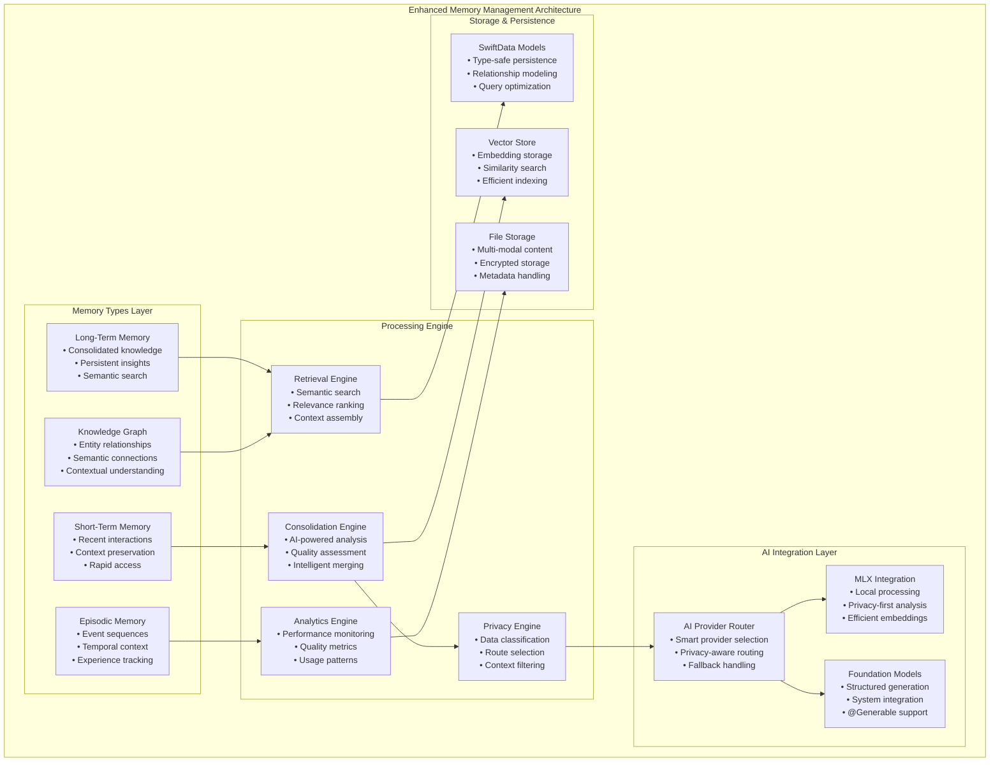

# Enhanced Memory Management Specification

> **Advanced memory management system for ProjectOne's three-layer AI architecture**

Comprehensive specification for ProjectOne's enhanced memory management system, featuring intelligent consolidation, privacy-aware processing, multi-modal memory types, and seamless integration with the three-layer AI provider architecture.

## Executive Summary

ProjectOne's Enhanced Memory Management System provides sophisticated memory handling capabilities that integrate seamlessly with MLX Swift providers and Apple Foundation Models. The system manages Short-Term Memory (STM), Long-Term Memory (LTM), Episodic Memory, and Knowledge Graph entities with intelligent consolidation, privacy-aware processing, and autonomous operations.

**Key Capabilities:**
- **Intelligent Consolidation**: AI-powered STM to LTM transition with quality scoring
- **Privacy-Aware Processing**: Automatic privacy level detection and route selection
- **Multi-Modal Memory**: Text, image, audio, and structured data support
- **Real-Time Performance**: Sub-500ms retrieval with intelligent caching
- **Autonomous Operations**: Background consolidation and maintenance
- **Cross-Provider Integration**: Works with all three AI provider layers

## System Architecture



## Memory Type Specifications

### Short-Term Memory (STM)

**Purpose**: Temporary storage for recent interactions and active context preservation.

**Characteristics:**
- **Capacity**: 1,000-5,000 entries (configurable)
- **Retention**: 1-7 days (decay-based)
- **Access Pattern**: Frequent read, batch consolidation
- **Privacy Level**: Full personal data support

**SwiftData Model:**

```swift
@Model
public final class STMEntry {
    
    // MARK: - Core Properties
    @Attribute(.unique) public var id: UUID
    public var content: String
    public var timestamp: Date
    public var memoryType: MemoryType
    public var importance: Double  // 0.0 to 1.0
    public var confidence: Double  // 0.0 to 1.0
    
    // MARK: - Consolidation Properties
    public var isConsolidated: Bool = false
    public var consolidationScore: Double = 0.0
    public var consolidationAttempts: Int = 0
    public var decayRate: Double = 0.1  // Daily decay factor
    
    // MARK: - Context Properties
    public var contextTags: [String] = []
    public var sourceType: MemorySourceType
    public var sessionId: UUID?
    public var conversationTurn: Int?
    
    // MARK: - Privacy Properties
    public var privacyLevel: PrivacyLevel
    public var containsPersonalData: Bool
    public var sensitiveCategories: [SensitiveDataCategory] = []
    
    // MARK: - Relationships
    @Relationship public var relatedEntities: [Entity] = []
    @Relationship public var consolidatedInto: LTMEntry?
    @Relationship(inverse: \EpisodicMemoryEntry.relatedSTMEntries) 
    public var episodicMemories: [EpisodicMemoryEntry] = []
    
    // MARK: - Multi-Modal Content
    public var hasAttachments: Bool = false
    @Relationship public var attachments: [MemoryAttachment] = []
    
    public init(
        content: String,
        memoryType: MemoryType,
        importance: Double,
        confidence: Double,
        sourceType: MemorySourceType,
        privacyLevel: PrivacyLevel,
        sessionId: UUID? = nil
    ) {
        self.id = UUID()
        self.content = content
        self.timestamp = Date()
        self.memoryType = memoryType
        self.importance = importance
        self.confidence = confidence
        self.sourceType = sourceType
        self.privacyLevel = privacyLevel
        self.sessionId = sessionId
        self.containsPersonalData = privacyLevel.requiresPrivacyProtection
    }
}
```

**Performance Characteristics:**
- **Insertion**: <10ms per entry
- **Retrieval**: <50ms for recent queries
- **Batch Operations**: 1,000 entries in <200ms
- **Memory Usage**: ~1KB per text entry

### Long-Term Memory (LTM)

**Purpose**: Persistent knowledge storage with consolidated, high-quality information.

**Characteristics:**
- **Capacity**: Unlimited (with quality-based pruning)
- **Retention**: Permanent (unless explicitly deleted)
- **Access Pattern**: Semantic search, relevance ranking
- **Privacy Level**: Mixed (with appropriate filtering)

**SwiftData Model:**

```swift
@Model
public final class LTMEntry {
    
    // MARK: - Core Properties
    @Attribute(.unique) public var id: UUID
    public var content: String
    public var summary: String
    public var title: String?
    public var createdAt: Date
    public var lastAccessed: Date
    public var lastModified: Date
    
    // MARK: - Quality Metrics
    public var importance: Double  // 0.0 to 1.0
    public var confidence: Double  // 0.0 to 1.0
    public var qualityScore: Double  // 0.0 to 1.0
    public var accessCount: Int = 0
    public var utilizationScore: Double = 0.0
    
    // MARK: - Source Information
    public var sourceSTMCount: Int  // Number of STM entries consolidated
    public var consolidationMethod: ConsolidationMethod
    public var consolidatedBy: String  // AI provider used
    public var consolidationTimestamp: Date
    
    // MARK: - Semantic Properties
    public var semanticTags: [String] = []
    public var topicCategories: [String] = []
    public var keyEntities: [String] = []
    public var conceptualThemes: [String] = []
    
    // MARK: - Privacy Properties  
    public var privacyLevel: PrivacyLevel
    public var containsPersonalData: Bool
    public var dataRetentionPolicy: DataRetentionPolicy
    public var lastPrivacyAudit: Date?
    
    // MARK: - Relationships
    @Relationship public var sourceSTMEntries: [STMEntry] = []
    @Relationship public var relatedEntities: [Entity] = []
    @Relationship public var knowledgeConnections: [KnowledgeConnection] = []
    @Relationship(inverse: \EpisodicMemoryEntry.relatedLTMEntries)
    public var episodicMemories: [EpisodicMemoryEntry] = []
    
    // MARK: - Vector Embeddings
    public var hasEmbedding: Bool = false
    public var embeddingVersion: String?
    public var embeddingProvider: String?
    
    // MARK: - Multi-Modal Content
    @Relationship public var attachments: [MemoryAttachment] = []
    
    public init(
        content: String,
        summary: String,
        importance: Double,
        confidence: Double,
        sourceSTMEntries: [STMEntry],
        consolidationMethod: ConsolidationMethod,
        consolidatedBy: String
    ) {
        self.id = UUID()
        self.content = content
        self.summary = summary
        self.createdAt = Date()
        self.lastAccessed = Date()
        self.lastModified = Date()
        self.importance = importance
        self.confidence = confidence
        self.sourceSTMCount = sourceSTMEntries.count
        self.consolidationMethod = consolidationMethod
        self.consolidatedBy = consolidatedBy
        self.consolidationTimestamp = Date()
        self.sourceSTMEntries = sourceSTMEntries
        
        // Determine privacy level from source entries
        let maxPrivacy = sourceSTMEntries.map(\.privacyLevel).max() ?? .publicKnowledge
        self.privacyLevel = maxPrivacy
        self.containsPersonalData = maxPrivacy.requiresPrivacyProtection
        self.dataRetentionPolicy = maxPrivacy.defaultRetentionPolicy
        
        // Calculate initial quality score
        self.qualityScore = calculateInitialQuality(
            importance: importance,
            confidence: confidence,
            sourceCount: sourceSTMEntries.count
        )
    }
    
    private func calculateInitialQuality(
        importance: Double,
        confidence: Double,
        sourceCount: Int
    ) -> Double {
        let baseQuality = (importance * 0.4) + (confidence * 0.4)
        let sourceBonus = min(0.2, Double(sourceCount) * 0.02)  // Up to 0.2 for 10+ sources
        return min(1.0, baseQuality + sourceBonus)
    }
}
```

### Episodic Memory

**Purpose**: Sequential event storage with temporal context and experience tracking.

**Characteristics:**
- **Capacity**: Event-based (not entry-based)
- **Retention**: Long-term with experience clustering
- **Access Pattern**: Temporal queries, experience retrieval
- **Privacy Level**: Full support with timeline privacy

**SwiftData Model:**

```swift
@Model
public final class EpisodicMemoryEntry {
    
    // MARK: - Core Properties
    @Attribute(.unique) public var id: UUID
    public var eventDescription: String
    public var eventType: EpisodicEventType
    public var timestamp: Date
    public var duration: TimeInterval?  // Event duration if applicable
    public var importance: Double  // 0.0 to 1.0
    
    // MARK: - Temporal Context
    public var sequenceOrder: Int?  // Order within a sequence
    public var isSequenceStart: Bool = false
    public var isSequenceEnd: Bool = false
    public var timeOfDay: TimeOfDay
    public var dayOfWeek: DayOfWeek
    
    // MARK: - Spatial Context
    public var location: String?
    public var locationCoordinates: LocationCoordinates?
    public var locationContext: LocationContext?
    
    // MARK: - Social Context
    public var participants: [String] = []
    public var socialContext: SocialContext?
    public var communicationMedium: CommunicationMedium?
    
    // MARK: - Emotional Context
    public var emotionalTone: EmotionalTone?
    public var moodIndicators: [MoodIndicator] = []
    public var stressLevel: Double?  // 0.0 to 1.0
    public var energyLevel: Double?  // 0.0 to 1.0
    
    // MARK: - Cognitive Context
    public var cognitiveLoad: CognitiveLoad?
    public var attentionLevel: AttentionLevel?
    public var mentalState: MentalState?
    
    // MARK: - Environmental Context
    public var environmentalFactors: [EnvironmentalFactor] = []
    public var weatherConditions: WeatherConditions?
    public var ambientConditions: AmbientConditions?
    
    // MARK: - Privacy Properties
    public var privacyLevel: PrivacyLevel
    public var containsPersonalData: Bool
    public var timelinePrivacy: TimelinePrivacy
    
    // MARK: - Relationships
    @Relationship public var relatedSTMEntries: [STMEntry] = []
    @Relationship public var relatedLTMEntries: [LTMEntry] = []
    @Relationship public var relatedEntities: [Entity] = []
    @Relationship public var sequenceConnections: [EpisodicSequence] = []
    
    // MARK: - Multi-Modal Content
    @Relationship public var attachments: [MemoryAttachment] = []
    
    public init(
        eventDescription: String,
        eventType: EpisodicEventType,
        timestamp: Date = Date(),
        importance: Double,
        location: String? = nil,
        participants: [String] = [],
        privacyLevel: PrivacyLevel
    ) {
        self.id = UUID()
        self.eventDescription = eventDescription
        self.eventType = eventType
        self.timestamp = timestamp
        self.importance = importance
        self.location = location
        self.participants = participants
        self.privacyLevel = privacyLevel
        self.containsPersonalData = privacyLevel.requiresPrivacyProtection
        
        // Derive temporal context
        self.timeOfDay = TimeOfDay.from(date: timestamp)
        self.dayOfWeek = DayOfWeek.from(date: timestamp)
        
        // Set timeline privacy based on content
        self.timelinePrivacy = deriveTimelinePrivacy(
            from: privacyLevel,
            participants: participants,
            location: location
        )
    }
}
```

### Knowledge Graph Entities

**Purpose**: Structured knowledge representation with semantic relationships.

**SwiftData Model:**

```swift
@Model
public final class Entity {
    
    // MARK: - Core Properties
    @Attribute(.unique) public var id: UUID
    public var name: String
    public var entityType: EntityType
    public var entityDescription: String?
    public var aliases: [String] = []
    
    // MARK: - Semantic Properties
    public var conceptualCategory: ConceptualCategory
    public var semanticProperties: [String: String] = [:]
    public var confidence: Double  // 0.0 to 1.0
    public var importance: Double  // 0.0 to 1.0
    
    // MARK: - Temporal Properties
    public var firstMentioned: Date
    public var lastMentioned: Date
    public var mentionCount: Int = 1
    public var temporalRelevance: TemporalRelevance
    
    // MARK: - Contextual Properties
    public var contextualTags: [String] = []
    public var domainSpecific: Bool = false
    public var domainCategory: DomainCategory?
    
    // MARK: - Privacy Properties
    public var privacyLevel: PrivacyLevel
    public var isPersonalEntity: Bool
    public var privacyContext: PrivacyContext?
    
    // MARK: - Relationships
    @Relationship public var outgoingRelationships: [Relationship] = []
    @Relationship(inverse: \Relationship.toEntity) public var incomingRelationships: [Relationship] = []
    @Relationship public var mentionedInSTM: [STMEntry] = []
    @Relationship public var mentionedInLTM: [LTMEntry] = []
    @Relationship public var episodicMentions: [EpisodicMemoryEntry] = []
    
    // MARK: - Vector Embeddings
    public var hasEmbedding: Bool = false
    public var embeddingVersion: String?
    
    public init(
        name: String,
        entityType: EntityType,
        entityDescription: String? = nil,
        conceptualCategory: ConceptualCategory,
        privacyLevel: PrivacyLevel
    ) {
        self.id = UUID()
        self.name = name
        self.entityType = entityType
        self.entityDescription = entityDescription
        self.conceptualCategory = conceptualCategory
        self.privacyLevel = privacyLevel
        self.isPersonalEntity = privacyLevel.requiresPrivacyProtection
        self.firstMentioned = Date()
        self.lastMentioned = Date()
        self.temporalRelevance = .current
        self.confidence = 0.8  // Initial confidence
        self.importance = 0.5   // Initial importance
    }
}

@Model  
public final class Relationship {
    
    @Attribute(.unique) public var id: UUID
    public var relationshipType: RelationshipType
    public var relationshipDescription: String?
    public var strength: Double  // 0.0 to 1.0
    public var confidence: Double  // 0.0 to 1.0
    public var bidirectional: Bool = false
    
    // MARK: - Temporal Properties
    public var establishedDate: Date
    public var lastConfirmed: Date
    public var confirmationCount: Int = 1
    
    // MARK: - Context Properties
    public var contextualEvidence: [String] = []
    public var sourceMemories: [UUID] = []  // Memory IDs that established this relationship
    
    // MARK: - Relationships
    @Relationship public var fromEntity: Entity
    @Relationship public var toEntity: Entity
    
    public init(
        from: Entity,
        to: Entity,
        type: RelationshipType,
        description: String? = nil,
        strength: Double,
        confidence: Double
    ) {
        self.id = UUID()
        self.fromEntity = from
        self.toEntity = to
        self.relationshipType = type
        self.relationshipDescription = description
        self.strength = strength
        self.confidence = confidence
        self.establishedDate = Date()
        self.lastConfirmed = Date()
    }
}
```

## Memory Consolidation Engine

### Intelligent Consolidation Process

The consolidation engine uses AI providers to intelligently merge STM entries into coherent LTM entries:

```swift
@available(iOS 26.0, macOS 26.0, *)
class MemoryConsolidationEngine: ObservableObject {
    
    // MARK: - Dependencies
    private let aiCore: EnhancedGemma3nCore
    private let privacyAnalyzer: PrivacyAnalyzer
    private let modelContext: ModelContext
    
    // MARK: - Published State
    @Published public var isConsolidating = false
    @Published public var consolidationProgress: Double = 0.0
    @Published public var lastConsolidationDate: Date?
    @Published public var consolidationQuality: Double = 0.0
    
    // MARK: - Configuration
    public struct ConsolidationConfiguration {
        let minSTMEntriesForConsolidation: Int = 3
        let maxSTMEntriesPerConsolidation: Int = 20
        let minImportanceThreshold: Double = 0.3
        let minConfidenceThreshold: Double = 0.5
        let consolidationInterval: TimeInterval = 3600  // 1 hour
        let useAIAnalysis: Bool = true
        let privacyAwareConsolidation: Bool = true
        let qualityThreshold: Double = 0.7
        
        static let `default` = ConsolidationConfiguration()
        static let aggressive = ConsolidationConfiguration(
            minSTMEntriesForConsolidation: 2,
            minImportanceThreshold: 0.2,
            consolidationInterval: 1800  // 30 minutes
        )
        static let conservative = ConsolidationConfiguration(
            minSTMEntriesForConsolidation: 5,
            minImportanceThreshold: 0.5,
            consolidationInterval: 7200  // 2 hours
        )
    }
    
    public let configuration: ConsolidationConfiguration
    
    public init(
        aiCore: EnhancedGemma3nCore,
        privacyAnalyzer: PrivacyAnalyzer,
        modelContext: ModelContext,
        configuration: ConsolidationConfiguration = .default
    ) {
        self.aiCore = aiCore
        self.privacyAnalyzer = privacyAnalyzer
        self.modelContext = modelContext
        self.configuration = configuration
    }
    
    // MARK: - Primary Consolidation Methods
    
    /// Perform intelligent memory consolidation
    public func performIntelligentConsolidation() async throws {
        guard !isConsolidating else {
            throw ConsolidationError.consolidationInProgress
        }
        
        await MainActor.run {
            isConsolidating = true
            consolidationProgress = 0.0
        }
        
        defer {
            Task { @MainActor in
                isConsolidating = false
                lastConsolidationDate = Date()
            }
        }
        
        do {
            // Step 1: Identify consolidation candidates
            await updateProgress(0.1, status: "Identifying consolidation candidates...")
            let candidates = try await identifyConsolidationCandidates()
            
            // Step 2: Group related memories
            await updateProgress(0.3, status: "Grouping related memories...")
            let groups = try await groupRelatedMemories(candidates)
            
            // Step 3: Analyze each group with AI
            await updateProgress(0.5, status: "Analyzing memory groups...")
            let analyses = try await analyzeMemoryGroups(groups)
            
            // Step 4: Consolidate high-quality groups
            await updateProgress(0.7, status: "Consolidating memories...")
            let consolidations = try await performConsolidations(analyses)
            
            // Step 5: Update knowledge graph
            await updateProgress(0.9, status: "Updating knowledge graph...")
            try await updateKnowledgeGraph(from: consolidations)
            
            // Step 6: Cleanup and metrics
            await updateProgress(1.0, status: "Completing consolidation...")
            try await cleanupConsolidatedMemories(consolidations)
            await updateConsolidationMetrics(consolidations)
            
        } catch {
            print("Consolidation failed: \(error)")
            throw error
        }
    }
    
    // MARK: - Consolidation Steps Implementation
    
    private func identifyConsolidationCandidates() async throws -> [STMEntry] {
        let descriptor = FetchDescriptor<STMEntry>(
            predicate: #Predicate { entry in
                !entry.isConsolidated &&
                entry.importance >= configuration.minImportanceThreshold &&
                entry.confidence >= configuration.minConfidenceThreshold &&
                entry.timestamp < Date().addingTimeInterval(-configuration.consolidationInterval)
            },
            sortBy: [SortDescriptor(\.importance, order: .reverse)]
        )
        
        return try modelContext.fetch(descriptor)
    }
    
    private func groupRelatedMemories(_ candidates: [STMEntry]) async throws -> [[STMEntry]] {
        // Use AI to group semantically related memories
        var groups: [[STMEntry]] = []
        var processed = Set<UUID>()
        
        for candidate in candidates {
            guard !processed.contains(candidate.id) else { continue }
            
            // Find semantically related memories using AI
            let relatedMemories = try await findSemanticallySimilar(
                to: candidate,
                in: candidates.filter { !processed.contains($0.id) }
            )
            
            if relatedMemories.count >= configuration.minSTMEntriesForConsolidation {
                groups.append(relatedMemories)
                for memory in relatedMemories {
                    processed.insert(memory.id)
                }
            }
        }
        
        return groups
    }
    
    private func findSemanticallySimilar(
        to target: STMEntry,
        in candidates: [STMEntry]
    ) async throws -> [STMEntry] {
        
        if configuration.useAIAnalysis {
            // Use AI for semantic similarity analysis
            let analysisPrompt = """
            Analyze these memory entries and group those that are semantically related:
            
            Target: \(target.content)
            
            Candidates:
            \(candidates.enumerated().map { "\($0.offset + 1). \($0.element.content)" }.joined(separator: "\n"))
            
            Return the numbers of entries that are semantically related to the target.
            """
            
            let similarityAnalysis = try await aiCore.generateStructured(
                prompt: analysisPrompt,
                type: SemanticSimilarityAnalysis.self
            )
            
            return [target] + similarityAnalysis.relatedIndices.compactMap { index in
                candidates.indices.contains(index) ? candidates[index] : nil
            }
            
        } else {
            // Fallback to simple keyword matching
            return [target] + candidates.filter { candidate in
                semanticOverlap(between: target.content, and: candidate.content) > 0.3
            }
        }
    }
    
    private func analyzeMemoryGroups(_ groups: [[STMEntry]]) async throws -> [MemoryGroupAnalysis] {
        return try await withTaskGroup(of: MemoryGroupAnalysis?.self) { group in
            var analyses: [MemoryGroupAnalysis] = []
            
            for memoryGroup in groups {
                group.addTask { [self] in
                    do {
                        return try await analyzeMemoryGroup(memoryGroup)
                    } catch {
                        print("Failed to analyze memory group: \(error)")
                        return nil
                    }
                }
            }
            
            for await analysis in group {
                if let validAnalysis = analysis {
                    analyses.append(validAnalysis)
                }
            }
            
            return analyses
        }
    }
    
    private func analyzeMemoryGroup(_ memories: [STMEntry]) async throws -> MemoryGroupAnalysis {
        // Check privacy requirements
        let privacyLevels = memories.map(\.privacyLevel)
        let maxPrivacyLevel = privacyLevels.max() ?? .publicKnowledge
        
        // Use appropriate AI provider based on privacy
        let aiProvider: AIProviderType = maxPrivacyLevel.requiresOnDevice ? .mlxLLM : .foundation
        
        let analysisPrompt = """
        Analyze these related memory entries and provide consolidation guidance:
        
        Memories:
        \(memories.enumerated().map { "\($0.offset + 1). [\($0.element.timestamp)] \($0.element.content)" }.joined(separator: "\n"))
        
        Provide analysis for consolidation including:
        - Main themes and concepts
        - Key entities and relationships
        - Consolidated summary
        - Importance and confidence scores
        - Quality assessment
        """
        
        let analysis = try await aiCore.generateStructured(
            prompt: analysisPrompt,
            type: ConsolidationAnalysis.self,
            preferredProvider: aiProvider
        )
        
        return MemoryGroupAnalysis(
            sourceMemories: memories,
            analysis: analysis,
            privacyLevel: maxPrivacyLevel,
            recommendedAction: determineConsolidationAction(analysis)
        )
    }
    
    private func performConsolidations(
        _ analyses: [MemoryGroupAnalysis]
    ) async throws -> [ConsolidationResult] {
        
        var results: [ConsolidationResult] = []
        
        for analysis in analyses {
            guard analysis.recommendedAction == .consolidate else { continue }
            
            let ltmEntry = try await createLTMEntry(from: analysis)
            try await markSourceMemoriesAsConsolidated(analysis.sourceMemories, into: ltmEntry)
            
            results.append(ConsolidationResult(
                ltmEntry: ltmEntry,
                sourceMemories: analysis.sourceMemories,
                qualityScore: analysis.analysis.qualityScore
            ))
        }
        
        return results
    }
    
    private func createLTMEntry(from analysis: MemoryGroupAnalysis) async throws -> LTMEntry {
        let ltmEntry = LTMEntry(
            content: analysis.analysis.consolidatedContent,
            summary: analysis.analysis.summary,
            importance: analysis.analysis.importanceScore,
            confidence: analysis.analysis.confidenceScore,
            sourceSTMEntries: analysis.sourceMemories,
            consolidationMethod: .aiPoweredAnalysis,
            consolidatedBy: "ConsolidationEngine-v1.0"
        )
        
        // Set additional properties
        ltmEntry.title = analysis.analysis.title
        ltmEntry.semanticTags = analysis.analysis.semanticTags
        ltmEntry.topicCategories = analysis.analysis.topicCategories
        ltmEntry.keyEntities = analysis.analysis.keyEntities
        
        // Insert into model context
        modelContext.insert(ltmEntry)
        try modelContext.save()
        
        return ltmEntry
    }
    
    // MARK: - Helper Methods
    
    private func updateProgress(_ progress: Double, status: String) async {
        await MainActor.run {
            consolidationProgress = progress
            // Could also update status if we had a status property
        }
    }
    
    private func semanticOverlap(between text1: String, and text2: String) -> Double {
        let words1 = Set(text1.lowercased().components(separatedBy: .whitespacesAndNewlines))
        let words2 = Set(text2.lowercased().components(separatedBy: .whitespacesAndNewlines))
        
        let intersection = words1.intersection(words2)
        let union = words1.union(words2)
        
        return union.isEmpty ? 0.0 : Double(intersection.count) / Double(union.count)
    }
    
    private func determineConsolidationAction(_ analysis: ConsolidationAnalysis) -> ConsolidationAction {
        if analysis.qualityScore >= configuration.qualityThreshold {
            return .consolidate
        } else if analysis.qualityScore >= 0.5 {
            return .defer
        } else {
            return .discard
        }
    }
    
    private func markSourceMemoriesAsConsolidated(
        _ memories: [STMEntry],
        into ltmEntry: LTMEntry
    ) async throws {
        for memory in memories {
            memory.isConsolidated = true
            memory.consolidatedInto = ltmEntry
            memory.consolidationScore = ltmEntry.qualityScore
        }
        
        try modelContext.save()
    }
    
    private func updateKnowledgeGraph(from consolidations: [ConsolidationResult]) async throws {
        // Extract and update entities and relationships
        // Implementation would use AI to identify new entities and relationships
        // from the consolidated LTM entries
    }
    
    private func cleanupConsolidatedMemories(_ consolidations: [ConsolidationResult]) async throws {
        // Optionally remove old STM entries or mark them for archival
        // Based on configuration and retention policies
    }
    
    private func updateConsolidationMetrics(_ consolidations: [ConsolidationResult]) async {
        let averageQuality = consolidations.map(\.qualityScore).reduce(0, +) / Double(consolidations.count)
        
        await MainActor.run {
            consolidationQuality = averageQuality
        }
    }
}
```

## Supporting Data Structures

```swift
// MARK: - Memory Types and Enums

public enum MemoryType: String, CaseIterable, Codable {
    case conversation = "conversation"
    case note = "note"
    case observation = "observation"
    case insight = "insight"
    case fact = "fact"
    case experience = "experience"
    case instruction = "instruction"
    case preference = "preference"
    case goal = "goal"
    case reminder = "reminder"
}

public enum MemorySourceType: String, CaseIterable, Codable {
    case userInput = "user_input"
    case aiGenerated = "ai_generated"
    case systemObservation = "system_observation"
    case voiceRecording = "voice_recording"
    case documentProcessing = "document_processing"
    case imageAnalysis = "image_analysis"
    case webContent = "web_content"
    case appIntegration = "app_integration"
}

public enum PrivacyLevel: Int, CaseIterable, Codable, Comparable {
    case publicKnowledge = 0    // General facts, public information
    case contextual = 1         // Context-dependent information
    case personal = 2           // Personal but not sensitive
    case sensitive = 3          // Health, financial, intimate data
    case confidential = 4       // Highly sensitive information
    
    public static func < (lhs: PrivacyLevel, rhs: PrivacyLevel) -> Bool {
        lhs.rawValue < rhs.rawValue
    }
    
    public var requiresPrivacyProtection: Bool {
        self >= .personal
    }
    
    public var requiresOnDevice: Bool {
        self >= .sensitive
    }
    
    public var defaultRetentionPolicy: DataRetentionPolicy {
        switch self {
        case .publicKnowledge, .contextual:
            return .indefinite
        case .personal:
            return .years(5)
        case .sensitive:
            return .years(2)
        case .confidential:
            return .months(6)
        }
    }
}

public enum DataRetentionPolicy: Codable {
    case indefinite
    case years(Int)
    case months(Int)
    case days(Int)
    case userControlled
    
    public var description: String {
        switch self {
        case .indefinite:
            return "Indefinite retention"
        case .years(let count):
            return "\(count) year\(count == 1 ? "" : "s")"
        case .months(let count):
            return "\(count) month\(count == 1 ? "" : "s")"
        case .days(let count):
            return "\(count) day\(count == 1 ? "" : "s")"
        case .userControlled:
            return "User controlled"
        }
    }
}

public enum ConsolidationMethod: String, CaseIterable, Codable {
    case aiPoweredAnalysis = "ai_powered_analysis"
    case semanticGrouping = "semantic_grouping"
    case temporalClustering = "temporal_clustering"
    case importanceThreshold = "importance_threshold"
    case userDirected = "user_directed"
    case automaticRules = "automatic_rules"
}

public enum ConsolidationAction: String, CaseIterable, Codable {
    case consolidate = "consolidate"
    case defer = "defer"
    case discard = "discard"
    case requiresReview = "requires_review"
}

// MARK: - Analysis Data Structures

@Generable
public struct ConsolidationAnalysis {
    public let title: String
    public let summary: String
    public let consolidatedContent: String
    public let mainThemes: [String]
    public let keyEntities: [String]
    public let semanticTags: [String]
    public let topicCategories: [String]
    public let importanceScore: Double
    public let confidenceScore: Double
    public let qualityScore: Double
    public let recommendedRetention: DataRetentionPolicy
    public let privacyAssessment: String
}

@Generable
public struct SemanticSimilarityAnalysis {
    public let relatedIndices: [Int]
    public let similarityScores: [Double]
    public let groupingRationale: String
    public let confidence: Double
}

public struct MemoryGroupAnalysis {
    public let sourceMemories: [STMEntry]
    public let analysis: ConsolidationAnalysis
    public let privacyLevel: PrivacyLevel
    public let recommendedAction: ConsolidationAction
}

public struct ConsolidationResult {
    public let ltmEntry: LTMEntry
    public let sourceMemories: [STMEntry]
    public let qualityScore: Double
}

// MARK: - Multi-Modal Attachments

@Model
public final class MemoryAttachment {
    @Attribute(.unique) public var id: UUID
    public var attachmentType: AttachmentType
    public var filename: String?
    public var mimeType: String?
    public var fileSize: Int64
    public var isEncrypted: Bool = true
    public var encryptionVersion: String?
    public var storageLocation: StorageLocation
    public var createdAt: Date
    public var lastAccessed: Date?
    
    // MARK: - Content Analysis
    public var hasBeenAnalyzed: Bool = false
    public var analysisResults: String?  // JSON-encoded analysis
    public var extractedText: String?
    public var contentSummary: String?
    
    // MARK: - Privacy Properties
    public var privacyLevel: PrivacyLevel
    public var containsPersonalData: Bool
    
    public init(
        attachmentType: AttachmentType,
        filename: String?,
        mimeType: String?,
        fileSize: Int64,
        storageLocation: StorageLocation,
        privacyLevel: PrivacyLevel
    ) {
        self.id = UUID()
        self.attachmentType = attachmentType
        self.filename = filename
        self.mimeType = mimeType
        self.fileSize = fileSize
        self.storageLocation = storageLocation
        self.privacyLevel = privacyLevel
        self.containsPersonalData = privacyLevel.requiresPrivacyProtection
        self.createdAt = Date()
    }
}

public enum AttachmentType: String, CaseIterable, Codable {
    case image = "image"
    case audio = "audio"
    case video = "video"
    case document = "document"
    case webLink = "web_link"
    case screenCapture = "screen_capture"
    case voiceNote = "voice_note"
    case handwrittenNote = "handwritten_note"
}

public enum StorageLocation: String, CaseIterable, Codable {
    case localEncrypted = "local_encrypted"
    case iCloudKeychain = "icloud_keychain"
    case deviceSecureEnclave = "device_secure_enclave"
    case temporaryCache = "temporary_cache"
}
```

## Performance Specifications

### Target Performance Metrics

| Operation | Target Time | Maximum Time | Memory Usage |
|-----------|-------------|--------------|--------------|
| STM Entry Creation | <10ms | 50ms | 1KB |
| STM Retrieval (recent) | <50ms | 200ms | 10MB |
| LTM Semantic Search | <200ms | 500ms | 50MB |
| Memory Consolidation | <30s | 120s | 100MB |
| Privacy Analysis | <50ms | 100ms | 5MB |
| Knowledge Graph Update | <100ms | 300ms | 20MB |
| Vector Embedding | <200ms | 1000ms | 30MB |
| Full Context Assembly | <300ms | 800ms | 75MB |

### Optimization Strategies

1. **Lazy Loading**: Load memory content only when accessed
2. **Intelligent Caching**: Cache frequently accessed memories and embeddings
3. **Background Processing**: Perform consolidation and analysis asynchronously
4. **Batch Operations**: Group related operations for efficiency
5. **Vector Indexing**: Use efficient vector similarity search
6. **Privacy-Aware Optimization**: Route based on privacy requirements
7. **Progressive Loading**: Stream large result sets
8. **Memory Pooling**: Reuse allocated memory for similar operations

## Error Handling and Recovery

```swift
public enum MemoryManagementError: Error, LocalizedError {
    case consolidationInProgress
    case insufficientMemoryQuality(Double)
    case privacyViolation(PrivacyLevel, String)
    case storageCapacityExceeded(Int64, Int64) // used, available
    case corruptedMemoryData(UUID)
    case embeddingGenerationFailed(String)
    case knowledgeGraphInconsistency(String)
    case retentionPolicyViolation(DataRetentionPolicy)
    case concurrentModification(UUID)
    case invalidMemoryRelationship(UUID, UUID)
    
    public var errorDescription: String? {
        switch self {
        case .consolidationInProgress:
            return "Memory consolidation is already in progress"
        case .insufficientMemoryQuality(let score):
            return "Memory quality score \(score) below threshold"
        case .privacyViolation(let level, let context):
            return "Privacy violation: \(level) data in \(context)"
        case .storageCapacityExceeded(let used, let available):
            return "Storage capacity exceeded: \(used)MB used, \(available)MB available"
        case .corruptedMemoryData(let id):
            return "Corrupted memory data for entry \(id)"
        case .embeddingGenerationFailed(let reason):
            return "Embedding generation failed: \(reason)"
        case .knowledgeGraphInconsistency(let issue):
            return "Knowledge graph inconsistency: \(issue)"
        case .retentionPolicyViolation(let policy):
            return "Retention policy violation: \(policy.description)"
        case .concurrentModification(let id):
            return "Concurrent modification detected for memory \(id)"
        case .invalidMemoryRelationship(let from, let to):
            return "Invalid relationship between memories \(from) and \(to)"
        }
    }
}
```

## Integration Points

### AI Provider Integration

The memory management system integrates with all three AI provider layers:

1. **Privacy Analysis Router**: Determines which provider to use based on content sensitivity
2. **Consolidation Engine**: Uses appropriate AI provider for memory analysis
3. **Embedding Generation**: Leverages on-device or cloud embeddings
4. **Knowledge Extraction**: Structured generation using @Generable types
5. **Quality Assessment**: AI-powered quality scoring and validation

### SwiftUI Integration

```swift
struct MemoryManagementDashboard: View {
    @StateObject private var consolidationEngine = MemoryConsolidationEngine()
    @StateObject private var memoryStatistics = MemoryStatistics()
    
    var body: some View {
        NavigationView {
            VStack {
                MemoryMetricsView(statistics: memoryStatistics)
                
                if consolidationEngine.isConsolidating {
                    ConsolidationProgressView(
                        progress: consolidationEngine.consolidationProgress,
                        quality: consolidationEngine.consolidationQuality
                    )
                }
                
                MemoryTypeBreakdownView(statistics: memoryStatistics)
                
                Button("Start Intelligent Consolidation") {
                    Task {
                        try await consolidationEngine.performIntelligentConsolidation()
                    }
                }
                .disabled(consolidationEngine.isConsolidating)
            }
        }
        .task {
            await memoryStatistics.refreshStatistics()
        }
    }
}
```

## Future Enhancements

### Planned Features

1. **Federated Memory**: Cross-device memory synchronization
2. **Collaborative Memory**: Shared memories with privacy controls
3. **Memory Insights**: AI-powered insights and recommendations
4. **Adaptive Consolidation**: Machine learning-optimized consolidation
5. **Multi-Modal Analysis**: Advanced image, audio, and video memory analysis
6. **Memory Visualization**: Interactive knowledge graph exploration
7. **Memory Export**: Structured data export and import capabilities
8. **Memory Analytics**: Advanced usage and quality analytics

### Research Areas

1. **Memory Decay Models**: More sophisticated forgetting algorithms
2. **Contextual Memory Retrieval**: Context-aware memory ranking
3. **Emotional Memory Modeling**: Emotion-based memory importance
4. **Memory Compression**: Efficient storage of large memory datasets
5. **Privacy-Preserving Learning**: Federated learning for memory systems
6. **Cross-Modal Memory**: Integration of text, image, audio memories
7. **Memory Personalization**: User-specific memory management preferences

This enhanced memory management specification provides a comprehensive foundation for sophisticated memory handling in ProjectOne, integrating seamlessly with the three-layer AI architecture while maintaining privacy, performance, and user experience excellence.

---

## Navigation

- **← Back to [Specifications Index](README.md)**
- **→ Dual Provider: [DUAL_PROVIDER_OPTIMIZATION_SPEC.md](DUAL_PROVIDER_OPTIMIZATION_SPEC.md)**
- **→ Architecture: [Architecture](../architecture/README.md)**

---

*Last updated: 2025-07-22 - Enhanced memory management specification with AI integration*