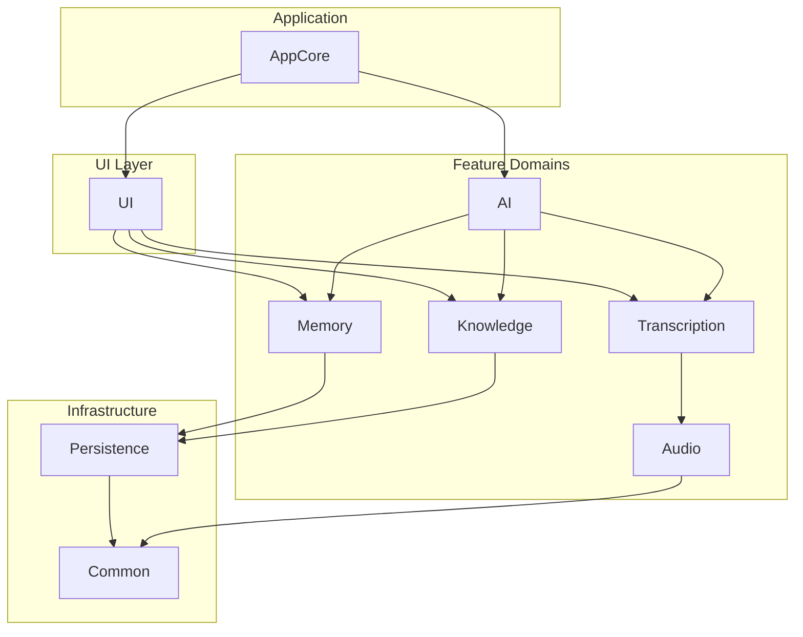

# Specification: Modular and Agent-Centric Refactor

**Status**: Finalized
**Date**: 2025-07-16

## 1. Objective

To refactor the ProjectOne codebase from its current structure (grouped by type) into a modular, agent-centric architecture. This will be achieved by organizing code into distinct Swift Packages based on feature domains and implementing a new agent-based pattern for AI processing.

This specification will serve as the definitive guide for this refactoring effort.

## 2. Guiding Principles

- **Separation of Concerns**: Each package should have a single, well-defined responsibility.
- **Explicit APIs**: Interactions between modules must go through a clear, public API, enforced by the package structure.
- **Testability**: Each package must be testable in isolation.
- **Reduced Complexity**: Developers should be able to work within one package without needing to understand the entire system.
- **Dependency Inversion**: High-level modules (like agents) should not depend on low-level modules (like data persistence), but on abstractions (protocols).

## 3. Proposed Architecture

### 3.1. Directory Structure

A new `Packages/` directory will be created at the project root to house the local Swift Packages.

```
/Users/jaredlikes/code/ProjectOne/
├── Packages/
│   ├── AppCore/         # Main app setup, dependency injection, navigation
│   ├── UI/              # All SwiftUI Views and UI-specific logic
│   ├── Knowledge/       # Knowledge Graph, entities, relationships
│   ├── Memory/          # STM, LTM, Working Memory, consolidation engine
│   ├── AI/              # AgentOrchestrator, Agent protocol, specific agents
│   ├── Audio/           # Audio recording, playback, file management
│   ├── Transcription/   # Transcription engines and protocols
│   ├── Persistence/     # SwiftData models and persistence logic
│   └── Common/          # Shared utilities, extensions, etc.
└── ProjectOne.xcodeproj/
```

### 3.2. Dependency Graph

The dependencies between packages will be strictly enforced to prevent circular references.



### 3.3. Agent-Centric Pattern

The core AI logic will be refactored to follow the agent-centric pattern outlined in `ADR_004_Agent_Centric_Architecture.md`. The `AI` package will contain the core `Agent` protocol, the `AgentOrchestrator`, and the concrete agent implementations (e.g., `TranscriptionAgent`, `KnowledgeAgent`).

## 4. Step-by-Step Migration Plan

This refactor will be executed in a bottom-up fashion, starting with the most foundational packages.

1.  **Package Scaffolding**:
    - Create the `Packages/` directory in the project root.
    - In Xcode, create each of the new local Swift Packages listed in section 3.1.
    - Add the new packages to the main `ProjectOne` app target.

2.  **Foundation Layer Migration**:
    - **`Common` Package**: Move shared utilities and extensions into this package. Define `public` access for necessary components.
    - **`Persistence` Package**: Move all SwiftData models (`Entity`, `Relationship`, `ProcessedNote`, etc.) into this package. Ensure it depends on `Common`. All models will be `public`.

3.  **Infrastructure Layer Migration**:
    - **`Audio` Package**: Move `AudioRecorder`, `AudioPlayer`, and related components. Depends on `Common`.
    - **`Transcription` Package**: Move `SpeechTranscriptionProtocol` and all engine implementations (`AppleSpeechTranscriber`, `WhisperKitTranscriber`, etc.). Depends on `Audio` and `Common`.

4.  **Domain Logic Layer Migration (Agent Refactoring)**:
    - **`Knowledge` Package**: Move `KnowledgeGraphService` and related logic. Depends on `Persistence`.
    - **`Memory` Package**: Move `MemoryConsolidationEngine` and memory models (STM, LTM). Depends on `Persistence`.
    - **`AI` Package**: This is the core of the agent refactor.
        - Create the `Agent` protocol, `AgentTask`, `AgentResult`, and `SystemContext`.
        - Create the `AgentOrchestrator`.
        - Refactor logic from `Gemma3nCore` and old services into new agent classes (`TranscriptionAgent`, `KnowledgeAgent`, `MemoryAgent`).
        - This package will depend on `Knowledge`, `Memory`, and `Transcription`.

5.  **Presentation Layer Migration**:
    - **`UI` Package**: Move all SwiftUI views into this package. This package will have the most dependencies, including `Knowledge`, `Memory`, `AI`, etc.

6.  **Composition Root**:
    - **`AppCore` Package**: This package will be responsible for initializing and wiring all the agents and services. It will contain the main application entry point (`ProjectOneApp.swift`). The `AgentOrchestrator` will be instantiated here, and all agents will be registered.

7.  **Final Cleanup**:
    - Once all files are moved, remove the old groups from the Xcode project.
    - Resolve any remaining dependency issues.
    - Ensure the main project builds successfully using the new package structure.

## 5. Verification

The refactor will be considered complete when:
1.  All source code resides within the new package structure.
2.  The project successfully compiles and runs on both iOS and macOS simulators.
3.  All existing unit and UI tests pass.
4.  The application's core functionality (recording, transcription, knowledge graph display) is verified to be working as before.
